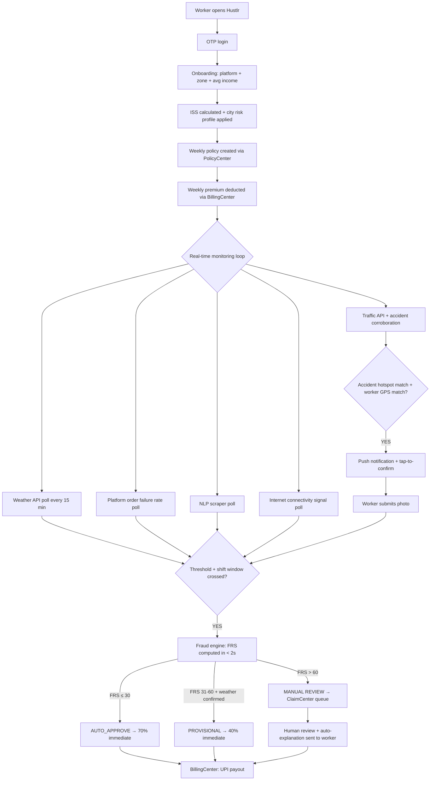
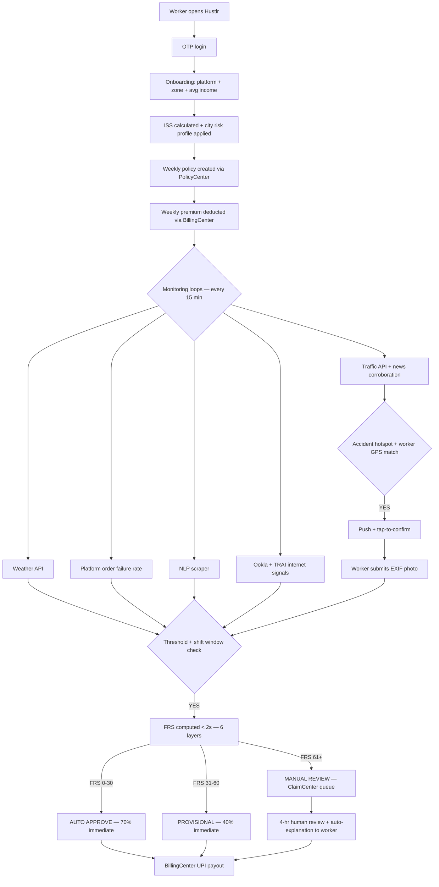

<div align="center">
  <h1>⚡ Hustlr</h1>
  <h3>Real-Time Income Protection Engine for India's Gig Delivery Workers</h3>

  <a href="https://drive.google.com/your-link-here">
    
  </a>
  <a href="https://figma.com/your-link-here">
    
  </a>
  <br><br>
  <strong>🏆 Guidewire DEVTrails 2026 — Phase 1 Submission</strong><br>
  <strong>👥 Team:</strong> [Team Name] &nbsp;|&nbsp; <strong>🎯 Persona:</strong> Q-Commerce Delivery Partners (Zepto / Blinkit)
</div>

---

> *"When it rains heavily, I can't deliver. When there's a curfew, I can't deliver. When the app crashes, I can't deliver. When a road accident blocks my route, I can't deliver. Those days, I earn zero rupees — but my rent doesn't know that."*
> — **Ravi, 26, Zepto Q-commerce delivery rider, Chennai**

---

## ⚡ How Hustlr Works — 15-Second View

```
1. Rain detected in Ravi's zone      →  IMD + OpenWeatherMap confirm threshold
2. Shift window check passes         →  disruption falls within Ravi's working hours
3. Fraud check in < 2 seconds        →  FRS score computed across 6 independent signal layers
4. Fixed payout credited instantly   →  ₹100/hr × verified disruption hours, capped at ₹300/day
```

No forms. No adjusters. No claim ever filed by the worker — for automated trigger events.

---

## 🔴 The Problem

India has **7.7 million** gig delivery workers. Q-commerce riders — the people delivering groceries in 10 minutes for Zepto and Blinkit — face the sharpest version of this problem. They operate within a strict 2–3 km radius of a single dark store. They earn ₹4,000–₹6,000 per week with no paid leave, no sick days, and no safety net. One flooded street eliminates their entire working zone. A dark store going offline wipes out a full shift. Chennai alone sees **~80 rain days per year** — on each one, a rider loses ₹400–₹600. Cyclone Michaung wiped out 3–4 days of income per worker with zero recourse.

Every existing insurance product covers accidents, hospitalization, and death — events that happen rarely. Not one covers the income disruption that happens 80+ days a year.

Hustlr fixes the right problem.

---

## 💡 What Hustlr Is

Hustlr is **not an insurance company.** It is an **underwriting intelligence engine** that enables licensed insurers to profitably serve gig workers — a segment traditional insurance has never been able to reach.

---

## 🏢 Insurance Partner Model

| Role | Entity |
|---|---|
| **Risk Underwriter** | Licensed insurer — ICICI Lombard / HDFC ERGO |
| **Trigger + Intelligence Engine** | Hustlr |
| **Policy Administration** | Guidewire PolicyCenter API |
| **Claims Automation** | Guidewire ClaimCenter API |
| **Premium Billing** | Guidewire BillingCenter API |
| **Distribution** | Zepto / Blinkit platform integration |

---

## ⚙️ Guidewire Integration

### PolicyCenter
- Weekly policy creation every Monday via PolicyCenter API
- ISS score + city risk profile passed as risk attributes for premium computation
- Policy status synced back to Hustlr in real time

### ClaimCenter
- On parametric trigger: Hustlr pushes a structured, pre-validated claim payload
- Fraud Risk Score attached — ClaimCenter routes CLEAN to auto-approval, FLAGGED to human queue
- On manual claim: worker-submitted proof package routed directly to ClaimCenter review queue
- Zero-touch for weather/bandh/internet events. Structured review for manual claim types.

### BillingCenter
- Weekly premium deduction via BillingCenter direct debit scheduling
- Payout disbursement coordinated through BillingCenter's payment gateway
- Worker wallet reconciliation synced weekly

### Guidewire Marketplace
- Hustlr packaged as a Marketplace integration — any insurer on PolicyCenter/ClaimCenter can onboard Hustlr's parametric trigger engine as a configurable product extension

---

## 📊 Parametric Logic — Core Principle

Hustlr does **not** calculate actual income loss. No investigation needed for automated triggers.

- A measurable disruption index is monitored in real time
- When it crosses a threshold AND falls within the worker's shift window → payout fires
- Payout = fixed rate per trigger type × verified disruption hours (capped at ₹300/day, ₹1,000/week)

```
Example:
  Trigger:          Heavy rain — IMD confirms 72mm, threshold 64.5mm crossed
  Duration:         3 hours above threshold
  Shift window:     Disruption 11 AM–2 PM within Ravi's 10 AM–10 PM  →  PASS
  Fixed rate:       ₹100/hr (Heavy Rain tier)

  Payout = ₹100 × 3 = ₹300  →  hits daily cap  →  ₹300 auto-disbursed to UPI
```

**Why fixed payouts, not income multipliers:** Fixed amounts remove the need to verify individual earnings, keep the product IRDAI-compliant as a pure parametric product, and make loss ratio modelling predictable for the insurer. The plan tier the worker chooses is the income proxy — a Standard Shield worker gets ₹100/hr, an Elite Shield worker gets a higher fixed rate — without needing to verify anyone's actual earnings.

---

## 🚨 Trigger Parameters

### Automated Parametric Triggers

| Trigger | Threshold | Data Source | Hourly Rate |
|---|---|---|---|
| Heavy Rain | ≥ 64.5mm / hr | IMD + OpenWeatherMap | ₹100/hr |
| Extreme Rain / Cyclone | ≥ 115.6mm / hr | IMD + OpenWeatherMap | ₹150/hr |
| Heat Wave | ≥ 43°C | IMD | ₹75/hr |
| Severe Pollution | AQI ≥ 200 | AQICN / WAQI | ₹75/hr |
| Platform App Outage | Order failure rate > 60% | Platform API + order failure rate | ₹100/hr |
| Bandh / Strike / Curfew | NLP confidence ≥ 0.6 + platform OFFLINE | NewsAPI + NLP scraper | ₹100/hr |
| VVIP Gridlock | Route speed < 5 km/h in ≥ 3 zones | Google Maps Traffic API | ₹75/hr |
| **Internet Zone Blackout** | **Connectivity < 10% in zone for ≥ 30 min** | **Ookla / TRAI + device signal reports** | **₹100/hr** |

**Payout cap:** ₹300/day · ₹1,000/week (liquidity protection)

### Manual Claim Triggers

| Trigger | What Worker Submits | Cross-Check Sources | SLA |
|---|---|---|---|
| Traffic Accident Blockspot | GPS screenshot + scene photo (EXIF-stamped) + platform earnings screenshot | Google Maps Traffic API + News API + order density | 4 hrs |
| Local Road Closure | Same as above | Municipal advisory feed + Maps | 4 hrs |
| Dark Store / Hub Shutdown | Photo of closed hub + Zepto/Blinkit screenshot | Platform API + NLP scraper | 4 hrs |

---

## 📱 Manual Claim Filing — UX Flow

> **Current UI Status:** The Claims screen (Phase 1 prototype) shows auto-triggered claims only. The "Report a Disruption" button for manual claims is planned for Phase 2. The architecture and proof requirements are fully designed — the UI entry point is the next build milestone.

### How Manual Claims Work in the App (Phase 2 Target)

Workers filing a manual claim tap **"Report a Disruption"** on the Claims screen. This opens a 3-step guided flow designed for one-thumb operation on a budget Android device.

**Step 1 — Select Disruption Type**
```
Worker sees:
  🚧  Road Blocked / Accident
  🏪  Dark Store / Hub Closed  
  🌐  Internet Outage (zone-level)
  📦  Other Delivery Blockage
```

**Step 2 — Capture Evidence (in-app, EXIF-stamped)**
```
Disruption Type          What the app asks for
─────────────────────────────────────────────────────────────────
Road Blocked / Accident  1 photo of blocked road or accident scene
                         (app timestamps + GPS-stamps at capture)
                         + tap to confirm location

Dark Store / Hub Closed  1 photo of closed hub entrance
                         + Zepto/Blinkit screenshot showing no orders

Internet Outage          App auto-reads signal strength — no photo needed
                         Worker taps "Confirm I can't work"

Other                    1 photo + brief description (max 100 chars)
```

**Step 3 — Submission & Tracking**
```
Worker sees:
  "Claim submitted. We're checking 3 data sources."
  [animated progress bar]

Within 4 hours:
  → AUTO-APPROVED: "₹X credited to your wallet"
  → NEED MORE INFO: "Tap here to add one more photo"
  → DECLINED + EXPLANATION: "Here's why, and how to appeal"
```

### Claims Screen — Current vs Target

| Element | Current (Phase 1 Prototype) | Target (Phase 2) |
|---|---|---|
| Auto-triggered claims | ✅ Shown with status badges | ✅ Same |
| Manual claim entry point | ❌ Not present | ✅ "Report a Disruption" button |
| Claim detail view | Tap to expand (planned) | Full timeline + auto-explanation |
| Appeal flow | Not present | One-tap appeal + 4-hr SLA |
| Filter by type | Not present | Filter: Auto / Manual / Pending |

### Why Manual Claims Exist Alongside Parametric Auto-Triggers

Hustlr's parametric triggers cover events with government-grade data sources (IMD rainfall, TRAI outages). For events where real-time API data is ambiguous or absent — a specific road accident, a single hub closure, a localized power cut — workers need a human-assisted pathway that is fast, transparent, and doesn't feel like filing an insurance claim the traditional way.

The 3-step flow is designed so that the average worker can submit a manual claim in under 90 seconds without leaving their delivery zone.

---

## 🌐 Internet Zone Blackout — Trigger Architecture

India's gig workers are uniquely vulnerable to localized internet outages — tower outages, ISP maintenance, and government-ordered shutdowns routinely affect specific pin codes for hours. A Zepto Q-commerce rider cannot accept orders, navigate to the dark store, or scan QR codes during a connectivity blackout. Unlike food delivery, Q-commerce riders operate within a strict 2–3 km radius of a single dark store — one pincode blackout eliminates their entire working zone instantly. This is a direct, quantifiable income loss with no existing insurance coverage.

**How Hustlr detects an internet blackout:**

```
Signal 1 — Ookla Real-Time Speed Map API
  Zone average download speed < 2 Mbps sustained for 20 minutes  →  degraded flag

Signal 2 — Device crowd-reporting (passive)
  ≥ 30% of active Hustlr users in a pin-code report < 1 bar signal strength
  → cluster anomaly flag

Signal 3 — TRAI outage registry
  Any registered outage for the zone's ISP/tower operator  →  authoritative flag

Dual-confirmation rule:
  Signal 1 + Signal 2  →  AUTO_TRIGGER (no single-source payouts)
  Signal 3 alone        →  AUTO_TRIGGER (government-grade source)
  Signal 1 alone        →  HOLD for 20-minute reconfirmation window
```

**Why this is different from a platform outage:**
A platform outage affects one app (Zepto). An internet blackout simultaneously kills every platform — Zepto, Blinkit, Google Maps, UPI payments. Hustlr's Internet Blackout trigger is platform-agnostic and fires when the worker's entire operating environment goes dark, not just one app.

**Fraud resistance:**
A fraudster cannot fake a localized internet blackout — it requires real coordinated infrastructure failure. A spoofed claim for an internet blackout would require the worker to both claim connectivity loss AND actively transmit data to claim it, which is self-contradictory. This makes the internet blackout trigger one of Hustlr's most fraud-resistant parametric signals.

---

## 🚧 Accident Blockspot — Trigger Architecture

Chennai's road network has documented high-frequency accident corridors — Rajiv Gandhi Salai (IT Corridor), GST Road, and Poonamallee High Road account for a disproportionate share of delivery-hour blockages. Delivery workers concentrated on these routes lose significant income to accident-induced gridlock that can last 2–4 hours.

**Detection approach — Hybrid automated + manual:**

**Automated Pre-Screening (fires a trigger candidate, not a payout):**
```
Google Maps Traffic API:
  Route speed < 5 km/h on a major corridor for ≥ 30 minutes  →  gridlock flag

Cross-checked against:
  NewsAPI / NLP scraper: keywords "accident", "collision", "vehicle overturned",
  "road blocked" in that zone within the past 45 minutes

If traffic flag + news corroboration:
  →  "Accident Blockspot Detected" push notification sent to workers in zone
  →  Workers on affected routes invited to submit a manual claim (tap to confirm)
```

**Worker-Assisted Confirmation (required for payout):**

Unlike weather events where IMD data is government-grade and unambiguous, accident data from third-party APIs has false-positive risk (slow traffic due to rain vs. slow traffic due to accident). Hustlr uses a tap-to-confirm flow rather than fully automated payouts for this trigger type.

```
Worker receives push: "Accident blocking detected on GST Road near you.
Were you affected? Tap to confirm + upload 1 photo."

Worker submits:
  1. Tap confirmation (timestamped)
  2. One photo of the blocked scene or the accident (EXIF-stamped by app)

Hustlr cross-checks:
  →  Was worker in that corridor at that time? (GPS history — last 30 min)
  →  Did worker have zero completed orders in that window? (platform API)
  →  Is the blockspot on Hustlr's Chennai Accident Hotspot Map?

If all 3 match:
  →  "Assisted Parametric" routing to ClaimCenter
  →  Fixed payout = ₹75/hr × blocked_hours (Accident Blockspot rate, Standard Shield)
  →  SLA: 4 hours
```

**Chennai Accident Hotspot Map:**

Hustlr maintains a static zone map of documented high-frequency accident corridors sourced from Chennai Traffic Police data (data.gov.in) and NCRB road accident statistics. Claims from hotspot corridors carry lower skepticism weight in the FRS system. Claims from low-incident roads require stronger corroboration.

| Tier | Corridors | Claim Skepticism Weight |
|---|---|---|
| Tier 1 — High frequency | GST Road, Rajiv Gandhi Salai, Poonamallee High Road | Low |
| Tier 2 — Medium frequency | Anna Salai, Velachery Main Road, OMR | Medium |
| Tier 3 — Low frequency | Internal streets, zone-internal routes | High |

---

## 👤 Persona & Scenarios

### Primary Persona: Ravi, Zepto Q-Commerce Delivery Rider (Chennai)

Q-commerce riders operate under constraints food delivery workers don't face: a strict 2–3 km delivery radius from a single dark store, 10-minute SLA per order, and income that collapses completely if the dark store goes offline or their zone becomes inaccessible. One flooded street, one bandh, one power cut — and their entire working zone is gone. Not just slowed. Gone.

| Attribute | Value |
|---|---|
| Platform | Zepto (primary), Blinkit (secondary) |
| Weekly Earnings | ₹5,200 (~₹750/day, ~₹75/hr over 10-hr shift) |
| Shift Window | 8 AM – 10 PM derived from 30-day activity history |
| Peak Slots | Morning 8–11 AM · Evening 6–10 PM |
| Delivery Radius | 2–3 km from assigned dark store — zone loss = total income loss |
| Device | Android ~₹10,000 budget phone |
| Annual exposure | ~80 rain days · loses ₹400–₹600/heavy rain day |

---

### 📊 Real Scenario Simulation — Chennai, November Rain

```
Date:         November 12, 2025
Location:     Adyar, Chennai
IMD data:     72mm rainfall — threshold crossed for 3 hours
Shift window: Disruption 11 AM–2 PM falls within Ravi's 8 AM–10 PM  →  PASS

Calculation:
  Trigger type:       Heavy Rain
  Fixed hourly rate:  ₹100/hr (Standard Shield)
  Disruption hours:   3
  Gross payout:       ₹300  →  hits daily cap of ₹300

Timeline:
  11:00 AM  →  IMD threshold crossed in Adyar
  11:02 AM  →  Shift window check: PASS
  11:02 AM  →  Fraud engine: FRS = 14/100  →  CLEAN
  11:02 AM  →  Claim pushed to Guidewire ClaimCenter
  11:04 AM  →  ₹210 (70%) credited to Ravi's UPI immediately
  48 hrs    →  ₹90  (30%) released after review window

Total: ₹300.  Weekly premium paid: ₹87.  Net benefit: ₹213.
```

### Scenario B — Bandh / Strike (Automated)

```
NLP scraper detects: "Chennai bandh in zones 4, 7, 11"  →  confidence 0.82
Platform API: Zepto dark stores OFFLINE in zones 4, 7, 11  →  dual confirmation PASS
Shift window: bandh falls within workers' logged shift hours  →  PASS

Workers on Standard Shield:
  →  Fixed payout = ₹100/hr × verified disruption hours (capped ₹300/day)
  →  Auto-claim pushed to ClaimCenter
  →  Zero worker action required
```

### Scenario C — Traffic Accident Blockspot (Assisted Manual)

```
Date:       March 15, 2026 — Evening peak slot, 8:30 PM
Location:   GST Road near Perungudi (Tier 1 hotspot corridor)
Event:      Truck overturned, blocking 3 of 4 lanes

Google Maps Traffic: zone speed < 5 km/h for 45 minutes  →  gridlock flag
NewsAPI: "truck accident GST Road Perungudi" — confidence 0.79  →  corroborated

Push sent to 43 active workers in zone:
  "Accident blockspot detected on GST Road. Were you affected? Tap + 1 photo."

Ravi taps confirm + uploads photo of blocked road.

Hustlr cross-checks:
  →  Ravi's GPS shows him on GST Road at 8:28 PM  →  MATCH
  →  Platform: 0 orders completed 8:00–10:30 PM  →  MATCH
  →  GST Road is Tier 1 hotspot  →  Low skepticism weight

Outcome:
  Fixed rate:   ₹75/hr (Accident Blockspot, Standard Shield)
  Blocked time: 2 hours
  Payout:       ₹75 × 2 = ₹150
  Claim routed to ClaimCenter as "Assisted Parametric"
  SLA: 4 hours
  Auto-explanation sent: "Claim approved — GPS match + zero orders + Tier 1 corridor confirmed."
```

### Scenario D — Internet Zone Blackout (Automated)

```
Date:       February 8, 2026 — 7:00 PM
Location:   Tambaram, Chennai (tower maintenance by BSNL)

Signal 1 — Ookla API: Tambaram average speed 0.8 Mbps  →  degraded flag
Signal 2 — 34 of 89 active Hustlr users in Tambaram reporting < 1 bar for 25 min  →  cluster flag
TRAI registry: BSNL tower outage logged for Tambaram 600045  →  authoritative flag

Dual confirmation: Signal 1 + TRAI  →  AUTO_TRIGGER

Shift window check: outage 7:00–9:30 PM falls within workers' active hours  →  PASS
Fraud check: internet blackout is self-validating (transmitting to claim = not blacked out)  →  CLEAN

Workers affected in Tambaram:
  →  Fixed payout = ₹100/hr × 2.5 hrs = ₹250 (Internet Blackout rate, Standard Shield)
  →  Auto-claim pushed to ClaimCenter
  →  Zero worker action required
  
Note: Workers whose GPS showed them outside Tambaram during the outage window do not receive payout.
```

### Scenario E — Platform App Outage (Automated via Order Failure Rate)

```
Zepto status page shows "operational" but orders are failing en masse.

Hustlr detects:
  order_failure_rate = (orders_assigned − orders_completed) / orders_assigned
  Zone failure rate  = 78%  →  threshold 60% crossed

Platform status API says UP. Order failure rate says DOWN.
Order failure rate wins — it reflects ground reality.

Workers on Standard Shield in affected zones:
  →  Shift window check applied
  →  Fixed payout = ₹100/hr × verified outage hours (capped ₹300/day)
  →  Auto-claim pushed to ClaimCenter
```

---

## 🔄 End-to-End Workflow



---

## 🛡️ Adversarial Defense & Anti-Spoofing Strategy

### The Threat

A coordinated syndicate of 500 workers organizes via Telegram. Using GPS spoofing apps, they fake their location inside a rain-alert zone while sitting safely at home, triggering mass false payouts and draining the liquidity pool within hours.

### The Differentiation — Why GPS Spoofing Fails Against Hustlr

Hustlr never trusts a single signal. Every payout decision requires **multi-stream coherence** — signals from independent data channels that a spoofing app cannot simultaneously fake.

| Signal Layer | What It Measures | What Spoofing Looks Like |
|---|---|---|
| GPS coordinates | Claimed location | Too perfect — zero jitter over 5-minute windows |
| Cell tower triangulation (OpenCelliD) | Which tower the device is connected to | Home tower ID doesn't match flood zone tower IDs |
| Wi-Fi fingerprint | SSIDs visible to device | Known home SSID present = flagged |
| IP geolocation (MaxMind) | ISP + approximate location of internet connection | Home broadband IP ≠ claimed outdoor zone |
| Accelerometer / motion | Physical movement patterns | Stationary couch motion ≠ stranded outdoor worker |
| Battery charging state | Charging = plugged in at home | Charging during claimed outdoor disruption = anomaly |

**The core insight:** A genuine delivery worker stranded in a flood zone has coherent signals across all six layers. A person sitting at home with a GPS spoofer has coherent GPS but incoherent cell tower, Wi-Fi, IP, motion, and battery signals. Faking all six simultaneously is technically infeasible on a ₹10,000 budget Android phone.

**Internet Blackout additional defense:** A worker cannot simultaneously claim an internet blackout and actively transmit the claim — the claim itself proves connectivity. The blackout trigger fires server-side from infrastructure signals, requiring no worker device transmission. This makes internet blackout the most fraud-resistant trigger in Hustlr's portfolio.

### The Data — What Hustlr Analyzes Beyond GPS

**Layer 1 — Individual Signal Checks (deterministic rules):**

```python
SIGNAL_WEIGHTS = {
    'gps_zone_mismatch':           25,   # GPS in flood zone but cell tower says elsewhere
    'wifi_home_ssid_detected':     20,   # Known home SSID present during claimed disruption
    'battery_charging':            15,   # Charging = stationary at home
    'accelerometer_idle':          10,   # No motion consistent with outdoor stranding
    'platform_app_inactive':       15,   # Not logged into Zepto/Blinkit during event
    'claim_velocity_high':         10,   # 3+ claims in past 7 days
    'ip_geolocation_home_match':   20,   # MaxMind shows home broadband IP
    'claim_latency_under_30s':     10,   # Filed < 30s after trigger = syndicate reflex
}
```

**Layer 2 — Behavioral Baseline:**
First 2 weeks on platform build a Personal Activity Graph per worker: home zone (inferred from late-night GPS clusters), normal work zones, typical active hours, average daily motion score. Claims from zones the worker has never worked in, or during historically inactive hours, receive a behavioral penalty.

**Layer 3 — Poisson Distribution Test (coordinated ring detection):**
When a genuine disruption hits, workers file claims gradually over 20–40 minutes as they realize they cannot work. Coordinated rings fire within seconds of each other because they are watching the same Telegram channel for the trigger signal. Hustlr runs a Poisson distribution test on claim timing within a zone. Uniform firing at p < 0.05 = coordinated ring confirmed.

**Layer 4 — Isolation Forest (syndicate pattern detection):**
Each claim event is represented as a feature vector including zone grid ID, time of day, number of simultaneous claimants in the zone within 15 minutes, device network fingerprint, days since onboarding, and referral chain depth. Isolation Forest (contamination = 0.05) scores each vector against the historical clean claim distribution. Deeply anomalous clusters flag the entire group for manual review.

**Layer 5 — Worker Trust Score (backend only, not shown in UI):**
Workers with 8+ weeks of clean claim history accumulate a Trust Score that reduces their effective FRS by up to 15 points. Long-tenure honest workers are actively protected from false positives. New accounts have no Trust Score benefit and therefore face higher default scrutiny — which is exactly the profile of a syndicate recruit.

**Layer 6 — Internet Blackout Self-Validation:**
As noted above, a claim for an internet blackout requires active device-to-server communication. Any device actively communicating cannot be experiencing a complete blackout. The blackout trigger fires from infrastructure-side signals (Ookla, TRAI) and does not rely on device reporting. Device reporting is used only for corroboration. This structural property eliminates the primary spoofing vector for this trigger type.

### The UX Balance — Protecting Honest Workers From the Fraud System

Genuine workers in a heavy rain event sometimes have degraded GPS signals, weak cell tower locks, and unusual motion patterns because they are trying to shelter from the rain. Hustlr's fraud engine is designed to never hard-deny a claim based on a single signal. Every flagged claim gets a provisional response, not a denial.

```
FRS 0–30   →  AUTO_APPROVE    →  70% immediate + 30% released at 48 hrs
FRS 31–60  →  PROVISIONAL     →  40% immediate + 60% held pending review
FRS 61–100 →  MANUAL REVIEW   →  Human ClaimCenter queue, 4-hour SLA
```

**No permanent blacklisting.** A worker flagged once receives an auto-explanation of exactly which signals triggered the flag. They can appeal with one EXIF-stamped live photo showing their location. Appeal resolution: 4 hours. First-time flags reduce to a caution flag — only repeat patterns trigger escalation.

**Auto-explanation format (example):**
```
Your claim was flagged for review because:
  - Your Wi-Fi showed a home network signal during the rain event
  - Your device motion was below your usual outdoor activity level

If you were genuinely affected, tap below to submit a location photo.
We will review within 4 hours and release your payout if confirmed.
```

This is honest with the worker, explains the system's reasoning, and gives them a clear path to resolution — without revealing the exact thresholds that a bad actor could optimize around.

---

## 🤖 AI/ML Architecture

### Model 1 — Income Stability Score (ISS)

**Purpose:** Assigns every worker a risk score 0–100 at onboarding, used by Model 2 to recommend the most appropriate weekly plan.

**Phase 1 — Rule Engine:**

```python
def calculate_iss(zone_flood_risk, avg_daily_income, disruption_freq_12mo, claims_history_penalty):
    score = 100
    score -= zone_flood_risk * 20           # 0.0 (safe) to 1.0 (Velachery/Pallikaranai)
    score -= min(disruption_freq_12mo, 15)  # IMD disruption days in past 12 months
    score += min(avg_daily_income / 200, 10)  # Higher income buffer = lower risk
    score -= claims_history_penalty         # 0 clean, up to 25 for flagged history
    return max(0, min(100, score))
```

**Phase 2:** XGBoost upgrade when real worker data available. Adopted only when precision on holdout beats the rule engine by > 5%.

**Real datasets used:**
- IMD District Rainfall 2015–2024 — [imdpune.gov.in](https://imdpune.gov.in)
- PLFS Gig Worker Earnings Survey 2023 — [mospi.gov.in](https://mospi.gov.in)
- data.gov.in Pincode-Zone Directory — [data.gov.in](https://data.gov.in)

### Model 2 — ISS-Based Onboarding Tier Recommendation

**Purpose:** At onboarding, use the worker's ISS score, zone risk profile, and historical disruption baseline to recommend the most appropriate weekly plan. Once the worker selects a plan, the price is fixed for the season (6 months). No Sunday repricing. No variable bills. Workers know exactly what they pay every week.

**Why fixed-price, not dynamic:** Gig workers operate on weekly income cycles of ₹4,000–₹6,000. A premium that changes every week based on a weather model creates budget unpredictability for the exact population Hustlr is designed to protect. The insurer's exposure is managed through pool caps, reinsurance, and concentration limits — not by shifting price risk onto the worker.

**Recommendation logic:**
```
ISS 0–29   →  Recommend Elite Shield (₹199/wk)   — high disruption exposure, needs max cover
ISS 30–49  →  Recommend Full Shield (₹125/wk)    — elevated risk, flood / cyclone zone likely
ISS 50–69  →  Recommend Standard Shield (₹87/wk) — moderate risk, most city workers
ISS 70–100 →  Recommend Basic Shield (₹49/wk)    — stable zone, low historical disruption

Add-on recommendations triggered separately:
  Zone bandh frequency > 4/year   →  suggest Curfew & Strike add-on (+₹15/wk)
  Platform outage rate > 2/month  →  suggest App Downtime add-on (+₹12/wk)
  Cyclone belt zone               →  suggest Cyclone add-on (+₹25/wk)
```

**The AI's role:** The model runs at onboarding and surfaces a personalised recommendation card — "Based on your zone and earnings history, Standard Shield covers 94% of disruption events Zepto riders in your area experienced last year." The worker still chooses. The intelligence is in the recommendation, not the price.

### Model 3 — Fraud Detection Engine (FRS)

Six-layer stacked scoring system (see Adversarial Defense section for full detail). Runs in < 2 seconds. Outputs FRS 0–100 → routes to AUTO_APPROVE / PROVISIONAL / MANUAL_REVIEW.

**Real dataset:** Kaggle Auto Insurance Claims fraud dataset (synthetic bootstrap for Phase 1 training).

### Model 4 — NLP Disruption Scraper

**Purpose:** Detects bandh, strike, curfew, VVIP events, and internet outage reports that weather APIs cannot capture. Polls every 15 minutes.

**Phase 1:** spaCy keyword scoring (HIGH_CONFIDENCE + MEDIUM_CONFIDENCE keyword buckets). Dual confirmation required — NLP signal alone cannot fire a payout without corroborating platform/infrastructure signal.

**Phase 2:** LLM preprocessing for unstructured government advisories. The LLM converts raw IMD bulletins and state government notifications into structured JSON trigger objects. The LLM touches preprocessing only — every YES/NO payout decision is deterministic and auditable. Example:

```
INPUT (raw):  "IMD issues red alert for Chennai district. Extremely heavy rainfall
               expected between 6 PM and midnight tonight."

OUTPUT (JSON): { "trigger": "extreme_rain", "zone": "Chennai", "confidence": 0.95,
                 "window_start": "18:00", "window_end": "24:00", "date": "2026-03-20" }
```

**Real dataset:** AQICN Historical AQI — [aqicn.org](https://aqicn.org) (for pollution trigger baseline)

### Model 5 — Internet Connectivity Anomaly Detector

**Purpose:** Identifies localized internet blackouts using crowdsourced device signal reports combined with infrastructure data. Operates independently of GPS — resistant to location spoofing.

```python
BLACKOUT_THRESHOLD = {
    'ookla_avg_speed_mbps':         2.0,   # Below this = degraded zone
    'device_cluster_pct_weak':      0.30,  # 30% of zone devices reporting < 1 bar
    'sustained_minutes':            20,    # Must persist to avoid transient spikes
    'trai_registry_match':          True   # TRAI outage = authoritative auto-trigger
}
```

**Fraud resistance property:** Auto-trigger fires server-side from Ookla + TRAI signals. Worker device reporting is corroborative only. A device actively communicating cannot be experiencing a complete blackout — the transmission itself invalidates the claim.

### Model 6 — Accident Blockspot Classifier

**Purpose:** Identifies whether a traffic gridlock event is caused by an accident (eligible for claim) versus normal congestion (not eligible). Runs only when Traffic API detects speed < 5 km/h.

```python
def classify_blockspot(zone, traffic_signal, news_signal, time_of_day):
    # Normal congestion is predictable — rush hour on known corridors
    congestion_prob = congestion_baseline_model.predict(zone, time_of_day)
    
    if congestion_prob > 0.80:
        return "NORMAL_CONGESTION"  # No trigger
    
    # Unexpected slowdown + news corroboration = accident
    if news_signal['confidence'] >= 0.65 and traffic_signal['duration_min'] >= 30:
        return "ACCIDENT_BLOCKSPOT"  # Trigger candidate
    
    return "INCONCLUSIVE"  # Hold for worker tap-to-confirm
```

**Chennai Accident Hotspot Map:** Sourced from NCRB Road Accident Statistics 2023 and Chennai Traffic Police data (data.gov.in). Tier 1 corridors carry reduced skepticism weight in FRS scoring.

### Model 7 — Facebook Prophet Forecasting (Phase 3)

**Purpose:** Forecasts next 4 weeks of disruption frequency per zone and projects forward loss ratio. Feeds insurer admin dashboard with capital reservation estimates.

Prophet handles India's monsoon seasonality natively (yearly + weekly seasonality components). Trained on IMD District Rainfall 2015–2024 + Chennai bandh history from NLP archive.

---

## 💰 Weekly Premium Tiers

> These plan names and prices reflect the actual Phase 1 prototype UI.

| Plan | Weekly Premium | Covers | Best For |
|---|---|---|---|
| **Basic Shield** | ₹49/wk | Rain + extreme heat | Low-risk zones, new workers |
| **Standard Shield** ⭐ Most Popular | ₹87/wk | Rain, heat, pollution, app downtime | Most city delivery workers |
| **Full Shield** | ₹125/wk | All disruption types | Flood-zone and cyclone-belt workers |
| **Elite Shield** 🔥 Best Value | ₹199/wk | All types + compound triggers + 10% cashback | High-frequency workers, Velachery / Pallikaranai |

### Income Add-Ons (toggleable, shown in prototype)

Workers on any base plan can toggle individual add-ons in the Policy & Plans screen:

| Add-On | Weekly Cost | Trigger Covered |
|---|---|---|
| Curfew & Strike | +₹15/wk | Bandh, curfew, Section 144 |
| Election Day | +₹20/wk | Polling day traffic + restricted movement |
| App Downtime | +₹12/wk | Platform outage via order failure rate |
| Cyclone | +₹25/wk | Extreme rain ≥ 115.6mm / cyclone alerts |
| Internet Blackout *(Phase 2)* | +₹18/wk | Zone-level connectivity outage via Ookla + TRAI |
| Accident Blockspot *(Phase 2)* | +₹15/wk | Road blocked by accident on hotspot corridors |

---

## 🏙️ City Risk Profiles

Each city gets a composite risk score built from 6 local data points — not a generic tier bucket.

| Data Point | Source |
|---|---|
| 10-year IMD rainfall history | imdpune.gov.in |
| NDMA flood zone maps | ndma.gov.in |
| Bandh/strike frequency (NLP archive) | Hustlr NLP scraper history |
| Platform order density | Platform API |
| Average disruption hours per event | IMD + historical |
| Internet outage frequency | TRAI registry + Ookla historical |
| Accident blockspot density | NCRB + Traffic Police data |
| VVIP movement frequency | State protocol office |

Example outputs:
- **Chennai:** High flood score (Velachery, Pallikaranai zone surcharges) + moderate bandh + high accident density on GST Road / IT Corridor
- **Kolkata:** Highest bandh score in India + moderate flood + low VVIP
- **Bengaluru:** Low bandh + high internet outage score (tower-dense but overloaded zones) + high traffic accident density on Electronic City flyover
- **Mumbai:** Extreme monsoon score + low bandh + high accident density on Eastern/Western Express Highways

---

## 🔄 End-to-End Workflow (Full)



---

## 📊 System Reliability — Fallback Hierarchy

| Signal Lost | Fallback |
|---|---|
| OpenWeatherMap unavailable | IMD station feed |
| IMD data delayed | Last confirmed reading + 30-min cache |
| Platform API unreachable | Order failure rate as primary signal |
| GPS signal lost on device | Last verified location within 15-min window |
| NLP scraper fails | Trigger held; manual admin review |
| Single-source trigger only | Held for admin confirmation — no auto-payout |
| MaxMind IP API unavailable | Wi-Fi fingerprint weighted up; IP layer skipped |
| Ookla API unavailable | TRAI registry as primary; device cluster as secondary |
| Google Maps Traffic unavailable | Accident trigger suspended; manual claims still accepted |

---

## 🏗️ Platform Decision — Mobile PWA (Flutter)

Delivery workers do not use laptops. Every interaction happens on a ₹10,000 Android phone at a red light. Designed for one-thumb operation, 3-second tasks, push + SMS as primary engagement channels.

Anti-spoofing engine requires direct access to device signals — cell tower IDs, Wi-Fi SSID fingerprints, accelerometer, battery state, and signal strength reporting for internet blackout detection. PWAs cannot reliably access these. Flutter provides full native sensor access plus a single codebase for both Android (worker app) and web (insurer admin dashboard).

---

## 🛠️ Tech Stack

**Frontend**

| Component | Technology |
|---|---|
| Framework | Flutter (Dart) — PWA + Web |
| State Management | Riverpod |
| Background Location | flutter_background_geolocation |
| Local Storage | Hive (offline-first) |
| Payments (mock) | Razorpay Flutter SDK — test mode |
| Notifications | Firebase Cloud Messaging + Twilio SMS fallback |

**Backend**

| Component | Technology |
|---|---|
| API Server | Node.js + Express |
| Database | Supabase (PostgreSQL + PostGIS) |
| Auth | Supabase Auth (OTP via phone) |
| Hosting | Render (free tier) |
| Trigger Polling | Node-cron (every 15 min) |
| NLP Scraper | Python + spaCy via FastAPI microservice |

**AI/ML**

| Component | Technology |
|---|---|
| ISS Scoring (Phase 1) | Python rule engine via FastAPI |
| ISS Tier Recommendation | Rule engine → XGBoost Phase 2 |
| Fraud Detection | scikit-learn Isolation Forest + deterministic rule layers |
| Internet Anomaly Detector | Statistical threshold engine (Phase 1) |
| Accident Classifier | Congestion baseline + news NLP corroboration |
| NLP Scraper | spaCy Phase 1 → LLM preprocessing Phase 2 |
| Disruption Forecasting | Facebook Prophet — Phase 3 |

**Guidewire**

| Integration | API |
|---|---|
| Policy lifecycle | PolicyCenter REST API |
| Claim creation + routing (auto + manual) | ClaimCenter REST API |
| Premium billing + payout | BillingCenter REST API |
| Distribution packaging | Guidewire Marketplace |

**External APIs**

| API | Use | Cost |
|---|---|---|
| OpenWeatherMap | Rainfall real-time | Free (1,000 calls/day) |
| IMD Open Data | Authoritative thresholds + fallback | Free |
| AQICN / WAQI | AQI monitoring | Free token |
| MaxMind GeoIP2 | IP geolocation + VPN/proxy detection | Free tier |
| OpenCelliD | Cell tower triangulation | Free tier |
| Ookla Speed Map API | Internet zone health monitoring | Free tier |
| TRAI Outage Registry | Authoritative ISP/tower outage data | Free (gov) |
| Google Maps Traffic | Road speed for gridlock + accident cross-check | Pay-per-use |
| Brave Search + NewsAPI | Crisis event corroboration + accident detection | Free tier |
| Zepto/Blinkit | Order failure rate + platform status | Mock Phase 1 |
| Razorpay | UPI payout simulation | Test mode |

---

## 🧪 MVP Scope — Phase 1

**Proving the parametric loop. Not an enterprise system.**

Phase 1 demonstrates:
- Rain trigger via live OpenWeatherMap + IMD with shift window check
- Fixed hourly payout model (₹75–₹150/hr by trigger type) with daily ₹300 + weekly ₹1,000 caps
- NLP scraper for bandh detection (mock news feed)
- ISS scoring (rule engine) with named real datasets
- ISS-based onboarding tier recommendation model
- Internet blackout trigger architecture (Ookla + TRAI + device cluster)
- Accident blockspot trigger with tap-to-confirm flow + hotspot map
- Fraud: 6-layer signal engine — cell tower + Wi-Fi fingerprint + IP geolocation + accelerometer + battery state + claim latency
- EXIF liveness check flow for borderline claims
- Auto-explanation generation for flagged claims
- Manual claim submission flow (UI + proof capture)
- Order failure rate trigger for platform outage
- Guidewire ClaimCenter payload structure (auto + manual variants)
- UPI payout via Razorpay test mode

Phase 2 adds: full Flutter app · live Guidewire integration · LLM news preprocessing · city risk profiles · live Ookla + TRAI integration  
Phase 3 adds: Prophet forecasting model · Isolation Forest fraud model · admin dashboard · Marketplace packaging

---

## 💸 Cost Efficiency

| Resource | Cost |
|---|---|
| OpenWeatherMap, IMD, AQICN | ₹0 |
| MaxMind GeoIP2 | ₹0 (free tier) |
| OpenCelliD | ₹0 (free tier) |
| Ookla Speed Map API | ₹0 (free tier) |
| TRAI Outage Registry | ₹0 (government open data) |
| Brave Search + NewsAPI | ₹0 (free tiers) |
| Supabase + Render | ₹0 (free tiers) |
| Razorpay test mode | ₹0 |

**Total infrastructure: ₹0/month.**

---

## 📅 6-Week Plan

### ✅ Phase 1 (Weeks 1–2) — Current
- [x] Shift window eligibility architecture
- [x] Fixed hourly payout model (₹75–₹150/hr by trigger type) with daily ₹300 + weekly ₹1,000 caps
- [x] ISS scoring (rule engine) with named real datasets
- [x] ISS-based onboarding tier recommendation model
- [x] 6-layer fraud signal engine (cell tower + Wi-Fi + IP + accelerometer + battery + claim latency)
- [x] Poisson distribution ring detection
- [x] NLP scraper + LLM preprocessing architecture
- [x] Named real datasets identified for all models
- [x] Manual claim types designed with proof requirements
- [x] Platform outage via order failure rate
- [x] Internet blackout trigger architecture (Ookla + TRAI + device cluster)
- [x] Accident blockspot trigger + Chennai hotspot map
- [x] Transparent appeals + auto-explanation system
- [x] Worker Trust Score (backend design)
- [x] Prophet forecasting plan (Phase 3)
- [x] City risk profiles designed (7 data points per city)
- [x] Financial model: pool cap, reserve, reinsurance, geo concentration limit
- [x] Guidewire integration mapped (PolicyCenter + ClaimCenter + BillingCenter)
- [ ] Flutter scaffold + Supabase schema
- [ ] ISS rule engine (Python)
- [ ] Phase 1 demo video

### Phase 2 (Weeks 3–4) — Automation & Protection
- [ ] Full Flutter app — all 5 screens + manual claim flow
- [ ] Weather + NLP trigger cron live
- [ ] Order failure rate trigger for platform outage
- [ ] Internet blackout trigger live (Ookla + TRAI)
- [ ] Accident blockspot trigger + tap-to-confirm UX
- [ ] MaxMind + OpenCelliD integration
- [ ] GPS jitter analysis in fraud engine
- [ ] EXIF liveness check flow
- [ ] Auto-explanation generation for rejections
- [ ] Live ClaimCenter/PolicyCenter integration
- [ ] City risk profiles: Chennai + Mumbai + Bengaluru + Kolkata

### Phase 3 (Weeks 5–6) — Scale & Optimise
- [ ] Isolation Forest fraud model + Poisson timing test
- [ ] LLM news preprocessing pipeline
- [ ] Facebook Prophet forecasting model
- [ ] Insurer admin dashboard + Prophet projections
- [ ] Pool reserve monitor
- [ ] Worker Trust Score accumulation logic
- [ ] Guidewire Marketplace packaging
- [ ] Final 5-min demo video

---

## 📊 Business Viability & Financial Model

### Premium Structure

| Parameter | Value | Rationale |
|---|---|---|
| Premium frequency | Weekly deduction | Matches gig worker pay cycle |
| Price stability | Fixed for 6-month season | Workers can budget reliably; no variable bills |
| Repricing cycle | Every 6 months | Adjusts for seasonal risk shifts (monsoon vs. summer) |
| Payout type | Fixed amounts per trigger type | No income multiplier — parametric simplicity |

**Why fixed payouts, not income-multiplier payouts:** Fixed amounts (e.g. ₹100/hr regardless of worker's earnings tier) simplify the actuarial model, remove the need to verify individual income, and make the product IRDAI-compliant as a pure parametric product. Workers on higher-tier plans get higher fixed payouts — the plan tier is the income proxy.

---

### Pool Protection Architecture

| Control | Parameter | Purpose |
|---|---|---|
| **Weekly payout cap** | 80% of available pool | Ensures 20% always remains liquid; prevents single-week wipeout |
| **Daily worker cap** | ₹300/day | Limits per-worker exposure on high-disruption days |
| **Weekly worker cap** | ₹1,000/week | Liquidity protection during sustained disruption events (cyclone weeks) |
| **Reserve fund** | 25% of all premiums collected | Never touched except for claims overflow above pool cap |
| **Geographic concentration limit** | Hard 25% cap per city | Prevents correlated city-wide losses from draining the full pool |
| **Reinsurance trigger** | Losses exceeding 4× weekly premium pool | Catastrophic events (Cyclone Michaung-scale) transferred to reinsurer |

**How the pool cap works in practice:**
```
Weekly premium pool (10,000 workers × avg ₹87)  =  ₹8,70,000
80% available for payouts                         =  ₹6,96,000
20% held as liquid buffer                         =  ₹1,74,000
25% reserve (separate, not in pool)               =  ₹2,17,500

If a cyclone week triggers payouts above ₹6,96,000:
  → Reserve fund activates to cover overflow
  → If total losses exceed 4× pool (₹34,80,000):
  → Reinsurance treaty activates — insurer protected
```

**Geographic concentration limit:**
No single city can represent more than 25% of the total active policy pool. This prevents a Chennai-wide flood event from simultaneously triggering payouts for 80% of all workers on the platform. Chennai is capped at 2,500 workers in a 10,000-worker pool.

---

### Trigger Sensitivity — Adaptive Thresholds

Trigger sensitivity increases during historically bad weeks to protect workers from near-miss events that cross the letter but not the spirit of the threshold. This is done by lowering IMD rainfall thresholds by 10% during weeks where a zone has already recorded 2+ disruption events.

```
Normal week:     Heavy rain threshold = 64.5mm/hr
High-risk week:  Heavy rain threshold = 58.1mm/hr  (10% reduction)
                 (Applies when zone has already had 2+ trigger events that week)
```

This makes claims slightly easier to trigger during genuinely bad weeks — protecting workers when they need it most — without opening the door to systematic gaming.

---

### Projected Financials — Chennai Pilot (10,000 Workers)

| Metric | Value |
|---|---|
| Target workers | 10,000 |
| Average weekly premium (blended across tiers) | ₹87 |
| Weekly premium pool | ₹8,70,000 |
| Weekly payout cap (80% of pool) | ₹6,96,000 |
| Reserve fund (25% of premiums) | ₹2,17,500 accumulated/week |
| Loss ratio target | < 0.70 |
| Estimated real loss ratio (fixed payouts + caps) | ~48–58% |
| Reinsurance trigger | ₹34,80,000 (4× pool) |
| Geographic cap — Chennai | 2,500 workers max |
| Traditional claims processing cost | ₹1,000–₹3,000/claim |
| Hustlr automated claims cost | ₹0 |
| Hustlr manual claims cost | ~₹200 (4-hr human review) |

---

## 🤝 IRDAI Compliance

- Technology partner model — not a licensed insurer
- Policy under partner insurer's IRDAI license
- Triggers rely on IMD — IRDAI-recognized data source
- Payout terms transparent at activation (parametric requirement)
- Microinsurance compliant: ₹49–₹199/week, simplified format
- Within IRDAI Regulatory Sandbox guidelines for parametric products (2019)

---

## 👥 Team

| Member | Role |
|---|---|
| [Name 1] | Flutter Development |
| [Name 2] | Backend / API + Guidewire Integration |
| [Name 3] | AI/ML + Fraud Engine + NLP + Prophet |
| [Name 4] | UI/UX Design |
| [Name 5] | Insurance Domain + City Risk Profiles + Pitch |

---

## 🎬 Phase 1 Deliverables

<div align="center">
  <a href="https://drive.google.com/your-link-here">
    
  </a>
  &nbsp;&nbsp;
  <a href="https://figma.com/your-link-here">
    
  </a>
</div>

---

*Hustlr — Real-time income protection for the workers who keep our cities fed.*
