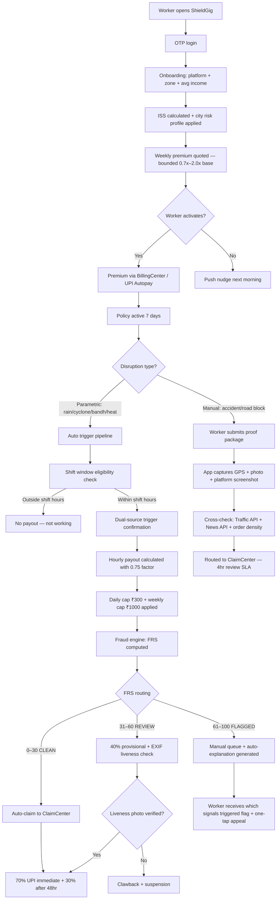

<div align="center">
  <h1>🛡️ ShieldGig</h1>
  <h3>Real-Time Income Protection Engine for India's Gig Delivery Workers</h3>

  <a href="https://drive.google.com/your-link-here">
    
  </a>
  <a href="https://figma.com/your-link-here">
    
  </a>
  <br><br>
  <strong>🏆 Guidewire DEVTrails 2026 — Phase 1 Submission</strong><br>
  <strong>👥 Team:</strong> [Team Name] &nbsp;|&nbsp; <strong>🎯 Persona:</strong> Food Delivery Partners (Zomato / Swiggy)
</div>

---

> *"When it rains heavily, I can't deliver. When there's a curfew, I can't deliver. When the app crashes, I can't deliver. Those days, I earn zero rupees — but my rent doesn't know that."*
> — **Ravi, 26, Zomato delivery partner, Chennai**

---

## ⚡ How ShieldGig Works — 15-Second View

```
1. Rain detected in Ravi's zone  →  IMD + OpenWeatherMap confirm threshold
2. Shift window check passes     →  disruption falls within Ravi's working hours
3. Fraud check in < 2 seconds   →  FRS score computed across 6 signal layers
4. ₹225 credited immediately    →  ₹100/hr × 3 hrs × 0.75 coverage factor
```

No forms. No adjusters. No claim ever filed by the worker — for weather events.

---

## 🔴 The Problem

India has **7.7 million** gig delivery workers earning ₹4,000–₹6,000 per week with no paid leave, no sick days, and no safety net. Chennai alone sees **~80 rain days per year.** On a heavy rain day, a rider loses ₹400–₹600. Cyclone Michaung wiped out 3–4 days of income per worker with no recourse.

Every existing insurance product covers accidents, hospitalization, and death — events that happen rarely. Not one covers the income disruption that happens 80+ days a year.

ShieldGig fixes the right problem.

---

## 💡 What ShieldGig Is

ShieldGig is **not an insurance company.** It is an **underwriting intelligence engine** that enables licensed insurers to profitably serve gig workers — a segment traditional insurance has never been able to reach.

---

## 🏢 Insurance Partner Model

| Role | Entity |
|---|---|
| **Risk Underwriter** | Licensed insurer — ICICI Lombard / HDFC ERGO |
| **Trigger + Intelligence Engine** | ShieldGig |
| **Policy Administration** | Guidewire PolicyCenter API |
| **Claims Automation** | Guidewire ClaimCenter API |
| **Premium Billing** | Guidewire BillingCenter API |
| **Distribution** | Zomato / Swiggy platform integration |

---

## ⚙️ Guidewire Integration

### PolicyCenter
- Weekly policy creation every Monday via PolicyCenter API
- ISS score + city risk profile passed as risk attributes for premium computation
- Policy status synced back to ShieldGig in real time

### ClaimCenter
- On parametric trigger: ShieldGig pushes a structured, pre-validated claim payload
- Fraud Risk Score attached — ClaimCenter routes CLEAN to auto-approval, FLAGGED to human queue
- On manual claim: worker-submitted proof package routed directly to ClaimCenter review queue
- Zero-touch for weather/bandh events. Structured review for manual claim types.

### BillingCenter
- Weekly premium deduction via BillingCenter direct debit scheduling
- Payout disbursement coordinated through BillingCenter's payment gateway
- Worker wallet reconciliation synced weekly

### Guidewire Marketplace
- ShieldGig packaged as a Marketplace integration — any insurer on PolicyCenter/ClaimCenter can onboard ShieldGig's parametric trigger engine as a configurable product extension

---

## 📊 Parametric Logic — Core Principle

ShieldGig does **not** calculate actual income loss. No investigation needed for automated triggers.

- A measurable disruption index is monitored in real time
- When it crosses a threshold AND falls within the worker's shift window → payout fires
- Payout = `avg_hourly_earnings × disruption_hours × 0.75`

```
Example:
  Ravi's 30-day avg earnings: ₹750/day ÷ 10 active hours = ₹75/hr
  Heavy rain confirmed: 3 hours above 64.5mm threshold
  Shift window check: disruption falls within 10 AM–10 PM  →  PASS

  Payout = ₹75 × 3 × 0.75 = ₹168.75  →  auto-disbursed to UPI
```

**Why 0.75 and not 1.0 — Basis Risk:**
Parametric insurance by design does not perfectly match individual loss. A worker who had planned to take the day off but still had a policy active receives 75% of their average hourly earnings — a small windfall. This is basis risk, and it is intentional. The 0.75 factor prices this leakage in. Attempting to verify individual intent defeats the zero-touch model. The loss ratio target (< 0.70) accounts for this.

---

## 👤 Persona & Scenarios

### Primary Persona: Ravi, Zomato Food Delivery Partner (Chennai)

| Attribute | Value |
|---|---|
| Platform | Zomato (primary), Swiggy (secondary) |
| Weekly Earnings | ₹5,200 (~₹750/day, ~₹75/hr over 10-hr shift) |
| Shift Window | 10 AM – 10 PM derived from 30-day activity history |
| Peak Slots | Lunch 12–3:30 PM · Dinner 7–11:30 PM |
| Device | Android ~₹10,000 budget phone |
| Annual exposure | ~80 rain days · loses ₹400–₹600/heavy rain day |

---

### 📊 Real Scenario Simulation — Chennai, November Rain

```
Date:         November 12, 2025
Location:     Adyar, Chennai
IMD data:     72mm rainfall — threshold crossed for 3 hours
Shift window: Disruption 11 AM–2 PM falls within Ravi's 10 AM–10 PM  →  PASS

Calculation:
  avg_hourly_earnings = ₹75/hr  (30-day rolling)
  disruption_hours    = 3
  coverage_factor     = 0.75
  Payout              = ₹75 × 3 × 0.75 = ₹168.75

Timeline:
  11:00 AM  →  IMD threshold crossed in Adyar
  11:02 AM  →  Shift window check: PASS
  11:02 AM  →  Fraud engine: FRS = 14/100  →  CLEAN
  11:02 AM  →  Claim pushed to Guidewire ClaimCenter
  11:04 AM  →  ₹118.13 (70%) credited to Ravi's UPI
  48 hrs    →  ₹50.62  (30%) released after review window

Total: ₹168.75.  Premium paid: ₹49.  Net benefit: ₹119.75.
```

### Scenario B — Bandh / Strike (Automated)

```
NLP scraper detects: "Chennai bandh in zones 4, 7, 11"  →  confidence 0.82
Platform API: Zomato OFFLINE in zones 4, 7, 11  →  dual confirmation PASS
Shift window: bandh falls within workers' logged shift hours  →  PASS

Workers on Standard Shield:
  →  Payout = avg_hourly_earnings × disruption_hours × 0.75
  →  Auto-claim pushed to ClaimCenter
  →  Zero worker action required
```

### Scenario C — Traffic Accident Blocking Zone (Manual Claim)

```
A major road accident blocks Ravi's primary delivery corridor for 2 hours.
No parametric trigger exists for this event type.

Ravi taps "Report Disruption" in the app.

What ShieldGig requires from Ravi:
  1. GPS location screenshot showing his position at time of disruption
  2. One photo or video showing the blocked road / accident scene
     (timestamped by the app at capture — EXIF data verified)
  3. Platform earnings screenshot showing zero orders in that 2-hour window

What ShieldGig cross-checks automatically:
  →  Google Maps Traffic API — was speed < 5 km/h in that corridor?
  →  News API — any accident or road closure reported in that area?
  →  Platform order data — was order density in that zone unusually low?

If 2 of 3 cross-checks confirm:
  →  Claim routed to ClaimCenter as "Assisted Manual"
  →  Review SLA: 4 hours
  →  Payout = avg_hourly_earnings × blocked_hours × 0.75
  →  Worker notified via push + SMS with reason for outcome
```

### Scenario D — Platform App Outage (Automated via Order Failure Rate)

```
Zomato status page shows "operational" but orders are failing en masse.

ShieldGig detects:
  order_failure_rate = (orders_assigned − orders_completed) / orders_assigned
  Zone failure rate  = 78%  →  threshold 60% crossed

Platform status API says UP. Order failure rate says DOWN.
Order failure rate wins — it reflects ground reality.

Workers on Standard Shield in affected zones:
  →  Shift window check applied
  →  Payout = avg_hourly_earnings × outage_hours × 0.75
  →  Auto-claim pushed to ClaimCenter
```

---

## 🔄 End-to-End Workflow



---

## 💰 Weekly Premium Model

### Dynamic Premium Formula

```
Weekly Premium = Base Rate × ISS Multiplier × City Risk Profile × Forecast Multiplier

Hard bounds: min(0.7x base rate) and max(2.0x base rate)
No worker ever pays less than 70% or more than 200% of their tier base rate
regardless of how extreme their risk score or forecast is.
```

**ISS Multiplier:**
```
ISS 80–100  →  0.85x
ISS 50–79   →  1.00x
ISS 30–49   →  1.25x
ISS 0–29    →  1.50x
```

**Sunday Night Forecast Repricing:**
Every Sunday 11 PM the system recalculates next week's premium from the 7-day IMD forecast. Cyclone in forecast = premium rises. Clear week = premium falls. Adjustment capped at ±40% from base. Final premium then bounded by the 0.7x–2.0x hard limits.

**Examples:**
- Velachery worker, July peak monsoon, ISS 55 → ₹79 (near 2x cap, bounded)
- Anna Nagar worker, January dry season, ISS 82 → ₹29 (0.7x floor applied)
- Adyar worker, standard week, ISS 68 → ₹49 (standard)

### Plan Tiers

| Plan | Base Weekly Premium | Triggers Covered | Hourly Rate |
|---|---|---|---|
| **Basic Shield** | ₹29 | Heavy Rain | ₹75/hr × 0.75 |
| **Standard Shield** | ₹49 | Rain + Platform Downtime + Bandh | ₹100/hr × 0.75 |
| **Full Shield** | ₹79 | Rain + Platform + Bandh + Heat + Pollution + Manual | ₹100/hr × 0.75 |
| **Elite Shield** | ₹109 | All triggers + Cyclone + Manual | ₹150/hr × 0.75 (cyclone) |

> Scope enforced strictly: Income loss only. Health, accident, vehicle repair, and life coverage permanently excluded.

---

## ⚡ Claim Types — Automated vs Manual

### Automated Parametric (zero worker action)

| Trigger | Source | Fallback | Threshold | Shift Window Required |
|---|---|---|---|---|
| Heavy Rain | IMD station | OpenWeatherMap | ≥ 64.5 mm/day | Yes |
| Extreme Rain | IMD | Satellite | ≥ 115.6 mm/day | Yes |
| Platform Downtime | Order failure rate > 60% | Status API | > 3 hrs in zone | Yes |
| Bandh / Strike | NLP scraper + LLM parse | — | Confidence ≥ 0.6 + platform offline | Yes |
| VVIP Gridlock | Traffic API | Rider GPS polygon | Speed < 5 km/h, 45 min | Yes |
| Severe Heat | IMD | OpenWeatherMap | ≥ 43°C, 2+ hrs | Yes |
| Severe Pollution | AQICN | State PCB | AQI ≥ 200 | Yes |
| Cyclone | IMD Red Alert | NDMA advisory | Official alert issued | Yes |

### Manual Claims (worker submits proof)

These events are real income disruptions but cannot be measured by a single external API. Worker submits a structured proof package via the app. ShieldGig cross-checks automatically and routes to ClaimCenter for a 4-hour review.

| Event Type | What Worker Submits | What ShieldGig Cross-Checks | SLA |
|---|---|---|---|
| Road accident blocking zone | GPS location + timestamped photo of blockage + zero-order earnings screenshot | Google Maps speed data + News API for accident reports + zone order density drop | 4 hrs |
| App/GPS crash during shift | Screen recording or screenshot of error + platform support ticket number | Platform API for reported incidents + device error log hash | 4 hrs |
| Police/local authority road closure | Photo of barricade + officer notice if available | Traffic API + News API + IMD/NDMA for any related event | 4 hrs |
| Flash mob / unannounced event | Photo/video of crowd blocking access + zone GPS timestamp | News API + social signal scraper + zone order density | 6 hrs |

**Payout formula for manual claims** is identical to automated:
`avg_hourly_earnings × verified_disruption_hours × 0.75`

The difference is human-in-the-loop verification replaces the automated trigger. Payout value is the same.

---

## 🔒 Shift Window Eligibility Check

A claim only fires if the disruption falls within the worker's established working hours. Derived from their 30-day delivery activity history — not self-declared.

```python
def shift_window_check(worker, disruption_start, disruption_end):
    # Worker's typical shift window inferred from 30-day GPS + order history
    typical_start = worker.activity_graph.median_start_hour  # e.g. 10
    typical_end   = worker.activity_graph.median_end_hour    # e.g. 22

    disruption_overlap_hours = calculate_overlap(
        disruption_start, disruption_end,
        typical_start, typical_end
    )

    if disruption_overlap_hours == 0:
        return False, 0   # Disruption outside shift window — no payout

    return True, disruption_overlap_hours  # Pay for overlapping hours only
```

**Why this matters:**
- Rain at 2 AM does not trigger a payout for a worker who sleeps at 2 AM
- Reduces basis risk (workers who planned days off can't claim full events)
- Reduces fraud surface (spoofing a flood at 3 AM when you'd never be working anyway is now worthless)
- New workers (< 2 weeks) default to a conservative 9 AM–9 PM window until history builds

---

## 💧 Liquidity Protection Caps

```
Per disruption hour  →  ₹75–₹150 × 0.75 coverage factor
Daily cap            →  ₹300/day regardless of hours or trigger count
Weekly cap           →  ₹1,000/week hard ceiling per worker
Pool reserve         →  25% of weekly premium pool held back
                        Released only if claims exceed 70% of pool
Loss ratio target    →  < 0.70
```

Maximum weekly liability per worker is known before the week starts — not discovered after a disaster.

---

## 🤖 AI/ML — Five Models

### Model 1: Income Stability Score (ISS)

Scores every worker 0–100 at onboarding. Determines premium multiplier.

**Real datasets used:**
- IMD District Rainfall 2015–2024 — imdpune.gov.in — zone-level heavy rain probability per pin-code
- PLFS Gig Worker Earnings 2023 — mospi.gov.in — real earnings distributions for premium calibration
- data.gov.in Pincode Directory — maps worker pin-code to IMD district zone risk score

**Phase 1 — Rule engine:**
```python
def calculate_iss(zone_flood_risk, avg_daily_income,
                  disruption_freq_12mo, claims_history_penalty):
    score = 100
    score -= zone_flood_risk * 20
    score -= min(disruption_freq_12mo, 15)
    score += min(avg_daily_income / 200, 10)
    score -= claims_history_penalty
    return max(0, min(100, score))
```

**Phase 2:** XGBoost. Adopted only when precision exceeds rule engine baseline by > 5% on holdout set.

---

### Model 2: Sunday Night Premium Repricing

Fetches 7-day IMD forecast every Sunday 11 PM. Recalculates premium before the disruption, not after. Final premium bounded by 0.7x–2.0x hard limits regardless of forecast risk.

---

### Model 3: Fraud Detection Engine (FRS 0–100)

**Real datasets used:**
- Kaggle Auto Insurance Claims — 15,000+ labeled fraud/non-fraud claims for supervised baseline
- Live GPS + OpenCelliD cell tower signals — real-time location authenticity
- Worker behavioral history — internal DB — delivery heatmaps, shift windows, claim history

**Six signal layers:**

**Layer 1 — Location Authenticity**

| Signal | What It Detects |
|---|---|
| Cell tower triangulation (OpenCelliD) | Physical location independent of GPS |
| IP geolocation (MaxMind) | Home broadband vs mobile data in field; VPN/proxy detection |
| Wi-Fi SSID fingerprint | Home Wi-Fi present during claimed outdoor disruption |
| GPS jitter analysis | Spoofed GPS has statistically perfect coordinates — real GPS micro-drifts naturally over a 5-minute window |

A spoofer at home shows: perfect GPS coordinates (zero variance) + home SSID + home broadband IP + no jitter. Four contradictions in one claim.

**Layer 2 — Shift Window Behavioral Baseline**
Claim checked against Personal Activity Graph. Zone never previously worked in = heavy FRS penalty.

**Layer 3 — Claim Initiation Latency**
Claims filed < 30 seconds after a trigger fires are flagged. Genuine workers don't have push-to-claim reflexes. Syndicate members watching a Telegram channel do.

**Layer 4 — Coordinated Ring Detection**
```
If N workers claim the same grid cell within 15 minutes
AND onboarding dates / device subnets / referral chains are correlated:
  →  Entire cluster flagged
  →  Isolation Forest: anomaly score > 3σ from historical claim velocity
  →  Poisson distribution test on claim timing:
       Real disruptions = gradual filing over 20–40 min
       Coordinated rings = uniform firing within seconds
       Uniform distribution at p < 0.05 = ring signal confirmed
```

**Layer 5 — Weather Cross-Verification**
At least one IMD station within 5km must independently confirm the trigger. No corroborating ground station = flagged.

**Layer 6 — Worker Trust Score** *(backend only — not visible in UI)*
Workers with 8+ weeks of clean claim history receive a Trust Score that reduces their effective FRS by up to 15 points. Long-tenure honest workers are actively protected from false positives without knowing the mechanism exists.

**FRS routing:**
```
0–30   CLEAN    →  auto-approve via ClaimCenter
31–60  REVIEW   →  40% provisional payout + EXIF liveness check
61–100 FLAGGED  →  manual review queue + auto-explanation generated
```

---

### Model 4: NLP Disruption Scraper + LLM Preprocessing

**Phase 1 — spaCy keyword scoring:**
Polls news feeds every 15 min for bandh/strike/curfew terms. Scores confidence per article. Requires platform API to confirm deliveries offline before trigger fires.

**Phase 2 — LLM preprocessing layer:**
An LLM (lightweight, restricted role) converts unstructured IMD bulletins, government advisories, and local incident reports into structured JSON signal objects consumed by the deterministic rule engine. The LLM touches preprocessing only — it never participates in the YES/NO payout decision. Every payout decision is deterministic, auditable, and explainable to regulators.

```
Unstructured input:
  "IMD issues orange alert for heavy to very heavy rainfall in Chennai
   districts on November 12–13 due to low pressure system in Bay of Bengal"

LLM output (structured JSON):
  {
    "alert_type": "heavy_rainfall",
    "severity": "orange",
    "zones": ["Chennai"],
    "start_date": "2025-11-12",
    "end_date": "2025-11-13",
    "source": "IMD",
    "confidence": 0.96
  }

Rule engine receives JSON → checks threshold → fires trigger or not.
```

---

### Model 5: Facebook Prophet — Disruption Forecasting *(Phase 3)*

Forecasts next 4 weeks of disruption frequency per zone and projected loss ratio. Feeds the insurer admin dashboard with forward-looking capital reservation estimates.

**Real datasets used:**
- IMD District Rainfall 2015–2024 — seasonal disruption frequency baseline
- WAQI Historical AQI — aqicn.org — pollution event frequency per city
- Internal claim + payout data accumulated from platform operation

**Why Prophet:** Built-in seasonality decomposition handles India's monsoon cycle (weeks 24–40 are structurally high-frequency) without manual feature engineering. Handles data gaps gracefully — critical for a startup with sparse early-stage data. Gives insurers accurate forward-looking loss estimates for capital reservation.

**Output:** Next 4 weeks of expected disruption events per zone + predicted loss ratio. Loss ratio target: < 0.70. If forecast exceeds 0.70, premium repricing and pool reserve alerts fire automatically.

---

## 🛡️ Adversarial Defense & Anti-Spoofing Strategy

> *Response to DEVTrails 2026 Market Crash: 500-worker syndicate used GPS-spoofing apps to drain the liquidity pool.*

### Core Principle
A real crisis leaves a consistent fingerprint across multiple independent signals. A spoofer can only fake one or two. ShieldGig exploits this asymmetry.

### What the Syndicate Cannot Fake

1. Cell tower IDs consistent with the claimed physical zone (OpenCelliD)
2. Natural GPS micro-drift — spoofed coordinates have zero statistical variance
3. Mobile data IP in field — home broadband shows up via MaxMind geolocation
4. Official IMD/NDMA advisories for the claimed crisis
5. 30-day delivery heatmap showing they operate in the claimed zone
6. Claim timing variance — rings fire uniformly; real disruptions spread over 20–40 min (Poisson test)
7. Independent onboarding paths — 500 members collapse to a small referral/device graph

### Protecting Honest Workers — EXIF Liveness + Transparent Appeals

**For borderline claims (FRS 31–60):**
```
→  40% provisional payout released immediately
→  Worker receives one-tap camera prompt
→  Live photo captured — app reads embedded GPS EXIF data
→  EXIF coordinates match claimed zone?
     YES  →  remaining 60% released instantly
     NO   →  provisional 40% clawed back, account suspended
```

**For flagged claims (FRS 61–100):**
```
→  Claim held for manual review
→  Auto-explanation generated immediately:
     "Your claim was flagged because:
      - Your device was connected to a Wi-Fi network
        not associated with your operating zone
      - GPS coordinates showed unusually low variance
        during the claimed disruption window
      You can appeal this decision."
→  One-tap appeal pathway in app
→  Human review with AI summary: 4-hour SLA
→  First-time flags: enhanced monitoring only
→  Confirmed multi-signal fraud: suspension with defined dispute process
→  No permanent blacklisting without human review
```

**Zone context override:** When IMD, NDMA, or government sources confirm a declared disaster, zone-level fraud thresholds are automatically elevated. During officially declared emergencies, the system assumes good faith and shifts burden of proof.

---

## 📈 Income Protection Dashboard

### Worker View
```
This Week
  Premium paid:      ₹49
  Payout received:   ₹168.75  (3-hr heavy rain, 0.75 factor applied)
  Net protected:     ₹119.75  ✅

  "Without ShieldGig this week, you would have lost ~₹225."

Last 4 weeks:
  Wk 1: paid ₹49  received ₹0        clear week
  Wk 2: paid ₹49  received ₹168.75   3-hr heavy rain
  Wk 3: paid ₹49  received ₹112.50   2-hr platform downtime
  Wk 4: paid ₹49  received ₹0        clear week
```

### Insurer / Admin View
- Live: active policies, premium pool, loss ratio vs 0.70 target, fraud flagged count
- 72-hour payout forecast + Prophet 4-week loss ratio projection
- Pool reserve status: current % vs 25% floor
- Fraud review queue → synced to ClaimCenter with auto-explanation summaries
- Zone risk heatmap by city-specific disruption profile
- Weekly: premium collected vs payout released (8-week trend)

---

## ⚠️ System Reliability

| Failure Mode | Handling |
|---|---|
| OpenWeatherMap unavailable | Fall back to IMD station feed |
| IMD data delayed | Last-confirmed reading + 30-min cache |
| Platform API unreachable | Order failure rate used as primary signal |
| GPS signal lost on device | Last verified location within 15-min window |
| NLP scraper fails | Trigger held; manual admin review |
| Single-source trigger only | Held for admin confirmation — no auto-payout |
| MaxMind IP API unavailable | Wi-Fi fingerprint signal weighted up; IP layer skipped |

---

## 🏗️ Platform Decision — Mobile PWA (Flutter)

Delivery workers do not use laptops. Every interaction happens on a ₹10,000 Android phone at a red light. Designed for one-thumb operation, 3-second tasks, push + SMS as primary engagement channels.

Anti-spoofing engine requires direct access to device signals — cell tower IDs, Wi-Fi SSID fingerprints, GPS jitter analysis. PWAs cannot reliably access these. Flutter provides full native sensor access plus a single codebase for both Android (worker app) and web (insurer admin dashboard).

---

## 🛠️ Tech Stack

**Frontend**

| Component | Technology |
|---|---|
| Framework | Flutter (Dart) — PWA + Web |
| State Management | Riverpod |
| Background Location | flutter_background_geolocation |
| Local Storage | Hive (offline-first) |
| Payments (mock) | Razorpay Flutter SDK — test mode |
| Notifications | Firebase Cloud Messaging + Twilio SMS fallback |

**Backend**

| Component | Technology |
|---|---|
| API Server | Node.js + Express |
| Database | Supabase (PostgreSQL + PostGIS) |
| Auth | Supabase Auth (OTP via phone) |
| Hosting | Render (free tier) |
| Trigger Polling | Node-cron (every 15 min) |
| NLP Scraper | Python + spaCy via FastAPI microservice |

**AI/ML**

| Component | Technology |
|---|---|
| ISS Scoring (Phase 1) | Python rule engine via FastAPI |
| Premium Repricing | Forecast-weighted rule engine → XGBoost Phase 2 |
| Fraud Detection | scikit-learn Isolation Forest + deterministic rule layers |
| NLP Scraper | spaCy Phase 1 → LLM preprocessing Phase 2 |
| Disruption Forecasting | Facebook Prophet — Phase 3 |

**Guidewire**

| Integration | API |
|---|---|
| Policy lifecycle | PolicyCenter REST API |
| Claim creation + routing (auto + manual) | ClaimCenter REST API |
| Premium billing + payout | BillingCenter REST API |
| Distribution packaging | Guidewire Marketplace |

**External APIs**

| API | Use | Cost |
|---|---|---|
| OpenWeatherMap | Rainfall real-time | Free (1,000 calls/day) |
| IMD Open Data | Authoritative thresholds + fallback | Free |
| AQICN / WAQI | AQI monitoring | Free token |
| MaxMind GeoIP2 | IP geolocation + VPN/proxy detection | Free tier |
| OpenCelliD | Cell tower triangulation | Free tier |
| Google Maps Traffic | Road speed for gridlock + accident cross-check | Pay-per-use |
| Brave Search + NewsAPI | Crisis event corroboration for manual claims | Free tier |
| Zomato/Swiggy | Order failure rate + platform status | Mock Phase 1 |
| Razorpay | UPI payout simulation | Test mode |

---

## 🧪 MVP Scope — Phase 1

**Proving the parametric loop. Not an enterprise system.**

Phase 1 demonstrates:
- Rain trigger via live OpenWeatherMap + IMD with shift window check
- Personalized payout using 30-day rolling avg earnings × 0.75 factor
- NLP scraper for bandh detection (mock news feed)
- Hourly payout with daily ₹300 + weekly ₹1,000 caps
- ISS scoring (rule engine) with named real datasets
- Fraud: GPS jitter + cell tower + IP geolocation + claim velocity
- EXIF liveness check flow for borderline claims
- Auto-explanation generation for flagged claims
- Manual claim submission flow (UI + proof capture)
- Order failure rate trigger for platform outage
- Guidewire ClaimCenter payload structure (auto + manual variants)
- UPI payout via Razorpay test mode

Phase 2 adds: full Flutter app · live Guidewire integration · LLM news preprocessing · city risk profiles  
Phase 3 adds: Prophet forecasting model · Isolation Forest fraud model · admin dashboard · Marketplace packaging

---

## 💸 Cost Efficiency

| Resource | Cost |
|---|---|
| OpenWeatherMap, IMD, AQICN | ₹0 |
| MaxMind GeoIP2 | ₹0 (free tier) |
| OpenCelliD | ₹0 (free tier) |
| Brave Search + NewsAPI | ₹0 (free tiers) |
| Supabase + Render | ₹0 (free tiers) |
| Razorpay test mode | ₹0 |

**Total infrastructure: ₹0/month.**

---

## 📅 6-Week Plan

### ✅ Phase 1 (Weeks 1–2) — Current
- [x] Shift window eligibility architecture
- [x] Personalized payout formula with 0.75 coverage factor
- [x] Hourly payout + daily/weekly caps
- [x] GPS jitter + IP geolocation fraud layers
- [x] Poisson distribution ring detection
- [x] NLP scraper + LLM preprocessing architecture
- [x] Named real datasets identified for all models
- [x] Manual claim types designed with proof requirements
- [x] Platform outage via order failure rate
- [x] Transparent appeals + auto-explanation system
- [x] Premium bounds (0.7x–2.0x)
- [x] Worker Trust Score (backend design)
- [x] Prophet forecasting plan (Phase 3)
- [x] City risk profiles designed
- [x] Guidewire integration mapped
- [ ] Flutter scaffold + Supabase schema
- [ ] ISS rule engine (Python)
- [ ] Phase 1 demo video

### Phase 2 (Weeks 3–4) — Automation & Protection
- [ ] Full Flutter app — all 5 screens + manual claim flow
- [ ] Weather + NLP trigger cron live
- [ ] Order failure rate trigger for platform outage
- [ ] MaxMind + OpenCelliD integration
- [ ] GPS jitter analysis in fraud engine
- [ ] EXIF liveness check flow
- [ ] Auto-explanation generation for rejections
- [ ] Live ClaimCenter/PolicyCenter integration
- [ ] City risk profiles: Chennai + Mumbai + Bengaluru + Kolkata

### Phase 3 (Weeks 5–6) — Scale & Optimise
- [ ] Isolation Forest fraud model + Poisson timing test
- [ ] LLM news preprocessing pipeline
- [ ] Facebook Prophet forecasting model
- [ ] Insurer admin dashboard + Prophet projections
- [ ] Pool reserve monitor
- [ ] Worker Trust Score accumulation logic
- [ ] Guidewire Marketplace packaging
- [ ] Final 5-min demo video

---

## 📊 Business Viability

| Metric | Value |
|---|---|
| Target workers — Chennai pilot | 10,000 |
| Average weekly premium | ₹49 |
| Weekly premium pool | ₹4,90,000 |
| Pool reserve (25%) | ₹1,22,500 held |
| Loss ratio target | < 0.70 |
| Estimated real loss ratio (capped + 0.75 factor) | ~45–55% |
| Traditional claims processing cost | ₹1,000–₹3,000/claim |
| ShieldGig automated claims cost | ₹0 |
| ShieldGig manual claims cost | ~₹200 (4-hr human review allocation) |

---

## 🤝 IRDAI Compliance

- Technology partner model — not a licensed insurer
- Policy under partner insurer's IRDAI license
- Triggers rely on IMD — IRDAI-recognized data source
- Payout terms transparent at activation (parametric requirement)
- Microinsurance compliant: ₹29–₹109/week, simplified format
- Within IRDAI Regulatory Sandbox guidelines for parametric products (2019)

---

## 👥 Team

| Member | Role |
|---|---|
| [Name 1] | Flutter Development |
| [Name 2] | Backend / API + Guidewire Integration |
| [Name 3] | AI/ML + Fraud Engine + NLP + Prophet |
| [Name 4] | UI/UX Design |
| [Name 5] | Insurance Domain + City Risk Profiles + Pitch |

---

## 🎬 Phase 1 Deliverables

<div align="center">
  <a href="https://drive.google.com/your-link-here">
    
  </a>
  &nbsp;&nbsp;
  <a href="https://figma.com/your-link-here">
    
  </a>
</div>

---

*ShieldGig — Real-time income protection for the workers who keep our cities fed.*
