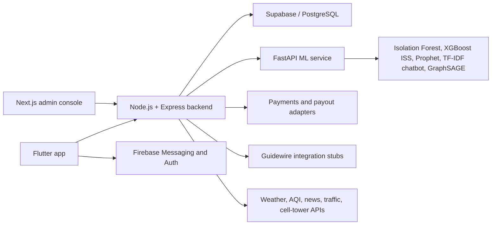
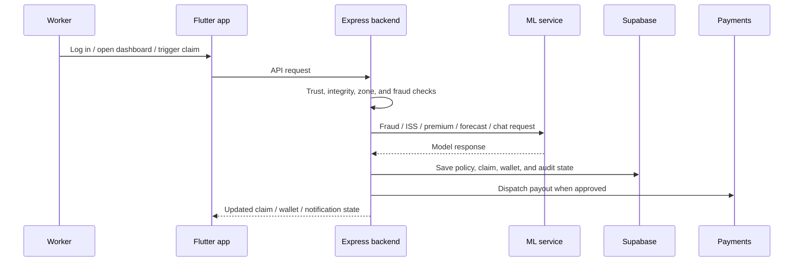

# Hustlr

Hustlr is a parametric micro-insurance platform for gig and delivery workers. The codebase combines a Flutter client, an Express backend, Python ML services, and a Next.js admin console to detect disruptions, score fraud risk, calculate pricing, and dispatch payouts with minimal manual handling.

## Project Overview

The core problem is income loss when workers cannot deliver because of weather, outages, traffic, platform downtime, or other zone-level disruptions. Hustlr responds by monitoring real-world signals, validating them with trust and fraud checks, and triggering policy, claim, wallet, and payout workflows automatically.

In simple terms: worker activity and zone conditions go in, backend rules and ML models process them, and the app shows coverage, claims, and payouts back to the user.

## Architecture

The supplied architecture diagram belongs in this section, before the workflow details below. The Mermaid flow mirrors the same system layout and keeps the README readable even when the image is not available as a workspace file.





## Tech Stack

| Area | Technologies used in code |
|---|---|
| Mobile app | Flutter, Dart, `flutter_bloc`, `provider`, `go_router` |
| Local state and storage | Hive, SharedPreferences |
| Maps, location, media | Google Maps, Geolocator, camera, image_picker, permission_handler |
| Notifications and auth | Firebase Core, Firebase Messaging, Firebase Auth, local_auth |
| UI and charts | `fl_chart`, Google Fonts, PDF/printing, webview_flutter |
| Payments | Razorpay Flutter SDK |
| Backend | Node.js, Express, Axios, CORS, dotenv, node-cron, h3-js |
| Database | Supabase, PostgreSQL |
| ML service | FastAPI, Uvicorn, scikit-learn, XGBoost, Prophet, PyTorch, torch-geometric, pandas, NumPy, SciPy |
| Admin console | Next.js, React, TypeScript, deck.gl, H3, Lucide icons |

## Key Features

- OTP-based app entry with Firebase Auth.
- Persistent app state with Hive and local session restoration.
- Supabase-backed worker, policy, claim, and wallet data.
- Disruption monitoring from weather, AQI, traffic, news, and zone-depth services.
- Fraud scoring through an Isolation Forest model plus statistical ring checks.
- Optional Graph Neural Network ring detection behind a feature flag.
- ISS scoring and premium calculation via the ML service.
- Automated claim and payout flows with fallback logic when a service is offline.
- Guidewire payload builders for ClaimCenter, PolicyCenter, and BillingCenter style integrations.
- Admin console views for fraud queue, policies, payouts, pool health, stress testing, and an H3 risk map.

## AI / ML Components

### 1. Fraud anomaly detection

Model type: Isolation Forest.

Input: a feature vector for a claim event, including zone mismatch, GPS jitter, accelerometer match, onboarding age, zone depth, and ISS score.

Output: anomaly score, anomalous flag, top feature names, and Poisson timing p-value.

```python
feature_order = [
    "gps_zone_mismatch", "wifi_home_ssid", "battery_charging", "accelerometer_idle",
    "platform_app_inactive", "ip_home_match", "claim_latency_under30s", "gps_jitter_perfect",
    "barometer_mismatch", "hw_fingerprint_match", "app_install_cluster", "days_since_onboard",
    "referral_depth", "claim_hour_sin", "claim_hour_cos", "city_behavioral_risk",
    "zone_depth_score", "has_real_disruption", "simultaneous_zone_claims", "iss_score"
]

X = np.array([[features[col] for col in feature_order]], dtype=float)
raw = model.decision_function(X)[0]
anomaly_score = float(1.0 - (1.0 / (1.0 + np.exp(-raw * 4.0))))
```

### 2. Statistical ring detection

Model type: Poisson inter-arrival test plus DBSCAN geographic clustering.

Input: a batch of claim timestamps and GPS coordinates.

Output: ring verdict, cluster counts, cluster radius, and a recommended action.

```python
timestamps = [c.timestamp for c in req.claims]
gps_coords = [(c.gps_lat, c.gps_lng) for c in req.claims]

poisson_result = test_poisson_arrivals(timestamps)
dbscan_result  = detect_gps_clusters(gps_coords)
action         = combined_ring_verdict(poisson_result, dbscan_result)
```

### 3. ISS scoring

Model type: XGBoost, with a rule-engine fallback.

Input: zone flood risk, average daily income, 12-month disruption frequency, platform tenure, and city.

Output: ISS score, tier, recommendation, and a small breakdown payload.

### 4. Premium pricing

Model type: deterministic pricing logic in the ML service.

Input: plan tier, zone, ISS score, and previous premium.

Output: base premium, zone adjustment, final premium, and a pricing note.

### 5. Disruption forecasting

Model type: Prophet.

Input: a zone ID and horizon in days.

Output: forecast rows with predicted demand, disruption probability, and trigger type.

### 6. Support chatbot

Model type: TF-IDF vectorizer + Logistic Regression classifier.

Input: a short user message.

Output: predicted intent, canned response, and confidence.

### 7. Fraud ring GNN

Model type: GraphSAGE.

Input: worker graph nodes and edges built from shared devices, UPI IDs, zone clustering, and registration bursts.

Output: fraud probability per node and detected ring groups.

## Architecture / Workflow

1. The Flutter app starts, opens Hive, restores local session state, initializes optional Supabase, then configures Firebase messaging and notifications.
2. The user authenticates with OTP and enters the main app flow.
3. The app calls the Express backend for worker data, policies, claims, wallets, disruptions, integrity, and demo controls.
4. The backend gathers and normalizes disruption signals, then asks the ML service for fraud, ISS, pricing, forecast, or chatbot responses when needed.
5. Supabase stores the canonical state for users, policies, claims, and wallets.
6. Approved events flow to payout adapters and notification services, while the admin console watches queues and system health.

## Installation & Setup

### 1. Clone and install root tooling

```bash
npm install
```

### 2. Start the backend and ML service together

```bash
npm run dev:stack
```

This runs the Node backend on port 3000 and the Python ML service on port 8000.

### 3. Install Flutter dependencies

```bash
cd Dhruvv-Hustlr
flutter pub get
```

### 4. Run the Flutter app

```bash
flutter run -d chrome --dart-define=HUSTLR_API_BASE=http://127.0.0.1:3000 --dart-define=HUSTLR_ML_BASE=http://127.0.0.1:8000
```

### 5. Run the admin console

```bash
cd hustlr-admin
npm install
npm run dev
```

## Usage

### Backend

```bash
cd hustlr-backend
npm run dev
```

Health checks:

```bash
curl http://127.0.0.1:3000/health
curl http://127.0.0.1:3000/health/services
```

### ML service

```bash
cd hustlr-ml
pip install -r requirements.txt
uvicorn main:app --host 0.0.0.0 --port 8000
```

Example endpoints:

```bash
curl http://127.0.0.1:8000/fraud/model-health
curl http://127.0.0.1:8000/forecast/adyar?days=7
```

### Flutter app

The app reads these runtime defines when supplied:

```bash
flutter run --dart-define=SUPABASE_URL=... --dart-define=SUPABASE_ANON_KEY=...
```

## Code Snippets

### Backend bootstrap

```js
app.use('/auth', authRoutes);
app.use('/workers', workerRoutes);
app.use('/policies', requireSession, policyRoutes);
app.use('/claims', requireSession, claimsRoutes);
app.use('/wallet', requireSession, walletRoutes);
app.use('/payments', requireSession, paymentRoutes);
app.use('/disruptions', disruptionRoutes);
app.use('/guidewire', guidewireRoutes);
app.use('/cities', citiesRoutes);
app.use('/integrity', requireSession, integrityRoutes);
app.use('/ml', mlRoutes);
app.use('/demo', demoRoutes);
```

This is the main route map for the backend API surface.

### Backend health endpoint

```js
app.get('/health', (req, res) => {
  res.json({
    status: 'ok',
    service: 'hustlr-backend',
    timestamp: new Date().toISOString(),
    uptime_seconds: Math.floor(process.uptime()),
  });
});
```

This is the simplest runtime check the Flutter app can ping.

### Flutter app bootstrap

```dart
await Hive.initFlutter();
final appBox = await Hive.openBox('appData');

await StorageService.init();
await ApiService.instance.restoreSessionTokenFromStorage();

if (hasSupabaseConfig) {
  await Supabase.initialize(url: supabaseUrl, anonKey: supabaseAnonKey);
}
```

This sets up local storage and optional Supabase before the app UI starts.

### ML bundle loading

```python
iso_path = MODELS_DIR / "model3_isolation_forest.pkl"
if iso_path.exists():
    _MODEL_BUNDLE = {
        "model": joblib.load(iso_path),
        "scaler": joblib.load(MODELS_DIR / "model3_scaler.pkl"),
    }
else:
    _MODEL_BUNDLE = load_model()
```

The ML service loads trained artifacts once at startup and falls back when needed.

### Fraud scoring endpoint

```python
features = req.feature_vector.to_model_features()
X = np.array([[features[col] for col in feature_order]], dtype=float)

raw = model.decision_function(X)[0]
anomaly_score = float(1.0 - (1.0 / (1.0 + np.exp(-raw * 4.0))))
```

This converts the claim event into the score consumed by the backend fraud layer.

### Guidewire payload builder

```js
return {
  integration: 'guidewire_claim_center_stub',
  version: '1.0',
  claim: {
    external_id: claim.id,
    loss_type: claim.trigger_type,
    severity: claim.severity,
    amounts: {
      gross_payout_paise: claim.gross_payout,
      tranche1_paise: claim.tranche1,
      tranche2_paise: claim.tranche2,
    },
  },
};
```

This is the shape used for ClaimCenter-style integrations.

### Chatbot training

```python
vectorizer = TfidfVectorizer(ngram_range=(1, 2))
X = vectorizer.fit_transform(df['text'])
y = df['intent']

model = LogisticRegression(random_state=42, class_weight='balanced')
model.fit(X, y)
```

The support bot is a compact classifier, not an LLM.

### Forecast generation

```python
model = load_zone_model(zone_id)
future = model.make_future_dataframe(periods=days, freq='D')
forecast = model.predict(future)
```

The forecast service produces the disruption projections used by the backend.

## Configuration

The code uses several runtime values and feature flags. The most important ones are below.

| Category | Examples |
|---|---|
| Backend core | `PORT`, `CORS_ORIGIN`, `SUPABASE_URL`, `SUPABASE_SERVICE_KEY`, `ML_SERVICE_URL` |
| Mobile runtime | `SUPABASE_ANON_KEY`, `HUSTLR_API_BASE`, `HUSTLR_API_PROD`, `HUSTLR_ML_BASE` |
| Payments | `RAZORPAY_KEY_ID`, `PAYPAL_CLIENT_ID`, `PAYPAL_CLIENT_SECRET`, `STRIPE_PUBLISHABLE_KEY` |
| External data | `OWM_API_KEY`, `AQICN_API_KEY`, `NEWSAPI_KEY`, `BRAVE_SEARCH_KEY`, `OPENROUTE_API_KEY` |
| Integrity and auth | `PLAY_INTEGRITY_BYPASS_DEV`, `PLAY_INTEGRITY_SIMULATED`, `PLAY_INTEGRITY_SERVICE_ACCOUNT_JSON`, `GOOGLE_APPLICATION_CREDENTIALS` |
| Optional integrations | `GUIDEWIRE_WEBHOOK_URL`, `GUIDEWIRE_WEBHOOK_SECRET`, `FIREBASE_SERVER_KEY`, `MAXMIND_ACCOUNT_ID`, `MAXMIND_LICENSE_KEY` |
| Feature flags | `ENABLE_GUIDEWIRE_ROUTES`, `ENABLE_GNN_FRAUD`, `DISABLE_DISRUPTION_CRON`, `DISABLE_REGIONAL_WEEKLY_CRON` |

Some values are required only when the corresponding integration is enabled. If a value is missing, the code usually falls back to a mock, stub, or degraded mode.

## Limitations & Future Improvements

- The chatbot is a lightweight intent classifier, not a generative LLM.
- GNN fraud ring detection is optional and disabled unless `ENABLE_GNN_FRAUD=true` and the model file exists.
- Several payment and Guidewire paths are stubs or sandbox-style adapters unless real credentials are provided.
- Some backend services fall back to cached, mock, or deterministic logic when external APIs are unavailable.
- The README can reference the supplied architecture diagram most cleanly in the Architecture section, but the image itself is not present as a workspace file.
- A good next step would be a committed `.env.example` that groups all required variables by service.

## See Also

- [Admin console README](hustlr-admin/README.md)
- [Database migration guide](database/README.md)
- [Fraud ML notes](hustlr-ml/README_fraud_model.md)
- [Prophet forecasting notes](hustlr-ml/prophet_service/README_prophet.md)
