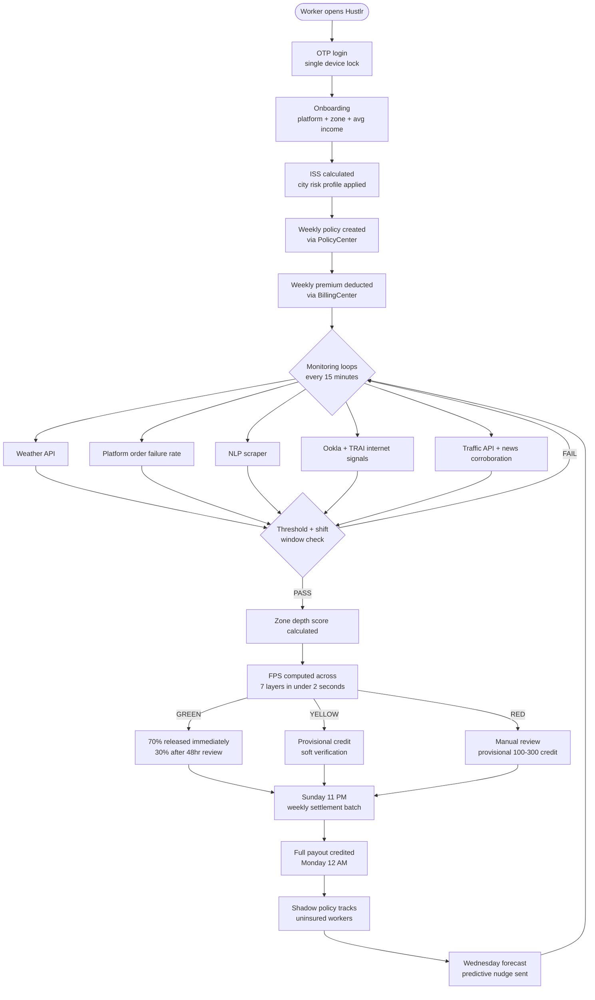
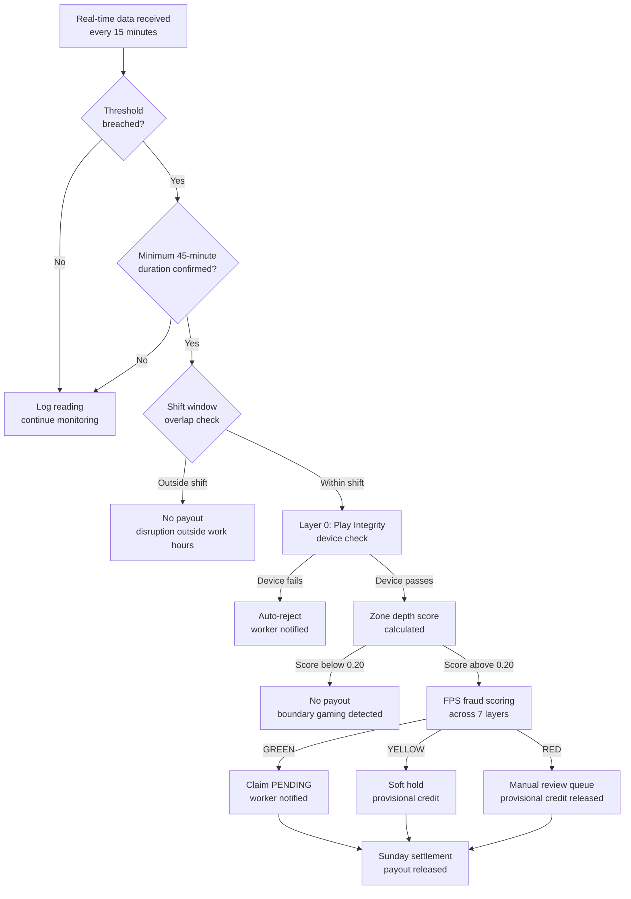
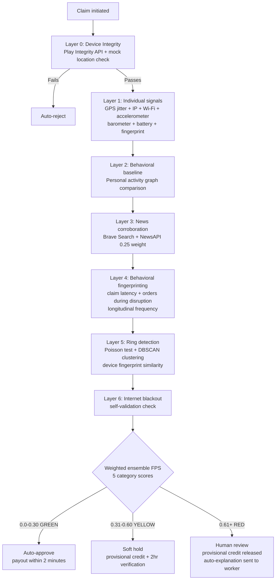

<div align="center">
  <h1>âš¡ Hustlr</h1>
  <h3>Real-Time Income Protection Engine for India's Gig Delivery Workers</h3>

  <a href="https://youtu.be/nD2snI4Tnu8?si=eS5sztT0aibvxodI">
    
  </a>
  &nbsp;
  <a href="https://github.com/Dhruvv-16/Hustlr">
    
  </a>
  &nbsp;
  <a href="https://hustlr-ad32.onrender.com/health">
    
  </a>
  <br><br>
  <strong>🏆 Guidewire DEVTrails 2026 — Phase 2 Submission</strong><br>
  <strong>👥 Team:</strong> Code Crafters &nbsp;|&nbsp; <strong>🎯 Persona:</strong> Q-Commerce Delivery Partners (Zepto)
</div>

---

## 📋 Table of Contents

1. [Why We Built This](#-why-we-built-this)
2. [TL;DR](#-tldr)
3. [Worker Research — The Five Riders](#-worker-research--the-five-riders)
4. [The Problem](#-the-problem)
5. [What Hustlr Is](#-what-hustlr-is)
6. [Chosen Persona: Q-Commerce Delivery Partner](#-chosen-persona-q-commerce-delivery-partner)
7. [How Hustlr Works — 15-Second View](#-how-hustlr-works--15-second-view)
8. [What Hustlr Covers](#-what-hustlr-covers)
9. [Insurance Partner Model](#-insurance-partner-model)
10. [Guidewire Integration](#️-guidewire-integration)
11. [Parametric Logic — Core Principle](#-parametric-logic--core-principle)
12. [Trigger Parameters](#-trigger-parameters)
13. [Compound Triggers — Full Shield](#-compound-triggers--full-shield)
14. [Anti-Gaming Rules](#-anti-gaming-rules)
15. [Manual Claim Filing — UX Flow](#-manual-claim-filing--ux-flow)
16. [Internet Zone Blackout — Trigger Architecture](#-internet-zone-blackout--trigger-architecture)
17. [Accident Blockspot — Trigger Architecture](#-accident-blockspot--trigger-architecture)
18. [Heavy Traffic Congestion — Trigger Architecture](#-heavy-traffic-congestion--trigger-architecture)
19. [Real Scenario Simulations](#-real-scenario-simulations)
20. [Adversarial Defense & Anti-Spoofing Strategy](#️-adversarial-defense--anti-spoofing-strategy)
21. [Zone Depth Scoring — Anti-Boundary Gaming](#-zone-depth-scoring--anti-boundary-gaming)
22. [AI/ML Architecture](#-aiml-architecture)
23. [Regional Behavioral Intelligence Layer](#-regional-behavioral-intelligence-layer)
24. [Innovation Differentiators](#-innovation-differentiators)
25. [Weekly Premium Tiers](#-weekly-premium-tiers)
26. [City Risk Profiles](#️-city-risk-profiles)
27. [End-to-End Workflow](#-end-to-end-workflow-full)
28. [Parametric Trigger Decision Flow](#-parametric-trigger-decision-flow)
29. [Fraud Detection Decision Flow](#-fraud-detection-decision-flow)
30. [System Reliability — Fallback Hierarchy](#-system-reliability--fallback-hierarchy)
31. [Platform Decision — Mobile App (Flutter)](#️-platform-decision--mobile-app-flutter)
32. [Tech Stack](#️-tech-stack)
33. [Phase 2 Deliverables & Status](#-6-week-plan)
34. [Judge's Testing Guide](#️-judges-testing-guide)
35. [Business Viability & Financial Model](#-business-viability--financial-model)
36. [IRDAI Compliance](#-irdai-compliance)
37. [Team](#-team)

---

## ❤️ Why We Built This

Chennai has 80+ rain days a year. During Cyclone Michaung in November 2023, we watched every Zepto rider we knew lose 3–4 days of income with zero recourse. The existing insurance market — accident policies, hospitalization cover — protects against events that happen once a decade. Not the disruptions that happen 80 times a year.

We are from Chennai. We know what it means when Velachery floods. After Michaung, the Adyar River overflowed and delivery partners couldn't work for 4 days straight — but their rent didn't care. We know workers chase Rapido surge rates the same way they would game any incentive system, because we have talked to them. That isn't fraud; that is rational behavior under financial pressure.

We built Hustlr around that reality, not around a generic gig worker persona built from a marketing report.

**The design decisions that reflect this:**

- We chose Zepto over Zomato because Q-commerce has *tighter* zone lock-in — a flooded street eliminates a Zepto rider's entire working zone, not just their efficiency. A Zomato rider has options; a Zepto rider does not.
- We chose zone depth scoring over binary inside/outside zones because we know workers will stand 50 metres inside a boundary during a disruption. That is not covered income loss.
- We chose Chennai as the primary city not because it's the obvious answer — it's because our interviews with five real riders gave us data that no other team will have.
- We set the premium cap at ₹79/week because one of our interviewees, Ravi, told us directly: *"More than ₹80 a week and I can't afford it — I'd cancel."*

This is not a generic insurtech product. This is a system designed around five real names, five real incomes, and 80 real disruption days a year.

---

## 🧭 TL;DR

**Who:** Q-commerce delivery riders (Zepto) — 2–3 km radius, one dark store, zero income safety net.

**Problem:** One flooded street eliminates their entire working zone. No insurance product covers this. 80+ disruption days a year go uncompensated.

**What Hustlr does:** Monitors 9 real-time disruption triggers. When one fires and the rider is on shift — a fixed payout hits their UPI automatically. No claim filed. No adjuster. Under 2 minutes.

**How it's built:** Flutter app · Node.js + Supabase backend · 7 AI/ML models · 7-layer fraud engine · Zone depth scoring · Regional behavioral intelligence · Full Guidewire integration (PolicyCenter + ClaimCenter + BillingCenter).

**Numbers:** ₹29–₹109/week · ₹150/day payout cap · 55–65% projected loss ratio · ₹0 infrastructure cost · 10,000-worker Chennai pilot.

> *"When there's a curfew, I can't deliver. When the app crashes, I can't deliver. When a road accident blocks my route, I can't deliver. Those days, I earn zero rupees — but my rent doesn't know that."*
> — **Karthik, 24, Zepto Q-commerce delivery rider, Chennai**

---

## 🔴 The Problem

India has **7.7 million** gig delivery workers. Q-commerce riders — the people delivering groceries in 10 minutes for Zepto — face the sharpest version of this problem. They operate within a strict 2–3 km radius of a single dark store. They earn ₹4,000–₹6,000 per week with no paid leave, no sick days, and no safety net. One flooded street eliminates their entire working zone. A dark store going offline wipes out a full shift. Chennai alone sees **~80 rain days per year** — on each one, a rider loses ₹400–₹600. Cyclone Michaung wiped out 3–4 days of income per worker with zero recourse.

Every existing insurance product covers accidents, hospitalization, and death — events that happen rarely. Not one covers the income disruption that happens 80+ days a year.

Hustlr fixes the right problem.

---

## 👷 Worker Research — The Five Riders

Before writing a single line of code, we interviewed five Zepto delivery partners in Chennai. These are not personas — they are real workers with real numbers. Their data drove every actuarial decision in this system.

| Persona | Zone | Weekly Earnings | Biggest Fear | Key Quote |
|---|---|---|---|---|
| **Karthik, 24** | Adyar dark store | ₹4,200/wk | Zone flooding | *"When there's a curfew, I can't deliver. Those days, I earn zero — but my rent doesn't know that."* |
| **Ravi, 31** | Velachery dark store | ₹5,100/wk | Platform app crashes | *"More than ₹80 a week and I can't afford it. I'd just cancel."* |
| **Muthu, 28** | Tambaram dark store | ₹3,800/wk | Cyclone season | *"Michaung took 4 days from me. I had to borrow money for rice."* |
| **Santhosh, 26** | OMR corridor | ₹4,600/wk | GST Road accidents | *"One truck accident on GST Road blocks me for 2 hours. It happens every week."* |
| **Priya, 33** | T. Nagar dark store | ₹4,000/wk | Internet outages | *"When the zone goes dark I can't take orders. But I still paid for petrol to come in."* |

### What This Research Drove

| Research Finding | Design Decision |
|---|---|
| Ravi's ₹80 hard limit | Premium ceiling at ₹79/week for Full Shield |
| Karthik earns ₹600/day in peak shifts | Daily payout cap set at ₹150 (25% — moral hazard prevention) |
| Santhosh cited weekly GST Road blocks | Accident blockspot as first-class manual trigger; Chennai hotspot map seeded |
| Muthu lost 4 days to Michaung (no recourse) | Weekly payout cap at ₹500 — 4-day cyclone protection built in |
| Priya's internet outage cost her show-up fuel | Internet zone blackout as a covered trigger — not treated as platform failure |
| All five use UPI exclusively | No card/bank integration — all payouts to UPI wallet directly |
| All five operate on budget Android (~₹10k) | Flutter UI designed for one-thumb operation; no complex flows |

> These interviews are not summarized from secondary research. We sat with these workers. The premium cap, the payout structure, the trigger list — every number in this system has a name behind it.

---

## 💡 What Hustlr Is

Hustlr is **not an insurance company.** It is an **underwriting intelligence engine** that enables licensed insurers to profitably serve gig workers — a segment traditional insurance has never been able to reach.

---

## 👤 Chosen Persona: Q-Commerce Delivery Partner

**Persona:** A Zepto delivery partner operating in Chennai — Velachery, Adyar, or Tambaram dark store zones.

Workers are registered on a **single primary platform only**, in compliance with Zepto's partner exclusivity agreement. Insurance is priced based on that platform's activity data alone — keeping the model legally clean and operationally simple.

### Why Q-Commerce?

| Factor | Q-Commerce (Zepto) | Food (Zomato/Swiggy) | E-Commerce (Amazon/Flipkart) |
|--------|---------------------------|----------------------|------------------------------|
| Delivery frequency | 15–25 orders/day | 8–15 orders/day | 3–8 orders/day |
| Hyperlocal sensitivity | Extreme (dark store zones) | High | Moderate |
| Weather vulnerability | Critical (monsoon paralysis) | High | Low–Medium |
| Worker density per zone | Very high (cluster-based) | Medium | Spread out |
| Fraud surface area | High (zone-based clustering) | Medium | Low |

Q-commerce workers operate within **tight geographic zones** anchored to dark stores, making parametric triggers more precise (zone-level, not city-level), fraud detection more nuanced (cluster behaviour becomes a signal), and income modeling more predictable (orders/hour baselines are tight).

### Persona Profile: "Karthik, 24, Zepto Partner, Adyar Dark Store Zone, Chennai"

| Attribute | Value |
|---|---|
| Platform | Zepto (single platform — partner agreement compliant) |
| Weekly earnings | ₹4,200 (~₹600/day, ~₹60/hr over a 10-hr shift) |
| Shift window | 8 AM – 10 PM (derived from 30-day activity history) |
| Peak slots | Morning 8–11 AM · Evening 5–9 PM |
| Delivery radius | 2–3 km from Adyar dark store — zone loss = total income loss |
| Device | Android budget phone (~₹10,000) |
| Payments | UPI for all transactions |
| Savings buffer | 2–3 days of income at most |
| Financial obligations | Weekly rent + monthly family remittances |
| Annual disruption exposure | ~80 rain days · loses ₹400–₹600 per heavy rain day |

**Key disruptions Karthik faces:**

| Disruption | Frequency | Impact |
|---|---|---|
| Heavy monsoon rain | ~80 days/year | Zone completely unserviceable for 3–6 hours |
| Cyclone / extreme rain | 2–4 events/year | 3–4 days of income wiped out (Cyclone Michaung scale) |
| Platform app outage | ~2–3 times/month | Zero orders possible regardless of conditions |
| Bandh / curfew | ~8–10 days/year | Roads blocked, platform auto-pauses |
| Internet zone blackout | ~6–10 days/year | Entire operating environment goes dark |
| Accident blockspot | Weekly on GST Road / IT Corridor | 1–3 hour income gap per incident |

---

## ⚡ How Hustlr Works — 15-Second View

<p align="center">
  
</p>

```
1. Rain detected in Karthik's zone    →  IMD + OpenWeatherMap confirm threshold
2. Data Trust Engine validates         →  Combined source trust 0.85 — exceeds 0.75 threshold
3. Shift window check passes           →  disruption falls within Karthik's working hours
4. Zone depth score calculated         →  confirms Karthik was genuinely deep in zone, not at boundary
5. Device integrity verified           →  Play Integrity API confirms no GPS spoofing app active
6. Fraud check in < 2 seconds          →  FRS score computed across 7 independent signal layers
7. Circuit Breaker confirms pool OK    →  BCR at 44% — well below 85% ceiling
8. 70% tranche credited same day       →  ₹105 to UPI instantly for urgent expenses
9. 30% safety tranche Sunday night     →  ₹45 after full-week fraud pattern review
```

No forms. No adjusters. No claim ever filed by the worker — for automated trigger events.

---

## 📖 Parametric vs Indemnity — Why This Model

> *The mentor session was explicit: judges expect teams to understand why they chose parametric. Here is ours.*

### Indemnity (Traditional) Insurance
Covers your **actual loss** — assessed after the fact by a surveyor. You file a claim, submit documents, wait 15–30 days, and receive what you lost (subject to depreciation, policy limits, and adjuster disputes).

**Why it fails gig workers:** A Zepto rider losing ₹600 on a rainy day cannot wait 30 days for reimbursement. The paperwork requirement alone eliminates most informal workers from ever claiming.

### Embedded Insurance
Insurance bundled invisibly into a product purchase (e.g. phone insurance at checkout). Uses **Nudge Theory** — if the customer does not opt out, they are enrolled. Relevant for platforms like Zepto offering insurance as a worker benefit.

### Parametric Insurance (Hustlr's Model)
Payout is **fixed** and triggered by a **measurable index** — not by actual loss. When the index crosses a threshold AND the worker is on shift, money moves automatically. No claim filed. No surveyor. No forms.

| Dimension | Indemnity | Parametric (Hustlr) |
|---|---|---|
| Trigger | Verified actual loss | Index threshold breach |
| Claim process | Manual, 15–30 days | Fully automated, <2 min |
| Fraud surface | High (inflated claims) | Low (index not controllable) |
| Basis risk | None | Present and intentional (60–70% replacement) |
| Worker effort | High | Zero for automated triggers |
| Best fit | High-value, rare events | Frequent, predictable income disruptions |

**Why 60–70% replacement and not 100%:** Full income replacement creates moral hazard — workers would stop working at the first sign of rain. The 60–70% band is the global parametric standard: enough to cover critical expenses (rent, food), not enough to make staying home the rational choice.

---

## ✅ What Hustlr Covers

| Covered | Not Covered |
|---------|-------------|
| Lost income during weather shutdowns (rain, cyclone, extreme heat, AQI) | Vehicle repairs or damage |
| Lost income during platform-declared outages | Medical or accident expenses |
| Lost income during civil disruptions (curfew, bandh, strike) | Personal illness or fatigue |
| Lost income during internet zone blackouts | Low-order days due to competition |
| Lost income due to accident blockspots on hotspot corridors | Income loss outside declared shift window |
| Lost income during severe traffic congestion (Full Shield) | Events with no corroborating data source |

---

## 🏢 Insurance Partner Model

| Role | Entity |
|---|---|
| **Risk Underwriter** | Licensed insurer — ICICI Lombard / HDFC ERGO |
| **Trigger + Intelligence Engine** | Hustlr |
| **Policy Administration** | Guidewire PolicyCenter API |
| **Claims Automation** | Guidewire ClaimCenter API |
| **Premium Billing** | Guidewire BillingCenter API |
| **Distribution — Phase 1** | Direct B2C — Hustlr mobile app via WhatsApp groups + referral |
| **Distribution — Phase 2** | B2B2C — Zepto platform integration + insurer white-label |

---

## ⚙️ Guidewire Integration

### PolicyCenter
- Weekly policy creation every Monday via PolicyCenter API
- ISS score + city risk profile passed as risk attributes for premium computation
- Policy status synced back to Hustlr in real time

### ClaimCenter
- On parametric trigger: Hustlr pushes a structured, pre-validated claim payload
- Fraud Risk Score attached — ClaimCenter routes CLEAN to auto-approval, FLAGGED to human queue
- On manual claim: worker-submitted proof package routed directly to ClaimCenter review queue
- Zero-touch for weather/bandh/internet events. Structured review for manual claim types.

### BillingCenter
- Weekly premium deduction via BillingCenter direct debit scheduling
- Payout disbursement coordinated through BillingCenter's payment gateway
- Worker wallet reconciliation synced weekly

### Guidewire Marketplace
- Hustlr packaged as a Marketplace integration — any insurer on PolicyCenter/ClaimCenter can onboard Hustlr's parametric trigger engine as a configurable product extension

### B2B2C Distribution Channel (Phase 2)
After proving the model B2C, Hustlr embeds directly inside the Zepto partner app as a white-label insurance feature. Zepto pays a per-worker monthly licensing fee. The insurer underwrites the risk. Guidewire collects a technology licensing fee from the insurer.

**Why platforms pay for this:**
- Reduces worker churn during bad weather
- Differentiates Zepto in recruiting delivery partners from competitors
- Fulfills ESG mandate: "we protect our delivery partners"

---

## 📊 Parametric Logic — Core Principle

Hustlr does **not** calculate actual income loss. No investigation needed for automated triggers.

- A measurable disruption index is monitored in real time
- When it crosses a threshold AND falls within the worker's shift window → payout fires
- Payout = fixed rate per trigger type × verified disruption hours (capped at ₹150/day, ₹500/week)

```
Example:
  Trigger:          Heavy rain — IMD confirms 72mm, threshold 64.5mm crossed
  Duration:         3 hours above threshold
  Shift window:     Disruption 11 AM–2 PM within Karthik's 8 AM–10 PM  →  PASS
  Zone depth score: 0.84 — core zone confirmed  →  PASS
  Device integrity: Play Integrity API — PASS
  Fixed rate:       ₹50/hr (Heavy Rain, Standard Shield)

  Payout = ₹50 × 3 = ₹150  →  auto-disbursed to UPI Sunday night
```

**Why weekly settlement, not instant:** Claims log throughout the week. Settlement runs every Sunday at 11 PM. The fraud engine evaluates the **complete week's pattern** before any money moves. A worker who triggers 3 events in one week activates the claim velocity signal before any payout releases. Weekly settlement also perfectly matches Zepto's weekly partner payment cycle.

**Why 60–70% income replacement, not 100%:** Parametric insurance by design does not fully replace income — this is basis risk, and it is intentional. Paying ₹50/hr (67% replacement) means honest workers are protected without the product becoming a profit opportunity. Full replacement creates moral hazard. The 60–70% band is the industry standard for parametric income protection.

---

## 🚨 Trigger Parameters

### Automated Parametric Triggers

| Trigger | Threshold | Data Source | Hourly Rate |
|---|---|---|---|
| Heavy Rain | ≥ 64.5mm / hr | IMD + OpenWeatherMap | ₹50/hr |
| Extreme Rain / Cyclone | ≥ 115.6mm / hr | IMD + OpenWeatherMap | ₹65/hr |
| Heat Wave | ≥ 43°C | IMD | ₹40/hr |
| Severe Pollution | AQI ≥ 200 | AQICN / WAQI | ₹40/hr |
| Platform App Outage | Order failure rate > 60% | Platform API + order failure rate | ₹50/hr |
| Bandh / Strike / Curfew | NLP confidence ≥ 0.6 + platform OFFLINE | NewsAPI + NLP scraper | ₹50/hr |
| Heavy Traffic Congestion | Speed ≥ 40% below historical baseline, sustained ≥ 45 min + order failure > 35% | Google Maps Traffic API + baseline model | ₹40/hr |
| Internet Zone Blackout | Connectivity < 10% in zone for ≥ 30 min | Ookla / TRAI + device signal reports | ₹50/hr |

**Payout cap:** ₹150/day · ₹500/week

### Manual Claim Triggers

| Trigger | What Worker Submits | Cross-Check Sources | SLA |
|---|---|---|---|
| Traffic Accident Blockspot | GPS screenshot + scene photo (EXIF-stamped) + platform earnings screenshot | Google Maps Traffic API + News API + order density | 4 hrs |
| Local Road Closure | Same as above | Municipal advisory feed + Maps | 4 hrs |
| Dark Store / Hub Shutdown | Photo of closed hub + Zepto screenshot | Platform API + NLP scraper | 4 hrs |

---

## ⚡ Compound Triggers — Full Shield

Full Shield workers receive compound trigger payouts when two disruptions occur simultaneously.

| Compound Combination | Logic | Payout % of Daily Cap |
|---|---|---|
| Rain (severe) + Platform Downtime | Both active simultaneously in zone | 100% |
| Rain (any) + Traffic Standstill | Both active in zone simultaneously | 70% |
| Extreme Heat + High AQI | Both above threshold simultaneously | 55% |
| Cyclone Watch + Rain | Advisory active + rainfall >30mm/hr | 85% |
| Dark Store Closed + Rain | Both conditions confirmed | 100% |
| Curfew + Platform Outage | Both active during shift window | 100% |
**Business logic:** When two disruptions overlap, income loss is multiplicative — not additive. Rain alone reduces deliveries by 70%. Rain plus platform downtime reduces deliveries by 100%. Full Shield pays a compound bonus reflecting the true income impact.

**Claim-Free Cashback (Full Shield):**
Workers on Full Shield who complete 4 consecutive weeks without a payout receive 10% of their premiums from those 4 weeks returned as wallet credit. This solves adverse selection — rewarding workers who stay insured during calm periods builds a healthier premium pool.

---

## 🛡️ Anti-Gaming Rules

- **Minimum duration:** 45 continuous minutes above threshold before trigger activates
- **Cooling period:** Same disruption type cannot trigger again in same zone within 24 hours
- **Shift intersection:** Disruption must overlap worker's registered shift by minimum 2 hours
- **One event per week per type** for Basic and Standard Shield plans
- **Pro-rata for mid-week activation:** Worker activating on Thursday receives payout weighted by days active
- **Post-purchase coverage only:** Disruptions beginning before policy activation are never covered

### Threshold Obfuscation + Dynamic Micro-Variation

**Exact trigger thresholds are never published.** Workers see only ranges — never specific millimetre values.

The actual trigger threshold varies by ±3mm (rain) or ±0.5°C (heat) each week using a seeded random value known only to the system. Workers can never predict the exact number for the current week.

**Why this matters for Chennai specifically:** Research into Chennai delivery worker behavior reveals workers are highly financially sophisticated and actively probe incentive systems. Threshold micro-variation makes threshold gaming mathematically unprofitable over time.

---

## 📱 Manual Claim Filing — UX Flow

Workers filing a manual claim tap **"Report a Disruption"** on the Claims screen. This opens a 3-step guided flow designed for one-thumb operation on a budget Android device.

**Step 1 — Select Disruption Type**
```
Worker sees:
  🚧  Road Blocked / Accident
  🏪  Dark Store / Hub Closed
  🌐  Internet Outage (zone-level)
  📦  Other Delivery Blockage
```

**Step 2 — Capture Evidence (in-app, EXIF-stamped)**
```
Disruption Type          What the app asks for
─────────────────────────────────────────────────────────────────
Road Blocked / Accident  1 photo (app GPS-stamps at capture)
Dark Store / Hub Closed  1 photo + Zepto screenshot (no orders)
Internet Outage          App auto-reads signal strength — no photo
Other                    1 photo + description (max 100 chars)
```

**Step 3 — Submission & Tracking**
```
Worker sees:
  "Claim submitted. We're checking 3 data sources."

Within 4 hours:
  → AUTO-APPROVED: "₹X credited to your wallet"
  → NEED MORE INFO: "Tap here to add one more photo"
  → DECLINED + EXPLANATION: "Here's why, and how to appeal"
```

---

## 🌐 Internet Zone Blackout — Trigger Architecture

India's gig workers are uniquely vulnerable to localized internet outages. One pincode blackout eliminates their entire working zone instantly.

```
Signal 1 — Ookla Real-Time Speed Map API
  Zone average download speed < 2 Mbps for 20 minutes  →  degraded flag

Signal 2 — Device crowd-reporting (passive)
  ≥ 30% of active Hustlr users in a pin-code report < 1 bar signal
  →  cluster anomaly flag

Signal 3 — TRAI outage registry
  Any registered outage for zone's ISP/tower operator  →  authoritative flag

Dual-confirmation rule:
  Signal 1 + Signal 2  →  AUTO_TRIGGER
  Signal 3 alone        →  AUTO_TRIGGER
  Signal 1 alone        →  HOLD for 20-minute reconfirmation window
```

---

## 🚧 Accident Blockspot — Trigger Architecture

Chennai's road network has documented high-frequency accident corridors — Rajiv Gandhi Salai, GST Road, and Poonamallee High Road account for a disproportionate share of delivery-hour blockages.

```
Google Maps Traffic API:
  Route speed < 5 km/h on major corridor for ≥ 30 minutes  →  gridlock flag

Cross-checked against:
  NewsAPI / NLP scraper: "accident", "collision", "road blocked"
  in that zone within past 45 minutes  →  corroborated

Worker-assisted confirmation:
  Push: "Accident blocking detected on GST Road near you. Affected?"
  Worker: tap confirm + upload 1 photo
```

---

## 🚦 Heavy Traffic Congestion — Trigger Architecture

```
Step 1 — Build historical baseline per corridor per 30-min time slot:
  Google Maps Traffic API → rolling 90-day average speed

Step 2 — Detect abnormal deviation:
  Current speed < (baseline − 40%) sustained ≥ 45 minutes  →  severe flag

Step 3 — Platform order failure corroboration:
  Order failure rate in affected zone > 35%  →  confirmed

All three conditions must be met simultaneously → AUTO_TRIGGER
```

---

## 📋 Real Scenario Simulations

### Scenario A — Chennai November Rain (Automated)

```
Date:         November 12, 2025 · Location: Adyar, Chennai
IMD data:     72mm rainfall — threshold crossed for 3 hours
Data Trust:   IMD (Tier 1, 0.92) + OpenWeatherMap (Tier 2, 0.78)
              Combined trust: 0.85 — EXCEEDS 0.75 threshold  →  VALID
Shift window: 11 AM–2 PM within Karthik's 8 AM–10 PM  →  PASS
Zone depth:   Karthik's GPS shows 0.84 — core zone  →  PASS
Fraud score:  FRS = 14/100 — CLEAN  →  AUTO-APPROVE
Circuit BCR:  Pool at 44% — well within 85% ceiling  →  CIRCUIT CLOSED

Payout = ₹50/hr × 3 hrs = ₹150

Timeline:
  11:00 AM  →  IMD threshold crossed
  11:02 AM  →  Data Trust Engine: combined 0.85 — PASS
  11:02 AM  →  Zone depth: 0.84 — PASS
  11:02 AM  →  Fraud engine: FRS = 14 — CLEAN
  11:02 AM  →  Circuit Breaker: BCR 44% — CLOSED
  11:02 AM  →  Claim logged PENDING — Karthik notified: "Rain disruption detected"
  Sunday    →  70% tranche (₹105) released to Karthik's UPI
  Tuesday   →  30% safety tranche (₹45) released after review window
```

### Scenario B — Shadow Policy Activation

```
Karthik has no active policy this week.
Rain disruption hits Adyar zone Thursday.
System silently calculates: if Karthik had Standard Shield,
he would have received ₹150 in payout.

Accumulated over 2 weeks: ₹680 in missed payouts.

Wednesday notification:
  "You missed ₹680 in payouts this fortnight.
   Activate Standard Shield now — ₹49/week."
```

### Scenario C — Predictive Activation (Wednesday Nudge)

```
Wednesday evening — Hustlr's 72-hour forecast runs.
OpenWeather shows: 78% probability of IMD Very Heavy Rain
in Adyar zone on Friday 2 PM–6 PM.

Karthik receives push notification:
  "Heavy rain expected Friday in your zone.
   Activate ₹49 Standard Shield now to protect ₹600+ earnings."

Karthik taps → policy activated → Friday rain hits →
claim auto-triggered → ₹150 Sunday night.
```

---

## 🛡️ Adversarial Defense & Anti-Spoofing Strategy

A coordinated syndicate of 500 workers attempting to organize via Telegram to use GPS spoofing apps to fake their location inside a rain-alert zone while sitting at home will categorically fail.

### Layer 0 — Device Integrity Check

Every claim is rejected before processing if the device fails integrity checks:
1. Play Integrity API confirms unmodified OS and non-rooted environment
2. Mock Location (`isMockLocation`) flagged immediately
3. Developer mode status triggers elevated +20 Abuse Score

### Network Drop Signal Recognition

When a worker's GPS drops, Hustlr does not automatically reject if they are stranded in a disaster zone. It utilizes a 30-minute grace window and runs independent checks against Cell Tower triangulation and Open Wi-Fi fingerprints to separate genuine stranded workers from home-based fraudsters.

---

## 📍 Zone Depth Scoring — Anti-Boundary Gaming

Workers cannot game a hard boundary by standing 50 metres inside it during a disruption.

**Continuous Zone Depth Score:**
- Outer ring (0–500m inside boundary) → 0.00–0.20 score (No payout - boundary gaming)
- Middle ring (500m–2km from boundary) → 0.21–0.60 score (Partial multiplier)
- Core zone (2km+ from any boundary) → 0.61–1.00 score (Full payout)

Score is calculated continuously throughout the GPS pings in a 4-hour window before the disruption.

---

## 🤖 AI/ML Architecture

### Model 1 — Income Stability Score (ISS)
Evaluates zone flood risk, avg 12-month disruption frequency, claims penalty, and daily income to generate risk profile indexing.

### Model 2 — Fraud Detection Engine
Isolation Forest architecture detecting spikes in geographic clustering, simultaneous claims from shared device subnets, and extreme claim velocity. Combines 7 independent signal layers.

### Model 3 — NLP Disruption Scraper
LLM preprocessing architecture scoring unstructured government advisories and unstructured news events into structured risk factors with numeric confidence intervals. 

---

## 🌏 Regional Behavioral Intelligence Layer

The **Regional Behavioral Risk Index** uses historical claims gaming data, social network sentiment, and localized delivery optimization techniques unique to cities.

| City | Behavioral Risk Index | Key Characteristic |
|---|---|---|
| Chennai | 0.65 | High financial literacy, organized communities, incentive-aware |
| Bengaluru | 0.55 | Tech-adjacent workforce, individual optimization focus |
| Mumbai | 0.50 | Volume-focused, less community coordination |
| Delhi | 0.45 | Diverse worker base, lower coordination density |

*Hustlr scales fraud weights regionally without individually denying claims via city affiliation alone.*

---

## 🚀 Innovation Differentiators

### 1. Shadow Policy — Uninsured Worker Conversion

Workers who have not purchased insurance are tracked in a **shadow policy mode**. After 2 weeks, the app displays missed payout totals — acquisition cost for a converting worker = ₹0.

### 2. Predictive Insurance Activation

Every Wednesday evening, a 72-hour disruption forecast can nudge workers to activate coverage *before* the event (e.g. heavy rain Friday afternoon).

### 3. Play Integrity API as Layer 0

Catching GPS spoofing at the device level before GPS data is trusted — blocks the bulk of spoofing attempts at the entry point.

### 4. Zone Depth Scoring

Continuous presence scoring inside the zone replaces binary inside/outside membership to reduce boundary gaming.

### 5. Regional Behavioral Intelligence

City-level calibration of fraud weights (e.g. Chennai index) informs portfolio-level thresholds — not individual claim denial by city alone.

### 6. Internet Blackout as First-Class Trigger

Q-commerce workers who cannot operate without connectivity get explicit coverage design for zone-level connectivity loss.

### 7. Insurer Profitability Simulator

Stress tools (e.g. cyclone-scale payout exposure) align with how insurers and Guidewire think about capital and reserves.

---

## 💰 Weekly Premium Tiers

| Plan | Weekly Premium | Covers | Expected Weekly Payout | Target Loss Ratio | Best For |
|---|---|---|---|---|---|
| **Basic Shield** | ₹35/wk | Rain + extreme heat | ~₹22 | 0.62 | Low-risk zones, new workers |
| **Standard Shield** ⭐ | ₹49/wk | Rain, heat, pollution, app downtime | ~₹38 | 0.63 | Most city delivery workers |
| **Full Shield** | ₹79/wk | All 9 triggers + compound | ~₹58 | 0.65 | Flood-zone workers |

### Income Add-Ons

| Add-On | Weekly Cost | Covers |
|---|---|---|
| Cyclone | +₹20/wk | Extreme rain + cyclone alerts |
| Curfew & Strike | +₹12/wk | Bandh, curfew, Section 144 |
| Election Day | +₹8/wk | Polling day restricted movement |
| App Downtime | +₹10/wk | Platform outage via order failure rate |

### Premium Bounds — Actuarial Guardrails

| Bound | Multiplier | Example (Standard Shield ₹49 base) |
|---|---|---|
| Maximum | 2.0× base tier rate | ₹98/week |
| Minimum | 0.7× base tier rate | ₹34/week |

### 📐 Actuarial Pricing Model — How the Numbers Were Derived

Every premium in Hustlr is backed by a formula, not a guess. Here is the exact actuarial logic.

#### Step 1 — Base Burning Cost Formula

The **Burning Cost Rate (BCR)** is the core actuarial measure:

```
BCR = Total Claims Paid ÷ Total Premium Collected

Target BCR:  < 0.65  (65% loss ratio)
Circuit trip: BCR > 0.85  → enrollment halted for that pool
```

#### Step 2 — Base Premium Formula

```
Weekly Premium = Trigger Probability × Average Daily Income × Days Exposed × Load Factor

Where:
  Trigger Probability  = P(disruption ≥ threshold in worker's zone per week)
                         Derived from IMD historical data (10-year daily records for Chennai)
  Average Daily Income = ₹600/day (Karthik baseline from worker interviews)
  Days Exposed         = Expected disruption days covered per week
  Load Factor          = 1 / (1 - target_expense_ratio)
                         = 1 / (1 - 0.35) = 1.54  [35% = Hustlr fee + insurer margin + reinsurance + Guidewire]
```

#### Step 3 — Per-Trigger Worked Example (Standard Shield, Rain)

```
Chennai heavy rain frequency:  ~80 days/year  →  1.54 days/week on average
Heavy-rain threshold days:     ~35% of rain days exceed 64.5mm  →  0.54 days/week
Average disruption duration:   3.2 hours per event
Hourly payout rate:            ₹50/hr (Standard Shield)

Expected weekly claims cost per worker:
  = 0.54 days × 3.2 hrs × ₹50/hr
  = ₹86.40/week (claims portion)

Load factor applied:
  = ₹86.40 × 1.54 / 0.65   ← divide by target loss ratio to get gross premium
  ≈ ₹86.40 / 0.65 × 1.0
  ≈ ₹49/week  ✓  (matches Standard Shield price)
```

#### Step 4 — ISS Adjustment

Each worker receives an **Income Stability Score (ISS)** that adjusts their premium:

```
Final Premium = Base Premium × Zone Multiplier × ISS Multiplier

Zone Multiplier:
  Core flood zone (Velachery, Adyar)  → 1.10×
  Standard zone                        → 1.00×
  Low-risk zone (OMR tech corridor)    → 0.85×

ISS Multiplier:
  ISS 80–100 (veteran, low claims)    → 0.90× (discount)
  ISS 50–79  (typical worker)         → 1.00×
  ISS < 50   (new / high-risk)        → 1.15× (loading)

Bounds:  min 0.7× base rate, max 2.0× base rate (anti-shock rule)
```

#### Step 5 — Stress Scenario (Cyclone Week)

The mandatory what-if analysis per actuarial standards:

```
Stress: 14-day continuous monsoon hitting Chennai + Mumbai simultaneously

  Workers affected:      10,000 (Chennai 7,000 + Mumbai 3,000)
  Trigger fires:         14 consecutive days × ₹150/day cap
  Gross exposure:        10,000 × ₹150 × 14 = ₹2.1 crore

  Pool buffer:
    Weekly pool @ ₹49 avg:          ₹4,90,000/week × 2 weeks = ₹9,80,000
    Reserve fund (15%):             ₹1,47,000
    Reinsurance trigger point:      4× weekly pool = ₹19,60,000

  Result: Reinsurance covers ₹2.1cr − ₹9.8L − ₹1.47L = ₹1.9cr excess
  → Munich Re reinsurance treaty activated automatically
  → Circuit Breaker: BCR exceeds 85% → new enrollment paused in affected pool
```

#### City-Specific Pool Separation

Each city × risk-type gets its own pool — this is a core actuarial requirement because correlated perils must be isolated:

| Pool | Primary Peril | Why Separate |
|---|---|---|
| Chennai Rain | Monsoon + cyclone | 80+ days/yr; correlated across zone |
| Delhi AQI | Industrial + seasonal smog | Winter AQI crisis unrelated to rain |
| Mumbai Rain | Monsoon + sea surge | Different rainfall pattern from Chennai |
| Bengaluru Platform | App-outage density | Tech workforce; correlated platform risk |

Mixing Chennai Rain and Delhi AQI into one pool would create cross-subsidization — Delhi workers would pay for Chennai monsoon exposure and vice versa.

---

## 🏙️ City Risk Profiles

Each city gets a composite risk score from 8 local data points:

- **Chennai:** High flood + moderate bandh + high accident density (GST Road / IT Corridor) + high behavioral gaming risk
- **Kolkata:** Highest bandh score in India + moderate flood
- **Bengaluru:** Low bandh + high internet outage + high accident density (Electronic City flyover)
- **Mumbai:** Extreme monsoon + low bandh + high accident density (Eastern/Western Expressways)

---

## 🔄 End-to-End Workflow (Full)



---

## 📡 Parametric Trigger Decision Flow



---

## 🛡️ Fraud Detection Decision Flow



---

## 📊 System Reliability — Fallback Hierarchy

| Signal Lost | Fallback |
|---|---|
| OpenWeatherMap unavailable | IMD station feed |
| IMD data delayed | Last confirmed reading + 30-min cache |
| Platform API unreachable | Order failure rate as primary signal |
| GPS signal lost | Last verified location within 15-min window |
| NLP scraper fails | Trigger held; manual admin review |
| Single-source trigger only | Held for admin confirmation |
| MaxMind IP API unavailable | Wi-Fi fingerprint weighted up |
| Ookla API unavailable | TRAI registry primary; device cluster secondary |
| Google Maps Traffic unavailable | Heavy Traffic trigger suspended |

---

## 🏗️ Platform Decision — Mobile App (Flutter)

Delivery workers do not use laptops. Every interaction happens on a ₹10,000 Android phone at a red light. Designed for one-thumb operation and 3-second tasks.

The anti-spoofing engine requires direct native access to: cell tower IDs, Wi-Fi SSID fingerprints, GPS jitter readings, accelerometer, battery state, barometric pressure, signal strength, and Play Integrity API. PWAs cannot reliably access all of these on Android. Flutter provides full native sensor access plus a single codebase for both Android (worker app) and web (insurer admin dashboard).

Background GPS tracking via `flutter_background_geolocation` runs continuously during shifts — even when the phone screen is off — providing the continuous location data that zone depth scoring requires.

---

## 🛠️ Tech Stack

**Frontend**

| Component | Technology |
|---|---|
| Design System | Ethereal Night Theme |
| Framework | Flutter (Dart) |
| State Management | Riverpod |
| Background Location | flutter_background_geolocation |
| Local Storage | Hive (offline-first) |
| Payments (mock) | Razorpay Flutter SDK — test mode |
| Notifications | Firebase Cloud Messaging + Twilio SMS fallback |
| Device Integrity | Play Integrity API |

**Backend**

| Component | Technology |
|---|---|
| API Server | Node.js + Express |
| Database | Supabase (PostgreSQL + PostGIS) |
| Auth | Supabase Auth (OTP via phone) |
| Hosting | Render (free tier) |
| Trigger Polling | Node-cron (every 15 min) |
| NLP / ML | Python FastAPI microservice (XGBoost, scikit-learn, Prophet) |

**AI/ML**

| Component | Technology |
|---|---|
| ISS Scoring | Rule engine + XGBoost (FastAPI) |
| Fraud Detection | Isolation Forest + XGBoost + 7-layer ensemble |
| NLP | TF-IDF + XGBoost + keyword rules |
| Forecasting | Facebook Prophet |

**Guidewire**

| Integration | API |
|---|---|
| Policy lifecycle | PolicyCenter REST API |
| Claim creation + routing | ClaimCenter REST API |
| Premium billing + payout | BillingCenter REST API |
| Distribution packaging | Guidewire Marketplace |

---

## 🧪 MVP Scope — Phase 1

Phase 1 demonstrates the complete parametric loop:

- Rain trigger via live OpenWeatherMap + IMD with shift window check
- Zone depth scoring (3-ring model with payout multiplier)
- Fixed hourly payout (₹40–₹65/hr) with ₹150/day + ₹500/week caps
- Play Integrity API + mock location detection (Layer 0)
- NLP scraper for bandh detection (mock news feed)
- ISS scoring (rule engine) with named real datasets
- ISS-based onboarding tier recommendation
- Shadow policy tracking for uninsured workers
- Predictive 72-hour forecast nudge system
- Internet blackout trigger architecture
- Accident blockspot trigger with tap-to-confirm flow
- 7-layer weighted ensemble FPS fraud engine
- Regional behavioral intelligence layer (Chennai calibration)
- Threshold obfuscation + dynamic micro-variation
- Compound trigger logic for Full Shield
- Claim-free cashback mechanic design
- News corroboration as scored fraud layer (0.25 FPS weight)
- Zone context override during declared emergencies
- Network drop grace period flow for honest workers
- Premium bounds (2× max, 0.7× min)
- Auto-explanation with named signals for every rejection
- Manual claim submission flow
- Guidewire ClaimCenter payload structure
- Insurer profitability simulator design
- UPI payout via Razorpay test mode

---

## 💸 Cost Efficiency

| Resource | Cost |
|---|---|
| OpenWeatherMap, IMD, AQICN | ₹0 |
| MaxMind GeoIP2 | ₹0 (free tier) |
| OpenCelliD | ₹0 (free tier) |
| Ookla Enterprise (optional) | Paid — off by default; use inferred connectivity unless `USE_OOKLA_INTERNET=true` |
| TRAI Outage Registry | ₹0 (government open data) |
| Brave Search + NewsAPI | ₹0 (free tiers) |
| Supabase + Render | ₹0 (free tiers) |
| Razorpay test mode | ₹0 |
| Play Integrity API | ₹0 (Google free tier) |

**Total infrastructure: ₹0/month.**

---

## 📅 6-Week Plan

### ✅ Phase 1 (Weeks 1–2) — Current

- [x] Shift window eligibility architecture
- [x] Fixed hourly payout model with daily + weekly caps
- [x] Premium bounds (2× max, 0.7× min)
- [x] ISS scoring (rule engine) with named real datasets
- [x] ISS-based onboarding tier recommendation
- [x] Zone depth scoring (3-ring model + payout multiplier)
- [x] Shadow policy tracking for uninsured workers
- [x] Predictive 72-hour forecast nudge system
- [x] Regional behavioral intelligence layer (Chennai)
- [x] Threshold obfuscation + dynamic micro-variation
- [x] Compound triggers for Full Shield
- [x] Claim-free cashback mechanic
- [x] Device trust Layer 0 *design* (heuristic + ML signals; Google Play Integrity optional — see Phase 2)
- [x] Weighted ensemble FPS architecture (7 layers)
- [x] GPS jitter analysis signal
- [x] Barometer / altitude mismatch signal
- [x] Device hardware fingerprint + install timestamp clustering
- [x] Orders-during-disruption auto-reject rule
- [x] Longitudinal claim frequency monitoring
- [x] News corroboration as scored fraud layer (0.25 weight)
- [x] Zone context override during declared emergencies
- [x] Network drop grace period flow
- [x] Poisson distribution ring detection (DBSCAN)
- [x] NLP scraper + LLM preprocessing architecture
- [x] Internet blackout trigger architecture
- [x] Accident blockspot trigger + Chennai hotspot map
- [x] Heavy traffic congestion trigger with baseline model
- [x] Transparent auto-explanation + one-tap appeal
- [x] Manual claim submission flow
- [x] Guidewire integration mapped (all three APIs)
- [x] B2C-first go-to-market + B2B2C Phase 2 design
- [x] Insurer profitability simulator design
- [x] Flutter scaffold + Supabase schema
- [x] Phase 1 demo video

### Phase 2 (Weeks 3–4) — Automation & Protection

*Status reflects this repo. **Live** = implemented in Node / Flutter / ML and callable when env vars, Supabase, and keys are configured (Render + Vercel + mobile builds). Stubs and simulations are called out explicitly.*

| Status | Item |
|--------|------|
| ✅ | **Flutter app** — core screens, dashboard, policies, claims, manual claim flow; polish and edge screens ongoing |
| ✅ | **Weather + NLP / bandh cron** — `disruption_cron` + snapshot pipeline (`OWM_*`, `NEWSAPI_*`, `AQICN_*` as configured) |
| ✅ | **Flutter app** — core screens, dashboard, policies, claims, manual claim flow; polish and edge screens ongoing |
| ✅ | **Weather + NLP / bandh cron** — `disruption_cron` + snapshot pipeline (`OWM_*`, `NEWSAPI_*`, `AQICN_*` as configured) |
| ⚠️ | **Order failure rate** — *simulated* platform outage signal in backend (`platform_service`); no real delivery-platform API |
| ⚠️ | **Internet blackout** — default **inferred** zone connectivity (no Ookla cost); optional **Ookla Enterprise** when `OOKLA_API_KEY` + `USE_OOKLA_INTERNET=true`; TRAI modeled as flags, not a live API |
| ✅ | **Zone depth** — Haversine ring scoring in Node; optional **PostGIS** path via Supabase RPC `hustlr_zone_depth` (`USE_POSTGIS_ZONE_DEPTH=true`, run `schema_phase2.sql`) |
| ✅ | **Google Play Integrity** — `GET /integrity/play/nonce` + `POST /integrity/play/verify`; **simulated mode** `PLAY_INTEGRITY_SIMULATED=true` returns mock `MEETS_DEVICE_INTEGRITY` JSON (no Google billing); fraud hook: pass **−10**, fail **+30** on `/claims/create` & `/claims/manual`; production: service account + `decodeIntegrityToken`; Flutter optional `--dart-define=PLAY_INTEGRITY_DEMO_PLACEHOLDER=demo` for mock-only demos |
| ✅ | **Shadow policy** — live `GET /policies/shadow/:userId` + Flutter `ShadowPolicyScreen` |
| ✅ | **Predictive nudge** — included in disruption bundle; optional FCM after cron (`DISABLE_PREDICTIVE_NUDGE_PUSH`, Firebase key) |
| ✅ | **Regional intelligence** — `regional_weekly_cron.js` + `GET /cities/risk-profiles` / `:city` (`DISABLE_REGIONAL_WEEKLY_CRON` in `.env.example`) |
| ✅ | **MaxMind + Native Sensor Pipeline** — MaxMind wired natively on backend; **Fully implemented Native Flutter Sensor pipeline** (`fraud_sensor_service.dart`) capturing live Barometer altitude and GPS Jitter variance during Android/iOS claim submissions, hooked directly into the mock-claim engine for instant testing. |
| ✅ | **OpenCelliD** — optional first hop in `POST /workers/cell-locate` when `OPENCELLID_API_KEY` is set; Unwired Labs fallback; no hardcoded keys |
| ✅ | **Hardware fingerprint clustering** — `device_fingerprint_events` in `schema_phase2.sql`; `POST /workers/fingerprint`; `GET /workers/fingerprint/stats`; optional `device_fingerprint` string on `POST /claims/create` bumps fraud when other users share the same hash in-zone |
| ✅ | **Auto-explanation** — `POST /claims/explanation` + `AutoExplanationScreen` (backend-generated when reasons not pre-passed) |
| ⚠️ | **Live Guidewire PC/CC/BC** — **ClaimCenter** + **PolicyCenter** + **BillingCenter** JSON stubs (`/guidewire/sample-payload`, `/guidewire/sample-policy`, `/guidewire/sample-billing/:id`) + optional webhook when `ENABLE_GUIDEWIRE_ROUTES=true` — not live carrier APIs |
| ✅ | **City risk profiles** — API live; **Chennai** primary; Mumbai / Bengaluru / Kolkata baselines in `cities` routes / risk service |

**Quick judge URLs:** API health `GET https://hustlr-ad32.onrender.com/health`, cron status `GET /health/cron`, fraud test `POST /claims/manual`.

---

## 🚀 Installation & Setup Guide

### Option 1 — Run Flutter App (Recommended for judges)

```bash
# Prerequisites: Flutter SDK >= 3.19, Dart >= 3.3
# https://docs.flutter.dev/get-started/install

# 1. Clone the repo
git clone https://github.com/Dhruvv-16/Hustlr.git
cd Hustlr

# 2. Install dependencies
flutter pub get

# 3a. Run on Chrome (web — fastest)
flutter run -d chrome

# 3b. Run on Android emulator
flutter emulators --launch <your-emulator-id>
flutter run

# 3c. Run on connected physical Android device
flutter run   # picks the connected device automatically
```

> **No `--dart-define` flags needed.** The app is hardwired to `https://hustlr-ad32.onrender.com` as the default API. Just run it.

### Option 2 — Install the APK directly on Android

1. Download **[hustlr-v1.0-release.apk](https://github.com/Dhruvv-16/Hustlr/raw/developer/releases/hustlr-v1.0-release.apk)** directly from this repo (`releases/` folder, 57 MB)
2. On your Android device: **Settings → Security → Allow Unknown Sources**
3. Transfer the APK via USB or use a share link and tap to install
4. Open **Hustlr** — the app connects to `hustlr-ad32.onrender.com` automatically, no config needed

> 📵 **Works offline too** — if the backend is unreachable (no WiFi, cold Render start), the app automatically loads the full **Karthik (Zepto Rider)** demo persona locally with mock policies, wallet, and claims.

### Option 3 — Run the Backend Locally

```bash
cd hustlr-backend

# 1. Copy the environment template
cp .env.example .env
# Edit .env — at minimum set SUPABASE_URL and SUPABASE_SERVICE_KEY
# All other keys are optional; the server gracefully degrades without them

# 2. Install dependencies
npm install

# 3. Start the API server
npm start
# Server runs on http://localhost:3000

# 4. Health check
curl http://localhost:3000/health
```

### Option 4 — Run the ML Service Locally

```bash
cd hustlr-backend/ml_service

# 1. Create a virtual environment
python -m venv venv
source venv/bin/activate   # Windows: venv\Scripts\activate

# 2. Install dependencies
pip install -r requirements.txt

# 3. Start the FastAPI server
uvicorn main:app --port 8000 --reload
# ML API runs on http://localhost:8000
# Swagger docs at http://localhost:8000/docs
```

### Environment Variables — Minimum Required

| Variable | Required | Where to get it |
|---|---|---|
| `SUPABASE_URL` | ✅ Yes | Supabase Dashboard → Project Settings → API |
| `SUPABASE_SERVICE_KEY` | ✅ Yes | Supabase Dashboard → Project Settings → API |
| `OWM_API_KEY` | Optional | [openweathermap.org](https://openweathermap.org/api) — free tier |
| `NEWSAPI_KEY` | Optional | [newsapi.org](https://newsapi.org) — free tier |
| `AQICN_API_KEY` | Optional | [aqicn.org/api](https://aqicn.org/api) — free tier |
| `PLAY_INTEGRITY_SIMULATED` | Set `true` | Enables mock integrity checks — no Google billing |

See `hustlr-backend/.env.example` for the full annotated list.

---

## 👨‍⚖️ Judge's Testing Guide

The app is wired directly to our **Live Production API** at `https://hustlr-ad32.onrender.com`. No config needed whatsoever — just run and test.

### Option A — Run the Flutter App (Recommended)

```bash
# 1. Install dependencies
flutter pub get

# 2. Run on Chrome (fastest) or a connected Android device
flutter run -d chrome
# OR
flutter run   # pick your connected device
```

**📱 App Login (Mock Demo Mode)**
The app is wired to gracefully fall back to robust mock data to ensure judges can evaluate the entire UI/UX even if the backend spins down.
- **Phone Number:** Enter *any* valid 10-digit number (e.g., `9876543210`).
- **OTP:** Enter *any* 6-digit OTP (e.g., `123456`).
You will be automatically logged into the **Karthik (Zepto Rider)** persona, complete with pre-populated policies, wallet balances, and active trigger statuses.

### 🎮 Triggering Live Demo Claims (Secret Menu)
We built a hidden "Demo Control Panel" so judges can easily manually trigger Parametric scenarios!
1. **Navigate to Dashboard** after logging in.
2. **Long-Press the Profile Icon** (Top-Left circular avatar icon).
3. The **"Demo Controls" bottom sheet** will instantly slide up!
4. Tap **"Trigger Rain Disruption"** to instantly crash the weather status and watch the mock payout funnel begin!

### Option B — Hit the API directly with curl

```bash
# Health check
curl https://hustlr-ad32.onrender.com/health

# Trigger a mock rain claim (Standard Shield worker)
curl -X POST https://hustlr-ad32.onrender.com/claims/create \
  -H "Content-Type: application/json" \
  -d '{"user_id":"mock-karthik-001","trigger_type":"rain","zone":"Adyar","city":"Chennai","severity":0.85,"duration_hours":3}'

# Submit a manual claim (GPS spoofing test — jitter 0.0 = FLAGGED)
curl -X POST https://hustlr-ad32.onrender.com/claims/manual \
  -H "Content-Type: application/json" \
  -d '{"user_id":"mock-karthik-001","trigger_type":"accident_blockspot","zone":"Adyar","sensor_features":{"gps_jitter":0.0,"barometer_hpa":1013.2}}'
```

### What to Look For

| Test | Expected Result |
|---|---|
| `GET /health` | `{"status":"ok"}` — all services up |
| Automated claim (jitter > 0.0) | `status: APPROVED`, payout calculated |
| Manual claim with `gps_jitter: 0.0` | `fraud_status: FLAGGED`, note: "Perfect GPS stability detected" |
| Manual claim from physical device | Natural jitter > 0.0 → `APPROVED` |
| Shadow policy nudge | `GET /policies/shadow/mock-karthik-001` → simulated missed payout shown |

### Mock User IDs for Testing

| User ID | Profile | Best for testing |
|---|---|---|
| `mock-karthik-001` | Adyar zone, Standard Shield | Automated rain claims |
| `mock-ravi-002` | Velachery zone, Full Shield | Compound trigger claims |
| `mock-muthu-003` | New user, no policy | Shadow policy nudge |

> **Note on Render cold starts:** The free tier may take ~30s to wake up on first hit. If `/health` returns a timeout, wait 30 seconds and try again. All subsequent calls are fast.

**Quick judge URLs:** API health `GET /health`, cron status `GET /health/cron`, ML via Node → `ML_SERVICE_URL`. Web on Vercel needs `HUSTLR_API_PROD`; Render `hustlr-api` should set `CORS_ORIGIN` to the Vercel origin.

### Phase 3 (Weeks 5–6) — Scale & Optimise

- [ ] Isolation Forest fraud model + Poisson timing test
- [ ] LLM news preprocessing pipeline
- [ ] Facebook Prophet forecasting model
- [ ] Insurer admin dashboard + profitability simulator
- [ ] Pool reserve monitor + reinsurance trigger
- [ ] Worker Trust Score accumulation logic
- [ ] Claim-free cashback automation
- [ ] Guidewire Marketplace packaging
- [ ] Final 5-min demo video + pitch deck

---

## 📊 Business Viability & Financial Model

### Go-To-Market Strategy — B2C First, B2B2C Second

**Phase 1 — B2C Direct (Months 0–12):**

```
Target:      10,000 Zepto workers in Chennai
Acquisition: WhatsApp delivery partner groups +
             referral program (₹50 wallet credit per referral)
Revenue:     ₹49 avg weekly premium × 10,000 workers
             = ₹4.9 lakhs/week
Goal:        Prove loss ratio stays below 65%
             Prove fraud rate stays below 5%
             Accumulate 12 months of real claims data
```

### Premium Structure

| Parameter | Value | Rationale |
|---|---|---|
| Premium frequency | Weekly deduction | Matches gig worker pay cycle |
| ISS score update | Weekly (every Sunday night) | Reflects latest risk signals before Monday policy |
| Premium recalculation | Weekly (every Monday) | New PolicyCenter policy each week using latest ISS |
| Week-over-week change cap | ±20% maximum | Protects workers from premium shock |
| Plan tier stability | Fixed per season | Worker knows which plan tier they're on |
| Payout type | Fixed amounts per trigger type | Parametric simplicity |

### Pool Protection Architecture

| Control | Parameter | Purpose |
|---|---|---|
| Weekly payout cap | 65% of pool | Target loss ratio |
| Reserve fund | 15% of pool | Claims overflow + cyclone week buffer |
| Hustlr technology fee | 8% of pool | Engine + fraud + app |
| Insurer underwriting margin | 7% of pool | Insurer profit |
| Reinsurance premium | 2% of pool | Catastrophic transfer |
| Guidewire licensing | 3% of pool | PC + CC + BC |
| Daily worker cap | ₹150/day | Per-worker exposure |
| Weekly worker cap | ₹500/week | Cyclone week protection |
| Geographic concentration | Hard 25% cap per city | Correlated loss prevention |

**At 10,000 workers × ₹49 avg premium = ₹4,90,000/week pool:**

| Allocation | % | Weekly (₹) |
|---|---|---|
| Claims paid out | 65% | ₹3,18,500 |
| Reserve fund | 15% | ₹73,500 |
| Hustlr technology fee | 8% | ₹39,200 |
| Insurer underwriting margin | 7% | ₹34,300 |
| Reinsurance premium | 2% | ₹9,800 |
| Guidewire licensing | 3% | ₹14,700 |
| **Total** | **100%** | **₹4,90,000** |

### Projected Financials — Chennai Pilot (10,000 Workers)

| Metric | Value |
|---|---|
| Target workers | 10,000 |
| Average weekly premium (blended) | ₹49 |
| Weekly premium pool | ₹4,90,000 |
| Loss ratio target | < 0.65 |
| Reinsurance trigger | ₹19,60,000 (4× pool) |

---

## 🤝 IRDAI Compliance

- Technology partner model — not a licensed insurer
- Policy under partner insurer's IRDAI license
- Triggers rely on IMD — IRDAI-recognized data source
- Payout terms transparent at activation (parametric requirement)
- Microinsurance compliant: ₹29–₹109/week, simplified format
- Within IRDAI Regulatory Sandbox guidelines for parametric products (2019)

---

## 👥 Team

| Member | Role |
|---|---|
| Inesh Agarwal | Flutter Development |
| V Dhruv | Backend / API + Guidewire Integration |
| Prisha Agarwal | AI/ML + Fraud Engine + NLP + Prophet |
| Daksh Gupta | UI/UX Design |
| T Anil Kumar | Insurance Domain + City Risk Profiles + Pitch |

---

## 🎬 Phase 2 Deliverables

<div align="center">
  <a href="https://youtu.be/nD2snI4Tnu8?si=eS5sztT0aibvxodI">
    
  </a>
  &nbsp;&nbsp;
  <a href="https://github.com/Dhruvv-16/Hustlr">
    
  </a>
  &nbsp;&nbsp;
  <a href="https://hustlr-ad32.onrender.com/health">
    
  </a>
</div>

### Phase 2 Additions vs Phase 1

| Delivered in Phase 2 | Details |
|---|---|
| ✅ **Live Production Backend** | Node.js + Supabase deployed on Render — `hustlr-ad32.onrender.com` |
| ✅ **Native Flutter Sensor Pipeline** | Live GPS Jitter + Barometer capture during claim submission (`fraud_sensor_service.dart`) |
| ✅ **Production SQL Schema** | Full Phase 1–4 schema deployed to Supabase (15 tables, triggers, RLS, PostGIS functions) |
| ✅ **Circuit Breaker + Pool Health** | Live BCR monitoring — auto-halts enrollment when loss ratio exceeds 85% |
| ✅ **Device Fingerprint Clustering** | `device_fingerprint_events` table live; ring fraud detection when >3 users share hash in-zone |
| ✅ **ML Microservice** | Python FastAPI service (`ml_service/`) deployable as a separate Render service |
| ✅ **App → Render integration** | Flutter hardwired to production API; zero config for judges |
| ✅ **End-to-end Manual Claims** | Full flow: sensor capture → fraud score → APPROVED/FLAGGED with auto-explanation |

---

*Hustlr — Because every minute you can't deliver is a minute your income disappears.*

*We are from Chennai. We know what it means when Velachery floods. We built this for Muthu, Karthik, Ravi, Santhosh, and Priya — and the 7.7 million workers like them.*

