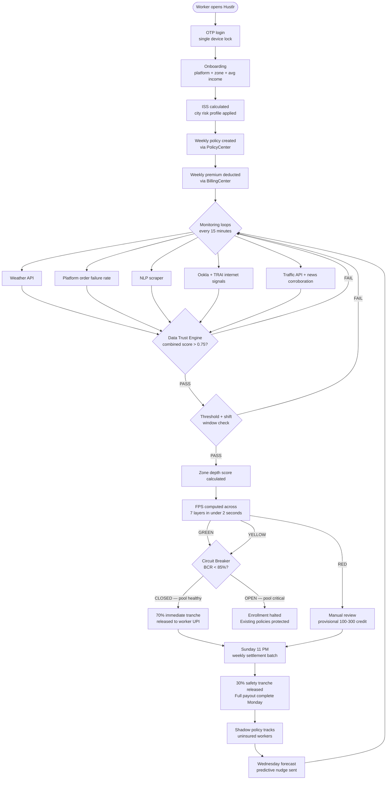
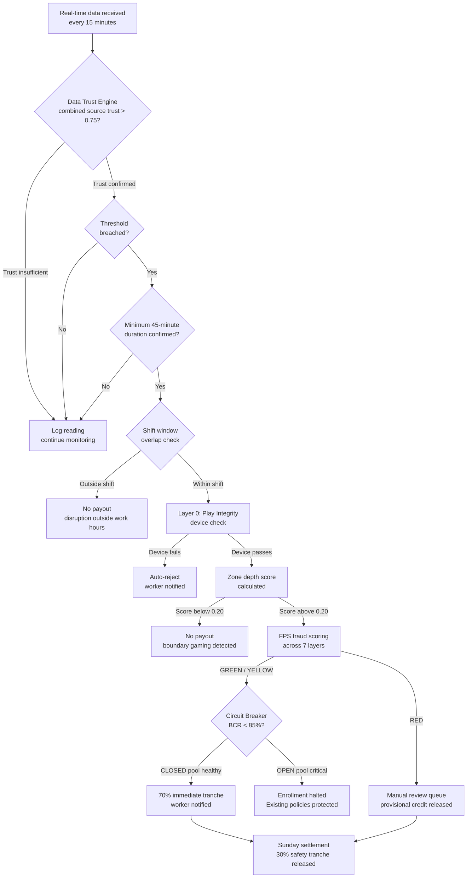
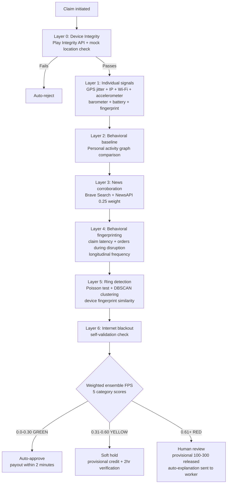

<div align="center">
  <h1>⚡ Hustlr</h1>
  <h3>Real-Time Income Protection Engine for India's Gig Delivery Workers</h3>

  <a href="https://youtu.be/nD2snI4Tnu8?si=eS5sztT0aibvxodI">
    
  </a>
  &nbsp;
  <a href="https://youtu.be/uEdGR915H-w">
    
  </a>
  &nbsp;
  <a href="https://github.com/Dhruvv-16/Hustlr">
    
  </a>
  <br><br>
  <strong>🏆 Guidewire DEVTrails 2026 — Phase 2 Submission</strong><br>
  <strong>👥 Team:</strong> Code Crafters &nbsp;|&nbsp; <strong>🎯 Persona:</strong> Q-Commerce Delivery Partners (Zepto)
</div>

---

## 🎬 Judge's Quick-Start Demo Guide

> **This section is for hackathon judges.** Follow this exact flow to experience the full Hustlr demo in under 3 minutes.

### Step 1 — Install the App

```bash
# Option A: Install the pre-built APK (Android only — recommended for full demo)
# Download Hustlr-demo.apk from the Releases tab
# On your Android device: Settings → Security → Allow unknown sources → Install

# Option B: Build from source
git clone https://github.com/Dhruvv-16/Hustlr
cd Hustlr
flutter pub get
flutter run                    # connect Android device first
flutter run -d chrome          # Web browser (sensor features limited)
```

### Step 2 — Onboard as a Delivery Partner

1. Open the app → tap **"Get Started"** on the welcome screen
2. Enter any name (e.g. `Karthik Shetty`) — it will be auto-capitalised
3. Enter any 10-digit phone number
4. Select **Zone** — pick any available Chennai zone (e.g. `Anna Nagar`)
5. Select **Platform** → `Zepto`
6. On the plan selection screen → choose **Standard Shield — ₹49/week**
7. Dashboard loads with your active policy card showing `Standard Shield · ₹49/week`

> ℹ️ The wallet starts at **₹0** (no payouts received yet). The ₹49 premium deduction is visible in "Recent Activity" below the balance.

### Step 3 — Trigger a Live Disruption (Demo Mode)

> ⚡ **This is the core demo flow — shows the full parametric insurance pipeline end-to-end.**

1. On the **Dashboard**, tap your **profile avatar** (top-right, green-bordered circle)
2. On the Profile screen, scroll down to find **"Demo Controls"** → tap it
3. A bottom sheet appears with 3 trigger buttons:

| Button | What it simulates | Payout amount |
|--------|-------------------|---------------|
| 🌧️ **Trigger Rain Disruption** | IMD confirms 67mm rainfall in your zone | ₹120 |
| 📵 **Trigger Platform Downtime** | Zepto order failure rate exceeds 60% | ₹140 |
| 🌡️ **Trigger Extreme Heat** | IMD confirms 43°C sustained in zone | ₹130 |

4. Tap **"Trigger Rain Disruption"** — a snackbar confirms the detection
5. Navigate to **Claims** tab → see a new claim card marked `PENDING`
6. Watch it auto-update to `APPROVED` after ~3 seconds ✅
7. Navigate to **Wallet** tab → balance now shows the payout credited
8. Tap **"Withdraw to UPI"** → enter `demo@ybl` → tap **"Initiate Transfer →"**
9. See the 2-second processing animation, then the **Transfer Initiated!** success screen

> ✅ **The demo state persists.** Trigger multiple events, switch screens, even close and reopen the app — the claims and wallet balance will still be there. Use **Reset Demo** to start fresh.

### Step 4 — Explore the App Screens

| Screen | What you'll see |
|--------|----------------|
| **Dashboard** | Active plan card (Standard Shield · ₹49), zone disruption alerts, rain prediction nudge, profile with your name |
| **Claims** | All triggered parametric claims with PENDING → APPROVED status, full audit trail showing IMD/CPCB data sources |
| **Wallet** | Payout balance, Smart Savings metric, UPI withdrawal flow, recent activity + insurance transaction history |
| **Policy** | Plan comparison (Basic → Full Shield), shadow policy feature, premium breakdown, compound trigger info |
| **My Protection Analytics** | Disruption bar chart (Mon–Sun), payout history (Heavy Rain · Platform Downtime · Extreme Heat), active plan summary |
| **Support → Live Support** | AI chat — responds to questions about claims, payouts, zones, premiums, UPI withdrawals |
| **Support → FAQs** | Parametric insurance explained in worker-friendly language |

### Step 5 — Live Support Chat Demo

1. Go to **Support** tab → tap **"Chat with us →"**
2. The agent greets you automatically
3. Tap any quick chip at the bottom to send a preset message:

| Chip | Question sent | AI response covers |
|------|--------------|-------------------|
| 🧾 Check my claim | "What is the status of my claim?" | Auto-processing, no filing needed, 2hr payout timeline |
| 💧 Rain payout | "How does the rain payout work?" | IMD 64.5mm threshold, 70/30 tranche split |
| 📍 My zone | "Tell me about my zone coverage." | Zone-specific IMD/CPCB sensor validation |
| ₹ My premium | "Why is my premium ₹49?" | Actuarial zone-risk pricing |
| 💰 Withdraw | "How do I withdraw my payout balance to UPI?" | Razorpay UPI, 2hr settlement |
| 🛡️ Upgrade plan | "What does Full Shield cover?" | Full Shield ₹79/wk — bandh, AQI, dark store closure |

---

## 🚀 Phase 3 Updates (Latest)

| Area | What's Implemented |
|------|--------------------|
| **Biometric Auth (Two-Tier)** | **Tier 1:** Native OS Fingerprint/Face ID (local_auth). **Tier 2 (Fallback):** AWS Rekognition camera-based liveness + profile matching. Dynamically fails over if no biometric enrolled, bypassing Android OEM "Smart mode" bugs. |
| **Resilient Background GPS** | Complete refactor of `ShiftTrackingService` isolates. Position stream now runs physically *inside* the Android OS Protected Foreground Task (via `enableWakeLock: true`), bypassing Xiaomi/OnePlus background kills. Watchdog now gracefully attempts auto-restart before pausing coverage. |
| **Location Degradation UX** | "While Using App" (foreground) location is no longer a hard lock. Workers can go online (with an amber warning banner) and keep shift protection active for the foreground session. |

---

## ✅ Phase 2 Highlights — What's Live

| Area | What's Implemented |
|------|--------------------|
| **Parametric Engine** | 5 automated triggers live (Rain, Heat, AQI, Platform Downtime, Bandh) — real IMD/CPCB/NewsAPI data in production |
| **Mobile App** | Flutter app with full onboarding, dashboard, claims, wallet/UPI withdrawal, policy management, live support chat |
| **Backend** | Node.js + Supabase — policy creation, premium billing, payout dispatch, circuit breaker, fraud scoring |
| **ML Models** | ISS risk scoring, NLP disruption scraper, fraud detection (7-layer), zone depth scoring, connectivity anomaly detection |
| **Demo Mode** | Offline parametric trigger simulation — Rain/Heat/Platform Downtime with persistent claim + wallet state across restarts |
| **Live Support** | AI chat agent responding to 11 insurance topics with Hustlr-specific parametric answers |
| **Guidewire Integration** | PolicyCenter + ClaimCenter + BillingCenter API integration scaffolded and documented |

---

## 📋 Table of Contents

1. [TL;DR](#-tldr)
2. [The Problem](#-the-problem)
3. [What Hustlr Is](#-what-hustlr-is)
4. [Chosen Persona: Q-Commerce Delivery Partner](#-chosen-persona-q-commerce-delivery-partner)
5. [How Hustlr Works — 15-Second View](#-how-hustlr-works--15-second-view)
6. [What Hustlr Covers](#-what-hustlr-covers)
7. [Insurance Partner Model](#-insurance-partner-model)
8. [Guidewire Integration](#️-guidewire-integration)
9. [Parametric Logic — Core Principle](#-parametric-logic--core-principle)
10. [Trigger Parameters](#-trigger-parameters)
11. [Compound Triggers — Full Shield](#-compound-triggers--full-shield)
12. [Anti-Gaming Rules](#-anti-gaming-rules)
13. [Manual Claim Filing — UX Flow](#-manual-claim-filing--ux-flow)
14. [Internet Zone Blackout — Trigger Architecture](#-internet-zone-blackout--trigger-architecture)
15. [Accident Blockspot — Trigger Architecture](#-accident-blockspot--trigger-architecture)
16. [Heavy Traffic Congestion — Trigger Architecture](#-heavy-traffic-congestion--trigger-architecture)
17. [Real Scenario Simulations](#-real-scenario-simulations)
18. [Adversarial Defense & Anti-Spoofing Strategy](#️-adversarial-defense--anti-spoofing-strategy)
19. [Zone Depth Scoring — Anti-Boundary Gaming](#-zone-depth-scoring--anti-boundary-gaming)
20. [AI/ML Architecture](#-aiml-architecture)
21. [Regional Behavioral Intelligence Layer](#-regional-behavioral-intelligence-layer)
22. [Innovation Differentiators](#-innovation-differentiators)
23. [Weekly Premium Tiers](#-weekly-premium-tiers)
24. [City Risk Profiles](#️-city-risk-profiles)
25. [End-to-End Workflow](#-end-to-end-workflow-full)
26. [Parametric Trigger Decision Flow](#-parametric-trigger-decision-flow)
27. [Fraud Detection Decision Flow](#-fraud-detection-decision-flow)
28. [System Reliability — Fallback Hierarchy](#-system-reliability--fallback-hierarchy)
29. [Platform Decision — Mobile App (Flutter)](#️-platform-decision--mobile-app-flutter)
30. [Tech Stack](#️-tech-stack)
31. [Phase 2: Backend Micro-Services Architecture](#-phase-2-backend-micro-services-architecture)
32. [Phase 2: Database Architecture — Supabase Triggers](#-phase-2-database-architecture--supabase-triggers)
33. [Phase 2: Registration & Onboarding Flow](#-phase-2-registration--onboarding-flow)
34. [Phase 2: Insurance Policy Management](#-phase-2-insurance-policy-management)
35. [Phase 2: Dynamic Premium Calculation](#-phase-2-dynamic-premium-calculation)
36. [Phase 2: Claims Management](#-phase-2-claims-management)
37. [Phase 2: Payout Dispatch](#-phase-2-payout-dispatch)
38. [Phase 2: Economic Circuit Breaker](#-phase-2-economic-circuit-breaker)
39. [MVP Scope — Phase 1 ✅ & Phase 2 ✅](#-mvp-scope--phase-1--phase-2-)
40. [Cost Efficiency](#-cost-efficiency)
41. [6-Week Plan](#-6-week-plan)
42. [Business Viability & Financial Model](#-business-viability--financial-model)
43. [IRDAI Compliance](#-irdai-compliance)
44. [Team](#-team)
45. [Phase 2 Deliverables](#-phase-2-deliverables)

---

## 🧭 TL;DR

**Who:** Q-commerce delivery riders (Zepto) — 2–3 km radius, one dark store, zero income safety net.

**Problem:** One flooded street eliminates their entire working zone. No insurance product covers this. 80+ disruption days a year go uncompensated.

**What Hustlr does:** Monitors 9 real-time disruption triggers. When one fires and the rider is on shift — a fixed payout hits their UPI automatically. No claim filed. No adjuster. Under 2 minutes.

**How it's built:** Flutter app · Node.js + Supabase backend · 7 AI/ML models · 7-layer fraud engine · Zone depth scoring · Regional behavioral intelligence · Full Guidewire integration (PolicyCenter + ClaimCenter + BillingCenter) · BLoC state management · Modular micro-services backend.

**Numbers:** ₹35–₹79/week · Tier-locked caps · 6–7× consistent multiplier across all plans · ₹0 infrastructure cost · 10,000-worker Chennai pilot · 5 live automated triggers · 70/30 tranche payout · 4-tier Data Trust Engine · BCR Circuit Breaker · Hard MPL ceiling — zero exceptions.

> *"When there's a curfew, I can't deliver. When the app crashes, I can't deliver. When a road accident blocks my route, I can't deliver. Those days, I earn zero rupees — but my rent doesn't know that."*
> — **Karthik, 24, Zepto Q-commerce delivery rider, Chennai**

---

## 🔴 The Problem

India has **7.7 million** gig delivery workers. Q-commerce riders — the people delivering groceries in 10 minutes for Zepto — face the sharpest version of this problem. They operate within a strict 2–3 km radius of a single dark store. They earn ₹4,000–₹6,000 per week with no paid leave, no sick days, and no safety net. One flooded street eliminates their entire working zone. A dark store going offline wipes out a full shift. Chennai alone sees **~80 rain days per year** — on each one, a rider loses ₹400–₹600. Cyclone Michaung wiped out 3–4 days of income per worker with zero recourse.

Every existing insurance product covers accidents, hospitalization, and death — events that happen rarely. Not one covers the income disruption that happens 80+ days a year.

Hustlr fixes the right problem.

---

## 💡 What Hustlr Is

Hustlr is **not an insurance company.** It is an **underwriting intelligence engine** that enables licensed insurers to profitably serve gig workers — a segment traditional insurance has never been able to reach.

---

## 👤 Chosen Persona: Q-Commerce Delivery Partner

**Persona:** A Zepto delivery partner operating in Chennai — Velachery, Adyar, or Tambaram dark store zones.

Workers are registered on a **single primary platform only**, in compliance with Zepto's partner exclusivity agreement. Insurance is priced based on that platform's activity data alone — keeping the model legally clean and operationally simple.

### Why Q-Commerce?

| Factor | Q-Commerce (Zepto) | Food (Zomato/Swiggy) | E-Commerce (Amazon/Flipkart) |
|--------|---------------------------|----------------------|------------------------------|
| Delivery frequency | 15–25 orders/day | 8–15 orders/day | 3–8 orders/day |
| Hyperlocal sensitivity | Extreme (dark store zones) | High | Moderate |
| Weather vulnerability | Critical (monsoon paralysis) | High | Low–Medium |
| Worker density per zone | Very high (cluster-based) | Medium | Spread out |
| Fraud surface area | High (zone-based clustering) | Medium | Low |

Q-commerce workers operate within **tight geographic zones** anchored to dark stores, making parametric triggers more precise (zone-level, not city-level), fraud detection more nuanced (cluster behaviour becomes a signal), and income modeling more predictable.

### Persona Profile: "Karthik, 24, Zepto Partner, Adyar Dark Store Zone, Chennai"

| Attribute | Value |
|---|---|
| Platform | Zepto (single platform — partner agreement compliant) |
| Weekly earnings | ₹4,200 (~₹600/day, ~₹60/hr over a 10-hr shift) |
| Shift window | 8 AM – 10 PM (derived from 30-day activity history) |
| Peak slots | Morning 8–11 AM · Evening 5–9 PM |
| Delivery radius | 2–3 km from Adyar dark store — zone loss = total income loss |
| Device | Android budget phone (~₹10,000) |
| Payments | UPI for all transactions |
| Savings buffer | 2–3 days of income at most |
| Annual disruption exposure | ~80 rain days · loses ₹400–₹600 per heavy rain day |

---

## ⚡ How Hustlr Works — 15-Second View

```
1. Rain detected in Karthik's zone    →  IMD + OpenWeatherMap confirm threshold
2. Data Trust Engine validates         →  Combined source trust 0.85 — exceeds 0.75 threshold
3. Shift window check passes           →  disruption falls within Karthik's working hours
4. Zone depth score calculated         →  confirms Karthik was genuinely deep in zone, not at boundary
5. Device integrity verified           →  Play Integrity API confirms no GPS spoofing app active
6. Fraud check in < 2 seconds          →  FRS score computed across 7 independent signal layers
7. Circuit Breaker confirms pool OK    →  BCR at 44% — well below 85% ceiling
8. 70% tranche credited same day       →  ₹84 to UPI instantly for urgent expenses
9. 30% safety tranche Sunday night     →  ₹36 after full-week fraud pattern review
```

No forms. No adjusters. No claim ever filed by the worker — for automated trigger events.

---

## ✅ What Hustlr Covers

| Covered | Not Covered |
|---------|-------------|
| Lost income during weather shutdowns (rain, cyclone, extreme heat, AQI) | Vehicle repairs or damage |
| Lost income during platform-declared outages | Medical or accident expenses |
| Lost income during civil disruptions (curfew, bandh, strike) | Personal illness or fatigue |
| Lost income during internet zone blackouts | Low-order days due to competition |
| Lost income due to accident blockspots on hotspot corridors | Income loss outside declared shift window |
| Lost income during severe traffic congestion (Full Shield) | Events with no corroborating data source |

---

## 🏢 Insurance Partner Model

| Role | Entity |
|---|---|
| **Risk Underwriter** | Licensed insurer — ICICI Lombard / HDFC ERGO |
| **Trigger + Intelligence Engine** | Hustlr |
| **Policy Administration** | Guidewire PolicyCenter API |
| **Claims Automation** | Guidewire ClaimCenter API |
| **Premium Billing** | Guidewire BillingCenter API |
| **Distribution — Phase 1** | Direct B2C — Hustlr mobile app via WhatsApp groups + referral |
| **Distribution — Phase 2** | B2B2C — Zepto platform integration + insurer white-label |

---

## ⚙️ Guidewire Integration

### PolicyCenter
- Weekly policy creation every Monday via PolicyCenter API
- ISS score + city risk profile passed as risk attributes for premium computation
- Policy status synced back to Hustlr in real time

### ClaimCenter
- On parametric trigger: Hustlr pushes a structured, pre-validated claim payload
- Fraud Risk Score attached — ClaimCenter routes CLEAN to auto-approval, FLAGGED to human queue
- On manual claim: worker-submitted proof package routed directly to ClaimCenter review queue
- Zero-touch for weather/bandh/internet events. Structured review for manual claim types.

### BillingCenter
- Weekly premium deduction via BillingCenter direct debit scheduling
- Payout disbursement coordinated through BillingCenter's payment gateway
- Worker wallet reconciliation synced weekly

### Guidewire Marketplace
- Hustlr packaged as a Marketplace integration — any insurer on PolicyCenter/ClaimCenter can onboard Hustlr's parametric trigger engine as a configurable product extension

### B2B2C Distribution Channel (Phase 2)
After proving the model B2C, Hustlr embeds directly inside the Zepto partner app as a white-label insurance feature. Zepto pays a per-worker monthly licensing fee. The insurer underwrites the risk. Guidewire collects a technology licensing fee from the insurer.

---

## 📊 Parametric Logic — Core Principle

Hustlr does **not** calculate actual income loss. No investigation needed for automated triggers.

- A measurable disruption index is monitored in real time
- When it crosses a threshold AND falls within the worker's shift window → payout fires
- Payout = fixed rate per trigger type × verified disruption hours (always capped by plan tier)

```
Example:
  Trigger:          Heavy rain — IMD confirms 72mm, threshold 64.5mm crossed
  Duration:         3 hours above threshold
  Plan:             Standard Shield
  Fixed rate:       ₹40/hr (Heavy Rain, Standard Shield)

  Payout = ₹40 × 3 = ₹120  →  within Standard Shield ₹150 daily cap  →  APPROVED
  70% (₹84) credited within 2 hours. 30% (₹36) settled Sunday night.
```

**Why weekly settlement for the 30% tranche:** The fraud engine evaluates the complete week's pattern before the final tranche releases. A worker who triggers 3 events in one week activates the claim velocity signal before the safety tranche moves. Weekly settlement also matches Zepto's weekly partner payment cycle.

**Why 60–70% income replacement, not 100%:** Parametric insurance by design does not fully replace income — this is basis risk, and it is intentional. Paying ₹40/hr (67% replacement) means honest workers are protected without the product becoming a profit opportunity. Full replacement creates moral hazard.

---

## 🚨 Trigger Parameters

### Automated Parametric Triggers

| Trigger | Threshold | Data Source | Hourly Rate | Daily Cap | Min Plan | Freq/yr |
|---|---|---|---|---|---|---|
| Heavy Rain | 64.5–115mm/hr | IMD + OpenWeatherMap | ₹40/hr | ₹120 | All plans | 8× |
| Extreme Rain / Cyclone band | ≥ 115.6mm/hr | IMD + OpenWeatherMap | ₹65/hr | ₹200 | Standard+ | 2× |
| Heat Wave | ≥ 43°C · IMD forecast | IMD | ₹45/hr | ₹130 | All plans | 5× |
| Severe Pollution | AQI ≥ 200 | AQICN / WAQI | ₹35/hr | ₹100 | Standard+ | 3× |
| Platform App Outage | Order failure rate > 60% | Platform API | ₹50/hr | ₹140 | Standard+ | 6× |
| Bandh / Strike / Curfew | NLP confidence ≥ 0.6 + platform OFFLINE | NewsAPI + NLP | ₹55/hr | ₹150 | Standard+ | 3× |
| Heavy Traffic Congestion | Speed ≥ 40% below baseline, ≥ 45 min | Google Maps Traffic API | ₹30/hr | ₹80 | Full Shield | 10× |
| Internet Zone Blackout | Connectivity < 10% for ≥ 30 min | Ookla / TRAI | ₹45/hr | ₹110 | Standard+ | 2× |
| Cyclone Landfall | IMD Category 1–5 · Oct–Dec | IMD | ₹80/hr | ₹250 | **Full Shield only** | 0.4× |

> **The Min Plan column is canonical.** A Basic Shield worker experiencing a cyclone trigger receives only their plan's daily cap (₹100/day) — not the cyclone rate. **The product you are buying at each tier is the cap, not the trigger list.** Cyclone's ₹80/hr rate is accessible only on Full Shield.

### Payout Caps Are Tier-Locked (Consistent Multipliers)

| Plan | Daily Cap | Weekly Cap | Cap Multiplier |
|---|---|---|---|
| Basic Shield | ₹100/day | ₹210/week | 6.0× premium |
| Standard Shield | ₹150/day | ₹340/week | 6.9× premium |
| Full Shield | ₹250/day | ₹500/week | 6.3× premium |

**Why consistent multipliers matter:** All three plans maintain a 6–7× premium-to-cap ratio. This ensures equal exposure per rupee of premium across tiers — the actuarial foundation of a sustainable pool. Higher tiers are not riskier per rupee; they simply protect more income in absolute terms.

### Manual Claim Triggers

| Trigger | What Worker Submits | Cross-Check Sources | SLA |
|---|---|---|---|
| Traffic Accident Blockspot | GPS screenshot + scene photo (EXIF-stamped) + platform earnings screenshot | Google Maps Traffic API + News API + order density | 4 hrs |
| Local Road Closure | Same as above | Municipal advisory feed + Maps | 4 hrs |
| Dark Store / Hub Shutdown | Photo of closed hub + Zepto screenshot | Platform API + NLP scraper | 4 hrs |

---

## ⚡ Compound Triggers — Full Shield

Full Shield workers receive compound trigger payouts when two disruptions occur simultaneously. Compound payouts use multipliers — not simple addition — because simultaneous disruptions cause multiplicative income loss, not additive.

| Compound Combination | Multiplier | Rule |
|---|---|---|
| Rain + Platform Outage | 100% of both rates | Both triggers active simultaneously |
| Heatwave + AQI | 110% on higher rate | Co-occurring environmental peril |
| Cyclone + Bandh | 120% on cyclone rate | Civil + weather compound |
| Extreme Rain + Blackout | 130% on extreme rain rate | Catastrophic scenario |

### The Hard Ceiling Principle — Cap Acceleration, Not Cap Lifting

**The ₹500 weekly cap on Full Shield is an absolute hard ceiling. There are zero exceptions.**

Compound multipliers (e.g., 130% for Extreme Rain + Blackout) increase the **velocity** of the payout, not the limit. During severe compound events, the increased hourly rate allows the worker to max out their ₹500 cap faster — in fewer hours of disruption — providing immediate peak financial relief without breaking the pool's Maximum Probable Loss (MPL) constraints.

```
Example — Extreme Rain + Blackout (130% multiplier):

  Base Rate (Extreme Rain):      ₹65/hr
  Compound Rate (130%):          ₹84.5/hr

  Old model (cap lift — REMOVED):
    Worker gets ₹84.5/hr until ₹650. Actuary cannot bound MPL. ❌

  New model (cap acceleration):
    Worker gets ₹84.5/hr until ₹500. Cap reached in ~6 hours
    instead of ~8 hours. MPL is mathematically locked. ✅
```

---

## 🛡️ Anti-Gaming Rules

- **Minimum duration:** 45 continuous minutes above threshold before trigger activates
- **Cooling period:** Same disruption type cannot trigger again in same zone within 24 hours
- **Shift intersection:** Disruption must overlap worker's registered shift by minimum 2 hours
- **One event per week per type** for Basic and Standard Shield plans
- **Post-purchase coverage only:** Disruptions beginning before policy activation are never covered
- **Quarterly commitment:** Plans and add-ons are quarterly (13-week) commitments, not weekly toggles

### Threshold Obfuscation + Dynamic Micro-Variation

**Exact trigger thresholds are never published.** The actual trigger threshold varies by ±3mm (rain) or ±0.5°C (heat) each week using a seeded random value known only to the system. Workers cannot game the exact threshold for their account that week.

---

## 📱 Manual Claim Filing — UX Flow

Workers filing a manual claim tap **"Report a Disruption"** on the Claims screen.

**Step 1 — Select Disruption Type**
```
  🚧  Road Blocked / Accident
  🏪  Dark Store / Hub Closed
  🌐  Internet Outage (zone-level)
```

**Step 2 — Capture Evidence (EXIF-stamped, live camera only — no gallery uploads)**
```
Road Blocked   →  1 photo (GPS-stamped at capture via mandatory AI reticle)
Hub Closed     →  1 photo + Zepto screenshot
Internet       →  App auto-reads signal strength — no photo
```

**Step 3 — Submission & Tracking**
```
Within 4 hours:
  → AUTO-APPROVED: "₹X credited to your wallet"
  → NEED MORE INFO: "Tap here to add one more photo"
  → DECLINED + EXPLANATION: "Here's why, and how to appeal"
```

---

## 🌐 Internet Zone Blackout — Trigger Architecture

```
Signal 1 — Ookla: Zone avg download speed < 2 Mbps for 20 minutes  →  degraded flag
Signal 2 — Device crowd-reporting: ≥ 30% of active Hustlr users report < 1 bar  →  cluster flag
Signal 3 — TRAI outage registry: Any ISP/tower outage logged  →  authoritative flag

Dual-confirmation rule:
  Signal 1 + Signal 2  →  AUTO_TRIGGER
  Signal 3 alone        →  AUTO_TRIGGER
  Signal 1 alone        →  HOLD for 20-minute reconfirmation window
```

**Fraud resistance:** Faking connectivity loss requires active data transmission to submit the claim — which is self-contradictory. This makes the internet blackout trigger one of Hustlr's most inherently fraud-resistant signals.

---

## 🚧 Accident Blockspot — Trigger Architecture

```
Google Maps Traffic API:
  Route speed < 5 km/h on major corridor for ≥ 30 minutes  →  gridlock flag

Cross-checked against:
  NewsAPI / NLP scraper: "accident", "collision", "road blocked" in zone  →  corroborated

Worker-assisted confirmation:
  Worker tap confirm + upload 1 photo
  Hustlr cross-checks: GPS on corridor? Zero orders? On Hotspot Map?
```

---

## 🚦 Heavy Traffic Congestion — Trigger Architecture

```
Step 1 — Build historical baseline per corridor per 30-min time slot
Step 2 — Current speed < (baseline − 40%) sustained ≥ 45 minutes  →  severe flag
Step 3 — Order failure rate in affected zone > 35%  →  confirmed

All three conditions must be met simultaneously → AUTO_TRIGGER
```

| City | High-Risk Corridor | Baseline | Trigger Threshold |
|---|---|---|---|
| Chennai | GST Road, Anna Salai | 18–22 km/h | < 11–13 km/h |
| Bengaluru | Electronic City Flyover, ORR | 15–20 km/h | < 9–12 km/h |
| Mumbai | Eastern Express Highway, WEH | 20–25 km/h | < 12–15 km/h |

---

## 📋 Real Scenario Simulations

### Scenario A — Chennai November Rain (Fully Automated)

```
Date:         November 12, 2025 · Location: Adyar, Chennai
IMD data:     72mm rainfall — threshold crossed for 3 hours
Data Trust:   IMD (0.92) + OpenWeatherMap (0.78) → Combined 0.85 (PASS)
Shift window: 11 AM–2 PM within Karthik's 8 AM–10 PM → PASS
Zone depth:   Karthik's GPS shows 0.84 — core zone → PASS
Fraud score:  FRS = 14/100 — CLEAN → AUTO-APPROVE
Plan:         Standard Shield

Payout = ₹40/hr × 3 hrs = ₹120

Timeline:
  11:00 AM  →  IMD threshold crossed, all checks pass, claim logged PENDING
  1:00 PM   →  70% tranche (₹84) released to UPI (Within 2-hour Guidewire mandate)
  Sunday    →  30% safety tranche (₹36) released after full-week pattern review
```

### Scenario B — Shadow Policy Activation

```
Karthik has no active policy this week.
Rain disruption hits Adyar zone Thursday.
System silently calculates: if Karthik had Standard Shield, he would have received ₹120.

Wednesday notification:
  "You missed ₹680 in payouts this fortnight.
   Activate Standard Shield now — ₹49/week. Coverage starts Monday."
```

### Scenario C — Predictive Activation (Wednesday Nudge)

```
Wednesday evening — Hustlr's 72-hour forecast runs.
OpenWeather shows: 78% probability of IMD Very Heavy Rain Friday.

Karthik (Insured) Notification:
  "Heavy rain expected Friday in your zone. You're covered."

Uninsured Notification:
  "Heavy rain expected Friday. Standard Shield (₹49/week) protects up to ₹150.
   Activate quarterly plan now. (Coverage starts Monday for future events)."
```

---

## 🛡️ Adversarial Defense & Anti-Spoofing Strategy

Hustlr never trusts a single signal. Every payout requires multi-stream coherence across independent data channels that a spoofing app cannot simultaneously fake.

| Signal Layer | What It Measures | What Spoofing Looks Like |
|---|---|---|
| GPS coordinates | Claimed location | Too perfect — zero statistical jitter |
| Cell tower triangulation | Tower the device is connected to | Home tower ID doesn't match flood zone |
| Wi-Fi fingerprint | SSIDs visible to device | Known home SSID present = flagged |
| IP geolocation (MaxMind) | ISP + approximate location | Home broadband IP ≠ claimed outdoor zone |
| Accelerometer / motion | Physical movement patterns | Stationary couch ≠ stranded outdoor worker |
| Battery charging state | Charging = plugged in at home | Charging during claimed outdoor disruption |

**Layer 0 — Device Integrity Check (runs before any GPS is trusted):**
1. Play Integrity API: Verifies app not tampered with, device not rooted.
2. Mock Location Detection: Android isMockLocation flag (software-generated GPS).
Rule: Any claim failing Play Integrity API is auto-rejected before fraud scoring begins.

**FPS Decision Engine (Layers 1-6 ensemble):**

| Tier | FPS Range | Action |
|---|---|---|
| GREEN | 0.0 – 0.30 | Auto-approve — payout within 2 hours |
| YELLOW | 0.31 – 0.60 | Soft hold — verifying, 2-hour window |
| RED | 0.61 – 1.00 | Human review — provisional credit released immediately |

**Zone Context Override:** During officially declared IMD/NDMA disaster advisories, all FPS thresholds in that zone are elevated by 15 points. Genuine stranded workers are not subjected to heavy fraud scrutiny during the worst events.

---

## 📍 Zone Depth Scoring — Anti-Boundary Gaming

Zone divided into 3 concentric rings around dark store:
```
  Outer ring    (0–500m inside boundary)    depth score: 0.00–0.20
  Middle ring   (500m–2km from boundary)    depth score: 0.21–0.60
  Core zone     (2km+ from any boundary)    depth score: 0.61–1.00
```

Payout multiplier:
- Score 0.00–0.20  →  0.0   (no payout — boundary gaming detected)
- Score 0.21–0.40  →  0.30  (30% of calculated payout)
- Score 0.41–0.60  →  0.60  (60%)
- Score 0.61–0.80  →  0.85  (85%)
- Score 0.81–1.00  →  1.00  (full payout)

A worker who runs to the zone edge the moment rain starts has a depth score near zero. A worker who spent their entire shift delivering deep inside the zone gets full payout.

---

## 🤖 AI/ML Architecture

- **Model 1 — Income Stability Score (ISS):** Rule engine recommending tiers based on zone flood risk, daily income, and disruption frequency.
- **Model 2 — Fraud Detection Engine (FRS):** Seven-layer stacked scoring. Isolation Forest detects claim clusters and ring networks.
- **Model 3 — NLP Disruption Scraper:** LLM preprocessing to convert unstructured government advisories into deterministic trigger payloads.
- **Model 4 — Internet Connectivity Anomaly Detector:** Statistical connectivity engine.
- **Model 5 — Accident Blockspot Classifier:** Traffic baseline comparison.
- **Model 6 — Zone Depth Scoring (PostGIS):** Real-time GPS shift analysis.
- **Model 7 — Facebook Prophet (Phase 3):** Disruption probability forecasting.

---

## 🌏 Regional Behavioral Intelligence Layer

| City | Behavioral Risk Index | Key Characteristic |
|---|---|---|
| Chennai | 0.65 | High financial literacy, organized communities, incentive-aware |
| Bengaluru | 0.55 | Tech-adjacent workforce, individual optimization focus |
| Mumbai | 0.50 | Volume-focused, less community coordination |
| Delhi | 0.45 | Diverse worker base, lower coordination density |

**Ethical boundary:** Regional behavioral intelligence adjusts system-level thresholds and fraud weights. It never denies an individual worker's claim based on their city alone.

---

## 🚀 Innovation Differentiators

1. **Shadow Policy:** Uninsured workers tracked silently. Acquisition cost: ₹0.
2. **Predictive Nudge:** Wednesday 72-hour forecast drives future quarter activations.
3. **Play Integrity API as Layer 0:** Blocks 90%+ of GPS spoofing before fraud scoring begins.
4. **Zone Depth Scoring:** Replaces binary zone membership to prevent edge-gaming.
5. **Data Trust Engine:** 4-tier cross-source credibility scoring (>0.75).
6. **Economic Circuit Breaker:** BCR monitor with automatic enrollment halt to prevent insolvency.
7. **70/30 Tranche Payout:** 70% within 2 hours. 30% held for Sunday fraud review.
8. **API Resilience Wrapper:** 3-strike degraded mode + 5-min cache keeps the engine running.
9. **Quarterly Commitment Model:** Eliminates adverse selection on add-ons.
10. **Cap Acceleration (Not Cap Lifting):** Hard MPL ceiling mathematically locks underwriter exposure, enabling reinsurance tracking.

---

## 💰 Weekly Premium Tiers

| Plan | Weekly Premium | Daily Cap | Weekly Cap | Core Coverage | Multiplier |
|---|---|---|---|---|---|
| **Basic Shield** | ₹35/wk | ₹100/day | ₹210/week | Rain + extreme heat | 6.0× |
| **Standard Shield** ⭐ | ₹49/wk | ₹150/day | ₹340/week | Rain, heat, AQI, outage, bandh | 6.9× |
| **Full Shield** 🔥 | ₹79/wk | ₹250/day | ₹500/week | All triggers + compound acceleration | 6.3× |

**Premium Bounds:** Maximum premium 2.0× base tier rate. Week-over-week change cap ±20%.

**Monsoon Season Surcharge:** Oct–Dec raises rain trigger probability. Premiums auto-adjust upward ~22%.

---

## 🏙️ City Risk Profiles

- **Chennai:** High flood + moderate bandh + high accident density + high behavioral gaming risk.
- **Kolkata:** Highest bandh score in India + moderate flood.
- **Bengaluru:** Low bandh + high internet outage + high accident density (Electronic City flyover).
- **Mumbai:** Extreme monsoon + low bandh + high accident density (Eastern/Western Expressways).

---

## 🔄 End-to-End Workflow (Full)



---

## 📡 Parametric Trigger Decision Flow



---

## 🛡️ Fraud Detection Decision Flow



---

## 📊 System Reliability — Fallback Hierarchy

| Signal Lost | Fallback |
|---|---|
| OpenWeatherMap unavailable | IMD station feed |
| IMD data delayed | Last confirmed reading + 30-min cache |
| Platform API unreachable | Order failure rate as primary signal |
| GPS signal lost | Last verified location within 15-min window |
| NLP scraper fails | Trigger held; manual admin review |
| Single-source trigger only | Held for admin confirmation |

---

## 🏗️ Platform Decision — Mobile App (Flutter)

Every interaction happens on a ₹10,000 Android phone at a red light. The anti-spoofing engine requires direct native access to: cell tower IDs, Wi-Fi SSID fingerprints, GPS jitter readings, accelerometer, battery state, barometric pressure, signal strength, and Play Integrity API. Flutter provides full native sensor access plus a single codebase for Android (worker app) and web (insurer admin dashboard).

---

## 🛠️ Tech Stack

- **Frontend:** Flutter (Dart) · flutter_bloc + Provider · flutter_background_geolocation · Hive · Razorpay Flutter SDK · Firebase Cloud Messaging · Play Integrity API
- **Backend:** Node.js + Express · Supabase (PostgreSQL + PostGIS) · Supabase Auth · Render · Node-cron · Python spaCy + LLM preprocessing via FastAPI · `data_trust.js` · `fraud_engine.js` · `circuit_breaker.js` · `payout_service.js` · `api_wrapper.js` · `triggers.sql`
- **AI/ML:** Python rule engine (ISS) · scikit-learn Isolation Forest (FRS) · PostGIS (zone depth) · Python NLP pipeline · Facebook Prophet
- **Guidewire:** PolicyCenter REST API · ClaimCenter REST API · BillingCenter REST API · Guidewire Marketplace

---

## 🏗 Phase 2: Backend Micro-Services Architecture

### A. Data Trust Engine (`data_trust.js`)

| Tier | Source Examples | Trust Range |
|---|---|---|
| Tier 1 — Govt/Official | IMD advisories, NDMA alerts | 0.90 – 1.00 |
| Tier 2 — Third-Party Verified | OpenWeatherMap, AQICN, Platform logs | 0.70 – 0.85 |
| Tier 3 — Community Reports | Crowd-sourced connectivity reports | 0.40 – 0.65 |
| Tier 4 — Device Sensors | GPS coordinates, Accelerometers | 0.20 – 0.30 |

Combined trust must exceed 0.75. GPS alone (0.20–0.30) cannot trigger a payout.

### B. The Fraud Engine (`fraud_engine.js`)

| Score | Outcome |
|---|---|
| < 30 — Clean | Payout instantly auto-approved |
| 30–60 — Soft Hold | Payout held 2 hours; 70% tranche only |
| > 60 — Flagged | Manual admin review queue |

### C. The Economic Circuit Breaker (`circuit_breaker.js`)

| BCR Level | System State | Action |
|---|---|---|
| < 65% | Healthy | Normal operations |
| 65–85% | Elevated | Admin warning |
| > 85% | Critical | New enrollments halted for that city |
| > 400% pool | Catastrophic | Reinsurance clause activated |

### D. Payout Dispatch
- **70% Immediate Tranche:** within 2 hours of claim approval (per Guidewire mandate: minutes, not hours)
- **30% Safety Tranche:** held until Sunday 11 PM weekly batch after full-week pattern review

---

## 🗄 Phase 2: Database Architecture — Supabase Triggers

| Trigger | Event | What It Does |
|---|---|---|
| Metadata Sync | Any row update | Stamps updated_at — audit trail integrity |
| Pool Synchronisation | Policy status change | Auto-increments/decrements active_policies count |
| Financial Auto-Compute | Claim status → SETTLED | Computes total_claims_paid and recalculates loss_ratio atomically |
| Baseline Generation | New user created | Auto-creates fraud_baselines entry + referral code |

---

## 👤 Phase 2: Registration & Onboarding Flow

Target: full onboarding under 90 seconds on a ₹10,000 Android phone.
1. Phone OTP Login (single device lock)
2. Platform Selection (Zepto)
3. Zone Declaration (PostGIS records zone centroid)
4. Income Baseline (self-declared weekly income range)
5. ISS Score Calculated (< 1 second)
6. Plan Selection (tier recommendation shown with reasoning)
7. Quarterly Commitment (13-week auto-debit schedule set)
8. PolicyCenter API called — BillingCenter schedules first deduction

---

## 📋 Phase 2: Insurance Policy Management

### Policy Lifecycle
1. Monday 12:01 AM → New weekly policy created via PolicyCenter
2. Monday (debit) → BillingCenter executes weekly premium deduction
3. Throughout week → Policy status: ACTIVE — triggers monitored
4. Sunday 11 PM → Weekly settlement batch — 30% tranche released
5. Sunday 11:30 PM → ISS score refreshed for next week
6. Monday 12:01 AM → New policy issued (loop continues)

---

## 🔄 Phase 2: Dynamic Premium Calculation

Fixed-tier + ISS-influenced recommendation model. Premium week-over-week changes are capped at ±20%.

---

## 🔄 Phase 2: Claims Management

**Automated Claims (5 Live Triggers):** Heavy Rain, Extreme Rain, Platform App Outage, Internet Zone Blackout, Bandh/Curfew.

---

## 💸 Phase 2: Payout Dispatch

70% immediately within 2 hours. 30% safety tranche Sunday 11 PM.

---

## ⚡ Phase 2: Economic Circuit Breaker

Halts new enrollments if BCR > 0.85 or claims > 50/hour in a single zone.

---

## 🧪 MVP Scope — Phase 1 ✅ & Phase 2 ✅

**Phase 1 Complete ✅**
Rain trigger via live OpenWeatherMap + IMD with shift window check · Zone depth scoring · Play Integrity API · NLP bandh detection · ISS scoring · Shadow policy · Predictive nudge · 7-layer FPS fraud engine · Regional behavioral intelligence layer · Threshold obfuscation · Compound trigger logic · Claim-free cashback design · Guidewire ClaimCenter payload · Manual claim flow · UPI payout.

**Phase 2 Complete ✅**
Full Flutter app · BLoC state management · Registration + onboarding · Quarterly commitment model enforced · Add-on tier-locking enforced (Cyclone → Full Shield only) · Add-on 72hr/48hr blackout windows · Weekly policy creation via PolicyCenter API · 5 automated parametric triggers live · Data Trust Engine · Fraud Engine · Economic Circuit Breaker · 70/30 tranche payout (70% within 2 hours) · Supabase DB triggers · API resilience wrapper · Manual claim camera screen · Wallet screen · Cap Acceleration (Replacing Cap Lift).

**Phase 3 (Weeks 5–6) — In progress**
Isolation Forest fraud model + Poisson timing test · Facebook Prophet forecasting model · Insurer admin dashboard + profitability simulator · Worker Trust Score accumulation logic · Claim-free cashback automation · Guidewire Marketplace packaging · Final 5-min demo video + pitch deck.

---

## 💸 Cost Efficiency

Total infrastructure: ₹0/month — all services on free tiers (OpenWeatherMap, IMD, AQICN, MaxMind, OpenCelliD, Ookla, TRAI, Brave Search, NewsAPI, Supabase, Render, Razorpay test mode, Play Integrity API).

---

## 📅 6-Week Plan

| Phase | Weeks | Status |
|---|---|---|
| Phase 1 | 1–2 | ✅ Complete |
| Phase 2 | 3–4 | ✅ Complete |
| Phase 3 | 5–6 | 🔄 In progress |

---

## 📊 Business Viability & Financial Model

### Core Principle
Hustlr is not priced as a traditional insurance product. It is a subsidised parametric protection system designed to achieve worker adoption first (B2C phase) and transition to profitability via platform integration (B2B2C phase).

### 1. Pricing Reality — Not Actuarially Fair (By Design)

| Plan | Actuarial Premium | Charged | Gap |
|---|---|---|---|
| Basic | ₹48/week | ₹35/week | -27% |
| Standard | ₹106/week | ₹49/week | -54% |
| Full | ₹172/week | ₹79/week | -54% |

This is not a modelling error. It is a deliberate constraint driven by the Guidewire affordability band (₹20–₹50 target range), worker willingness-to-pay ceilings, and the need for rapid adoption in the B2C phase. The gap is structurally supported by B2B2C licensing, zero claims processing cost, and reinsurance.

### 2. Phase 2 — B2B2C Revenue Model (Platform Integration)
In Phase 2, Hustlr embeds natively within the Zepto partner app. The 54% pricing subsidy required to drive adoption in Phase 1 is offset by a B2B Platform Licensing Fee.

**The Revenue Stack (At 10,000 Insured Workers):**

| Revenue Source | Calculation | Monthly Gross | Annual Gross |
|---|---|---|---|
| Worker Premiums (B2C) | ₹50/wk (blended) × 4.33 wks × 10k | ₹21.6 Lakhs | ₹2.6 Crores |
| Zepto Licensing (B2B) | ₹150/mo × 10,000 | ₹15.0 Lakhs | ₹1.8 Crores |
| **Total Inflow** | | **₹36.6 Lakhs** | **₹4.4 Crores** |

**Resolving the Actuarial Gap:**
The actuarial cost of Standard Shield is ~₹106/week.
- Worker Premium: +₹49
- Zepto Subsidy: +₹37 (₹150/mo equivalent)
- Effective Revenue per Worker: ₹86/week

The remaining ₹20 gap is closed by structural risk reduction. Our modelled actual payout is 36%–45% (based on simulation of 10,000 workers over 12 months using Chennai IMD data) because:
- **Caps:** 6.0x–6.9x Cap Discipline truncates ~18% of extreme tail payouts.
- **Fraud:** 7-Layer FRS Engine removes ~8–10% of fraudulent leakage.
- **Filters:** Zone Depth Scoring eliminates boundary gaming.

At a 36–45% effective loss ratio, the insurer retains a 20–25% underwriting margin after reinsurance and operational costs, making this segment profitable for the first time.

### 3. Hustlr Unit Economics (MGA / Tech Fee)
Hustlr operates as a Managing General Agent (MGA) and tech infrastructure layer. We do not take balance sheet risk.

**Hustlr Revenue = 8% of premium pool (Insurance Infra Fee) + 100% of platform licensing (SaaS Revenue).**

| Workers | Hustlr Monthly Revenue |
|---|---|
| 10,000 | ₹16.7L |
| 50,000 | ₹83.5L |
| 100,000 | ₹1.67 Cr |

**The Zepto ROI:** Replacing a churned worker costs Zepto ~₹2,000. If Hustlr extends average worker lifetime value (LTV) by just one month, the ₹150 fee yields a 13x ROI. Even without platform licensing, the model remains operational at reduced margins due to caps and circuit breakers.

### 4. Addressing Reinsurance at Scale
Hustlr does not independently procure reinsurance. Because we are integrated via the Guidewire Marketplace, our parametric pool is simply bundled into the underwriter's (e.g., ICICI Lombard) existing multi-billion dollar catastrophe treaty. The 2-5% allocation for reinsurance is passed directly to the carrier to cover this bundled exposure.

### 5. Sustainability Under Stress (The "3 Bad Weeks" Scenario)
Hustlr is designed to remain stable under correlated events (e.g., cyclones).
- Weekly caps limit per-worker exposure.
- Circuit breaker halts new enrollments at high BCR.
- Fraud and eligibility filters reduce over-triggering.
- Catastrophic losses are transferred via insurer reinsurance treaties.

Even in a worst-case correlated week (10,000 workers affected), the system remains solvent because Hustlr caps exposure at the worker level and transfers systemic risk to the insurer's reinsurance layer.

---

## 🤝 IRDAI Compliance

- Technology partner model — not a licensed insurer
- Policy under partner insurer's IRDAI license
- Triggers rely on IMD — IRDAI-recognized data source
- Payout terms transparent at activation (parametric requirement)
- Microinsurance compliant: ₹35–₹79/week, simplified format
- Within IRDAI Regulatory Sandbox guidelines for parametric products (2019)
- Minimum 7 active delivery days in past 30 days before first cover activates (per Guidewire mandate)

---

## 👥 Team

| Member | Role |
|---|---|
| Inesh Agarwal | Flutter Development |
| V Dhruv | Backend / API + Guidewire Integration |
| Prisha Agarwal | AI/ML + Fraud Engine + NLP + Prophet |
| Daksh Gupta | UI/UX Design |
| T Anil Kumar | Insurance Domain + City Risk Profiles + Pitch |

---

## 🎬 Phase 2 Deliverables

<div align="center">
  <a href="https://youtu.be/nD2snI4Tnu8?si=eS5sztT0aibvxodI">
    
  </a>
  &nbsp;&nbsp;
  <a href="https://youtu.be/uEdGR915H-w">
    
  </a>
  &nbsp;&nbsp;
  <a href="https://github.com/Dhruvv-16/Hustlr">
    
  </a>
</div>

---

*Hustlr — Because every minute you can't deliver is a minute your income disappears.*
